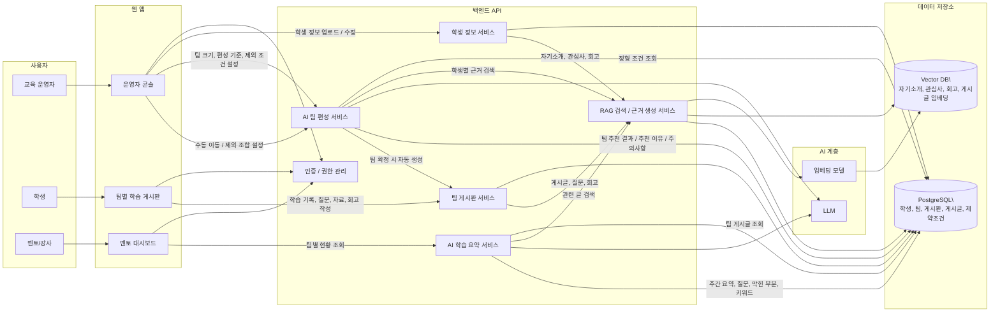
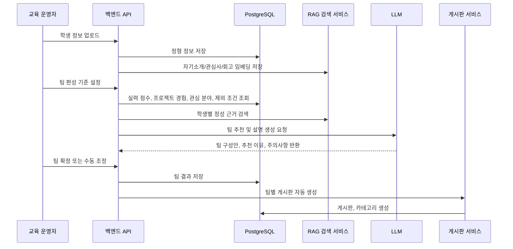

# 15-16주차 게시판 주제 정범진

## 주제

> 교육 운영자가 학생 기본 정보, 실력 점수, 프로젝트 경험, 관심 분야, 자기소개, 피하고 싶은 조건을 입력하면 AI가 근거를 제시하며 균형 잡힌 팀을 추천하고, 생성된 팀마다 학습 기록과 자료를 공유하는 전용 게시판을 자동으로 만들어주는 서비스
> 

## 데이터

> DB에 저장된 학생 정보와 게시글 정보 ‘자세한 내용은 아래 참고’
> 

## 결과

> 팀 매칭 결과, 학습 자료, 학습 요약
> 

**AI 팀 편성 도구 + 팀별 학습 운영 보드**

**사용자**

- 교육 운영자: 학생 정보를 업로드하고 팀 편성안을 검토/수정함
- 학생: 자기 팀 게시판에서 학습 내용, 질문, 자료, 회고를 공유함
- 멘토/강사: 팀별 진행 상황과 학습 공백을 확인함

**MVP 기능**

1. 학생 정보 입력
    - 데이터 입력
    - 이름, 반, 연락처, 실력 점수, 프로젝트 경험, 관심 주제, 자기소개, 피하고 싶은 조건 등
2. AI 팀 편성 추천
    - 팀 크기 설정: 예를 들어 4인 1팀
    - 기준 설정: 실력 점수 균형, 프로젝트 경험 분산, 관심사 유사도, 제외 조건 반영
    - 결과 제공: “왜 이 팀이 구성되었는지” 근거 설명
3. 운영자 수동 조정
    - 학생을 다른 팀으로 이동
    - 특정 조합 제외
4. 팀별 학습 게시판 자동 생성
    - 팀 생성 시 게시판도 자동 생성
    - 학습 기록, 질문, 자료 링크, 회고 작성
    - 주차별/프로젝트별 게시글 분류
5. 팀 학습 요약
    - 팀 게시판 글을 기반으로 AI가 1주간 학습 요약 생성
    - 자주 나오는 질문, 막힌 부분, 학습 키워드 추출해서 교육 자료 제공

**RAG를 쓰는 지점**

- 학생 설문/자기소개/회고를 문서로 저장
- 팀 편성 시 관련 학생 데이터를 검색
- “이 학생은 실력 점수가 높고 프로젝트 경험이 많음”, “이 학생은 AI 프로젝트에 관심이 높음”, “이 학생은 야간 회의를 피하고 싶어함” 같은 근거를 찾아 추천 설명에 활용
- 팀 게시판의 글을 검색해서 “이번 주 팀별 학습 현황” 요약 생성

**서비스 한 줄 소개**

> 학생의 실력 점수, 프로젝트 경험, 관심사, 자기소개, 피하고 싶은 조건을 바탕으로 근거 있는 팀 편성을 추천하고, 팀별 학습 기록을 축적·요약해주는 교육 운영용 RAG 기반 팀 빌딩 플랫폼
> 

**1. 사용할 데이터**

학생 한 명당 들어갈 데이터

| **구분** | **예시** | **용도** |
| --- | --- | --- |
| 기본 정보 | 이름, 반, 전화번호 | 학생 식별 |
| 실력 점수 | 85점 | 팀 실력 균형 계산 |
| 관심 분야 | AI, 백엔드, 데이터 분석 | 관심사 기반 매칭 |
| 프로젝트 경험 | 3회 | 경험자 분산 배치 |
| 자기소개 | “AI 서비스를 직접 배포해보고 싶다” | RAG가 해석할 정성 데이터 |
| 피하고 싶은 조건 | “야간 회의 어려움”, “발표 부담 큼” | 배치 제약 조건 |

**2. RAG에 넣을 데이터**

- 학생 자기소개
- 관심 분야 설명
- 이전 프로젝트 회고
- 팀 게시판 글
- 질문/답변 기록
- 주차별 회고

**3. 예상 출력값**

**Team Alpha**

- 김민지
- 이준호
- 박서연
- 최현우

추천 이유:

> 실력 점수와 프로젝트 경험이 한 팀에 과도하게 몰리지 않았고, AI 교육 서비스라는 관심사가 겹칩니다. 자기소개와 관심 분야를 근거로 볼 때 팀 게시판과 RAG 기능 구현 주제에 함께 집중하기 좋습니다.
> 

주의 사항:

> 야간 회의를 피하고 싶은 학생이 포함되어 있어 회의 시간 조율이 필요합니다.
> 

**4. 팀별 게시판**

> 각 팀이 무엇을 공부했고, 어디서 막혔고, 어떤 자료를 공유했는지 기록하게 하고, AI가 그 기록을 바탕으로 팀별 학습 상황을 요약/검색/추천해주는 기능
> 

**게시판 구성**

팀이 생성되면 자동으로 팀 전용 게시판이 만들어집니다.

예시:

```jsx
{
  "board_id": "B_T01",
  "team_id": "T01",
  "team_name": "Team Alpha",
  "members": ["김민지", "이준호", "박서연", "최현우"],
  "categories": ["공지", "학습 기록", "질문", "자료 공유", "회의록", "회고"]
}
```

**카테고리별 용도**

| **카테고리** | **내용** | **예시** |
| --- | --- | --- |
| 공지 | 팀 내 약속, 일정, 마감 | “금요일까지 API 명세 작성” |
| 학습 기록 | 오늘/이번 주 공부한 내용 | “RAG 구조와 임베딩 개념 학습” |
| 질문 | 막힌 점, 모르는 개념 | “벡터 DB 검색 결과가 이상하게 나옵니다” |
| 자료 공유 | 링크, 문서, 코드, 강의 | “FAISS 공식 문서 정리” |
| 회의록 | 회의 내용, 작업 분담 | “6월 7일 팀 회의록” |
| 회고 | 잘한 점, 어려웠던 점, 다음 목표 | “이번 주는 API 연결에서 시간이 많이 걸림” |

**5. DB 테이블 설계 기준**

현재 MVP에서는 팀 편성 근거를 단순하게 유지하기 위해 아래 필드만 사용합니다.

| **테이블** | **사용하는 주요 데이터** | **제거한 데이터** |
| --- | --- | --- |
| `users` | 이름, 반, 전화번호 | `github_id` |
| `student_profiles` | 실력 점수, 프로젝트 경험, 관심 분야, 자기소개, 피하고 싶은 조건 | level 관련 컬럼, `tech_stack`, `available_time`, `learning_goal`, `collaboration_style`, `portfolio_url` |
| `teams` | 주차, 반, 팀 번호, 팀 이름 | 없음 |
| `team_members` | 팀 ID, 학생 ID | `role`, `is_fixed`, `assigned_reason` |
| `boards` | 팀 ID, 게시판 이름 | 없음 |
| `posts` | 게시판 ID, 작성자 ID, 카테고리, 제목, 내용 | 없음 |
| `comments` | 게시판 ID, 게시글 ID, 작성자 ID, 내용 | 없음 |

**6. 아키텍처**
MVP 전체 흐름도



팀 편성 및 게시판 생성 흐름


