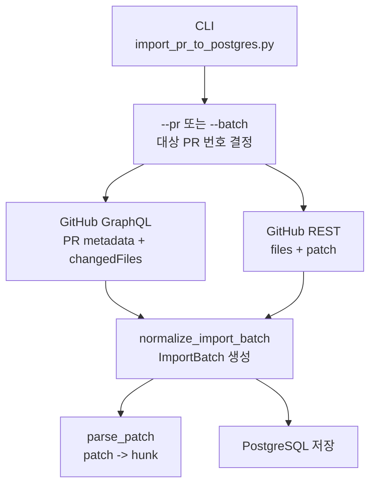
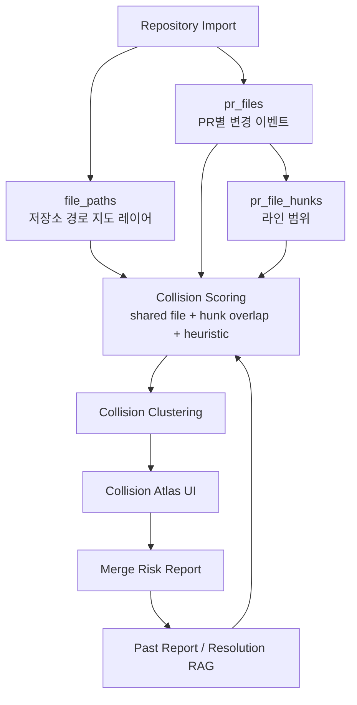
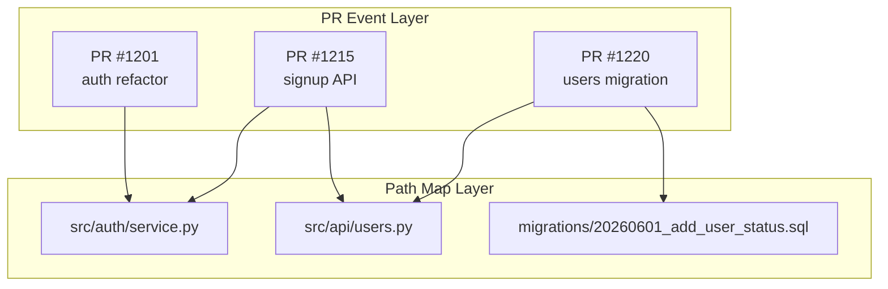
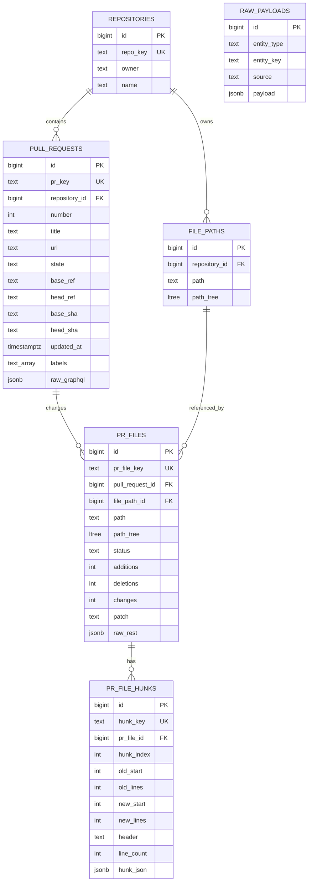
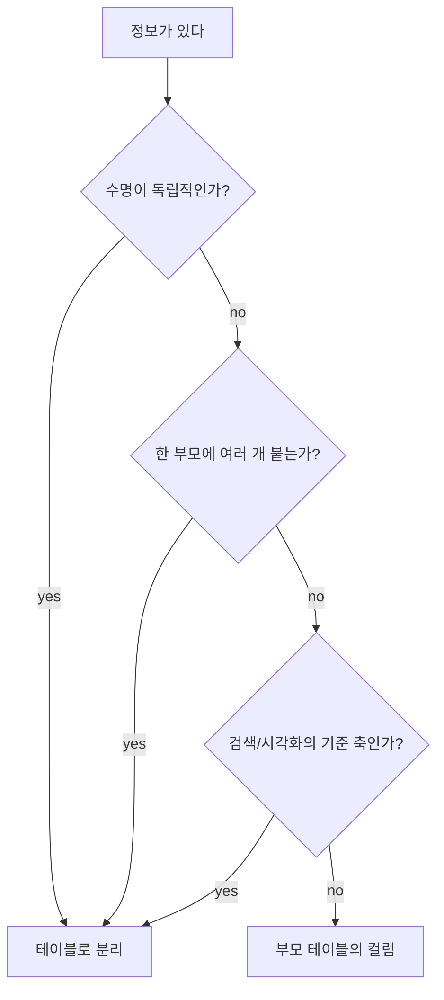
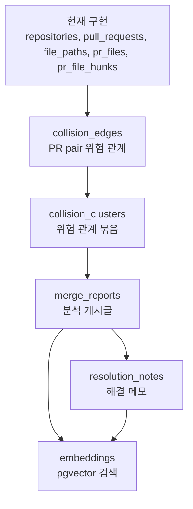
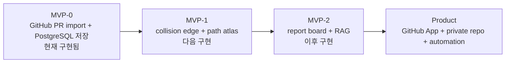
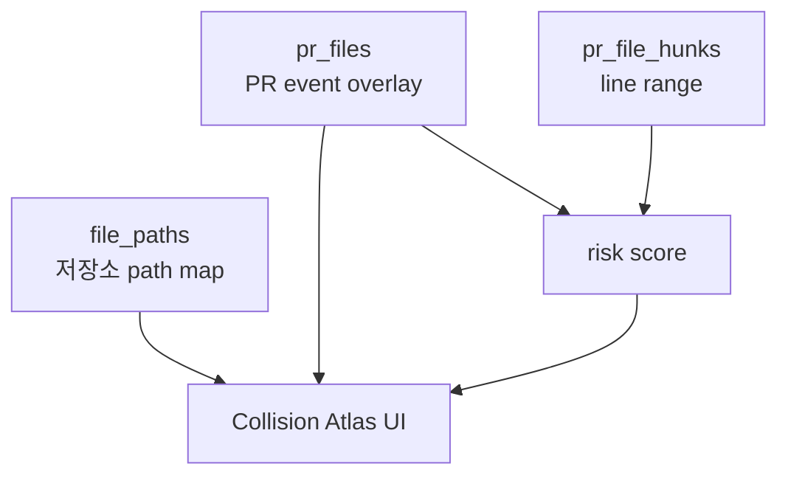
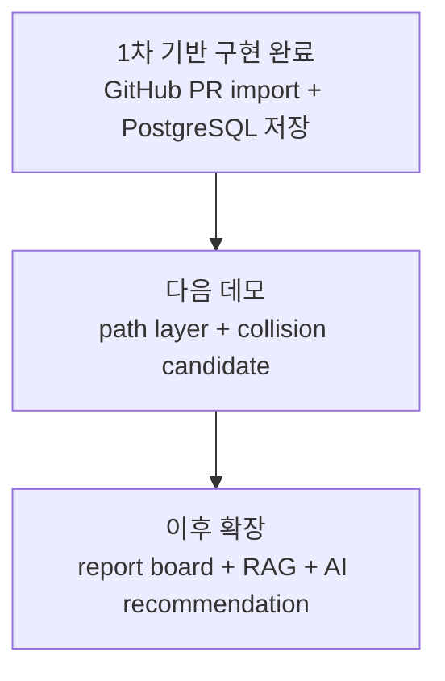

# PR Collision Atlas 기획서

## 1. 한 줄 정의

수천 개의 Pull Request가 있는 저장소에서 PR 간 충돌 가능성, 변경 집중 구역, merge 병목을 시각화하고 분석해 주는 개발 협업 보드.

이 서비스는 GitHub 저장소의 Pull Request 데이터를 수집하고, 각 PR의 변경 파일, 디렉토리, diff hunk, label, 작성자, 상태, 리뷰 흐름을 분석한다. 그 결과를 단순 PR 목록이 아니라 **개발 작업들의 충돌 지도**로 보여준다.

핵심은 코드를 예쁘게 그래프로 보여주는 것이 아니다. 핵심은 **동시에 진행 중인 작업들이 서로 어디에서 부딪히는지, 어떤 순서로 merge하면 위험이 낮아지는지, 어떤 영역이 팀의 병목이 되고 있는지**를 보이게 만드는 것이다.

## 2. 큰 그림

PR Collision Atlas는 다음 문제에서 출발한다.

- 여러 명이 동시에 같은 저장소에서 작업한다.
- PR이 많아질수록 어떤 PR이 어떤 파일과 기능을 건드리는지 한눈에 보기 어렵다.
- merge conflict는 보통 PR을 합치려는 순간에야 드러난다.
- 실제로 중요한 충돌과 별 의미 없는 충돌이 섞여 있다.
- 주석, 문서, 공백 변경 충돌은 낮은 위험일 수 있지만, API 응답, DB migration, 설정 파일 충돌은 훨씬 더 위험하다.
- 오픈소스처럼 PR이 수백~수천 개 쌓인 저장소에서는 단순 PR 목록이나 GitHub 기본 화면만으로 전체 흐름을 파악하기 어렵다.

이 서비스는 PR을 다음 세 수준으로 보여준다.

1. **Macro View:** 저장소 전체의 PR 흐름, 변경 집중 구역, merge 병목을 보여준다.
2. **Cluster View:** 서로 비슷하거나 충돌 가능성이 있는 PR들을 묶어서 보여준다.
3. **Detail View:** 특정 PR 또는 PR 간 관계를 선택하면 왜 위험한지, 어디가 겹치는지, 어떤 순서로 처리하면 좋은지 보여준다.

## 3. 서비스 정체성

이 서비스는 Git 클라이언트도 아니고, 단순 코드 시각화 도구도 아니다.

비슷해 보이는 도구와의 차이는 다음과 같다.

- Git merge tool: 이미 발생한 conflict를 해결하는 데 집중한다.
- Codebase visualizer: 코드 구조와 의존 관계를 이해하는 데 집중한다.
- PR Collision Atlas: 아직 merge하기 전, 동시에 열린 PR들의 충돌 가능성과 작업 병목을 보여준다.

즉 이 서비스는 **merge resolution tool**이 아니라 **merge planning and collision intelligence board**다.

## 4. 핵심 사용자

### 오픈소스 메인테이너

PR이 많이 쌓인 저장소에서 어떤 PR을 먼저 봐야 할지, 어떤 PR들이 서로 영향을 주는지 빠르게 파악하고 싶은 사람.

### 팀 리드 / 테크 리드

여러 개발자가 동시에 작업하는 상황에서 특정 영역에 변경이 과도하게 몰리고 있는지, 어떤 작업들이 서로 충돌할 수 있는지 확인하고 싶은 사람.

### 리뷰어

리뷰할 PR이 많을 때, 변경 영향도가 높은 PR과 낮은 PR을 구분하고 싶은 사람.

### 개인 개발자

내 브랜치를 main에 합치기 전에 어떤 PR과 부딪힐 가능성이 있는지 확인하고 싶은 사람.

## 5. 핵심 문제

### PR 목록은 많지만 관계는 보이지 않는다

GitHub의 PR 목록은 각 PR을 독립된 항목으로 보여준다. 하지만 실제 개발에서는 PR들이 서로 독립적이지 않다.

예를 들어 다음 PR들이 동시에 열려 있다고 하자.

- `#1201` 로그인 리팩토링
- `#1215` 회원가입 API 수정
- `#1220` users 테이블 migration 추가
- `#1233` 프로필 페이지 UI 수정

이 PR들은 서로 다른 제목을 가지고 있지만, 실제로는 `auth`, `users`, `profile API` 영역에서 연결될 수 있다. 이 관계는 PR 목록만으로는 잘 보이지 않는다.

### 충돌에는 중요도가 있다

모든 충돌이 같은 위험을 가지지는 않는다.

- 주석 문구 충돌
- README 변경 충돌
- import 순서 충돌
- 같은 함수의 로직 변경
- 같은 API response 변경
- 같은 DB migration chain 변경
- 같은 설정 파일의 production 값 변경

이것들을 모두 같은 "merge conflict"로 보여주면 사용자는 어디에 집중해야 할지 모른다.

### 대규모 저장소에서는 전체 시각화가 깨진다

PR이 30개인 저장소에서는 모든 PR을 그래프로 보여줄 수 있다. 하지만 PR이 3,400개라면 모든 PR을 노드로 띄우고 모든 관계를 선으로 잇는 방식은 실패한다.

대규모 PR 시각화는 다음 원칙을 가져야 한다.

- 전체를 그대로 그리지 않는다.
- 먼저 집계와 클러스터를 보여준다.
- 위험도가 낮은 관계는 접는다.
- 사용자가 관심 영역을 선택했을 때 세부 그래프를 펼친다.
- 시간, 디렉토리, label, 작성자, base branch 기준으로 필터링한다.

## 6. 핵심 가치

### Merge 전에 위험을 본다

사용자는 PR을 merge하려는 순간이 아니라, merge하기 전에 충돌 가능성을 볼 수 있다.

### 중요한 충돌에 집중한다

서비스는 단순히 "같은 파일을 수정했다"를 알려주는 데서 끝나지 않는다. 변경 종류, 파일 유형, hunk 위치, 키워드, 과거 해결 사례를 바탕으로 위험도를 나눈다.

### PR 흐름을 지도처럼 본다

저장소의 열린 PR들을 하나의 작업 지형으로 보여준다.

- 어디에 변경이 몰리는가
- 어떤 PR들이 서로 연결되어 있는가
- 어떤 디렉토리가 병목인가
- 어떤 PR이 오래 열려 있는가
- 어떤 PR을 먼저 merge해야 하는가

### 팀의 merge 지식이 쌓인다

각 merge 분석 결과와 해결 메모가 저장된다. 시간이 지나면 "예전에 비슷한 충돌을 어떻게 해결했는지" 검색할 수 있다.

## 7. 핵심 기능

### 7.1 Repository Import

사용자는 GitHub 저장소를 연결한다.

수집 대상:

- repository metadata
- open pull requests
- closed/merged pull requests 일부
- PR title/body
- labels
- author
- reviewers
- base branch
- head branch
- changed files
- additions/deletions
- commit count
- review/comment count
- PR state
- created/updated/merged timestamps

MVP에서는 GitHub public repository를 우선 대상으로 한다.

### 7.2 PR Macro Dashboard

저장소 전체 PR 상태를 집계해서 보여준다.

주요 지표:

- 열린 PR 수
- 오래 열린 PR 수
- 변경 파일 수가 큰 PR
- conflict risk가 높은 PR
- 변경이 몰린 디렉토리
- base branch별 PR 분포
- label별 PR 분포
- 최근 7일/30일 PR 생성 및 merge 흐름

예시:

```text
src/auth         42 PRs  high collision
src/api          31 PRs  medium collision
migrations       22 PRs  high collision
docs              9 PRs  low collision
```

### 7.3 Collision Cluster View

PR들을 개별 노드로 모두 보여주지 않고, 먼저 클러스터로 묶어 보여준다.

클러스터 기준:

- 같은 디렉토리를 수정한 PR
- 같은 파일을 수정한 PR
- 같은 label을 가진 PR
- 같은 base branch를 대상으로 하는 PR
- 제목/본문/파일 경로 임베딩이 유사한 PR
- migration/config/API 관련 키워드를 공유하는 PR

클러스터 예시:

- `Auth/API Cluster`
- `Migration Cluster`
- `Docs-only Cluster`
- `Frontend Profile Cluster`
- `Config and Deployment Cluster`

각 클러스터는 다음 정보를 가진다.

- 포함 PR 수
- 대표 파일/디렉토리
- 평균 위험도
- 가장 위험한 PR pair
- 가장 오래 열린 PR
- 추천 처리 순서

### 7.4 PR Collision Graph

특정 클러스터나 PR을 선택하면 상세 그래프를 보여준다.

노드:

- PR
- file
- directory
- API endpoint
- DB migration
- config file
- author
- label

엣지:

- PR modifies file
- PR shares file with PR
- PR shares directory with PR
- PR likely affects API
- PR likely affects migration
- PR similar to past PR

엣지 색상:

- 회색: 약한 관련
- 파랑: 같은 영역 변경
- 주황: 충돌 가능
- 빨강: 높은 충돌 위험

### 7.5 Risk Scoring

PR pair 또는 PR cluster에 위험 점수를 부여한다.

위험도 기준:

| 위험도 | 조건 |
| --- | --- |
| Low | docs, comments, whitespace, 서로 다른 파일의 단순 변경 |
| Medium | 같은 디렉토리, 같은 파일의 다른 hunk, 같은 feature label |
| High | 같은 파일의 가까운 hunk, 같은 함수/컴포넌트 추정, 같은 API 주변 변경 |
| Critical | DB migration, config, auth, API response, dependency lockfile 충돌 |

MVP에서는 완전한 semantic analysis보다 다음 휴리스틱을 사용한다.

- 파일 경로
- 확장자
- diff hunk line range
- 변경 키워드
- 파일명 패턴
- PR label
- PR title/body
- 과거 resolution note

### 7.6 Meaningless Conflict Filter

사용자가 말한 핵심 문제를 기능으로 만든다.

서비스는 낮은 가치의 충돌을 따로 분리한다.

낮은 가치 충돌 예시:

- 주석만 변경
- README 문구 변경
- 공백/formatting 변경
- import 순서 변경
- 테스트 snapshot의 단순 텍스트 변경

중요 충돌 예시:

- 같은 함수 로직 변경
- API request/response 변경
- DB migration 변경
- auth/permission 관련 변경
- config/env/deployment 관련 변경
- dependency lockfile 변경

이 기능의 목적은 "모든 충돌을 없애기"가 아니라, **사람이 봐야 할 충돌과 넘어가도 되는 충돌을 구분하는 것**이다.

### 7.7 Merge Order Recommendation

서비스는 PR들의 위험도를 바탕으로 merge 순서를 추천한다.

추천 기준:

- DB migration PR을 먼저 merge해야 하는가
- dependency update PR을 먼저 처리해야 하는가
- 오래 열린 PR을 rebase해야 하는가
- 여러 PR이 같은 파일을 건드릴 때 어떤 PR이 기준이 되어야 하는가
- docs-only PR은 별도 처리해도 되는가

출력 예시:

```text
추천 merge 순서:
1. #1220 users migration
2. #1215 회원가입 API 수정
3. #1201 로그인 리팩토링
4. #1233 프로필 페이지 UI 수정

이유:
- #1215와 #1233은 users API 응답에 함께 의존합니다.
- #1220이 schema를 먼저 확정해야 #1215의 변경 범위가 안정됩니다.
- #1201은 auth service를 건드리지만 migration과 직접 충돌하지 않습니다.
```

### 7.8 Merge Risk Report Board

각 분석 결과는 게시글처럼 저장된다.

게시글 구성:

- repository
- analysis target
- base branch
- 분석 시각
- 관련 PR 목록
- 위험 클러스터
- 추천 merge 순서
- AI 요약
- 해결 메모
- 댓글
- 최종 결과: resolved / ignored / merged / rebased

이 게시판은 단순 커뮤니티 게시판이 아니라, 팀의 merge 의사결정 기록이다.

### 7.9 RAG 기반 과거 사례 검색

과거 merge risk report, PR 설명, 해결 메모를 임베딩으로 저장한다.

사용자는 다음 질문을 할 수 있다.

- 이 PR과 비슷한 과거 PR이 있었나?
- migration 충돌이 났을 때 우리는 보통 어떻게 처리했나?
- auth 관련 충돌 중 실제로 문제가 됐던 사례가 있나?
- 이 디렉토리는 왜 자주 충돌이 나나?

검색 대상:

- PR title/body
- changed file paths
- risk explanation
- resolution notes
- comments
- final outcome

### 7.10 MCP 활용

MCP는 "여러 데이터 소스에서 merge 분석에 필요한 맥락을 가져오는 통로"로 사용한다.

가능한 MCP 서버:

- GitHub MCP: PR, issue, commit, review comment 조회
- Filesystem/Git MCP: 로컬 저장소 diff, branch, merge simulation 조회
- PostgreSQL MCP: 저장된 report, collision edge, resolution note 검색
- Documentation MCP: 프로젝트 README, ADR, API 문서 검색

MVP에서는 GitHub API 직접 연동과 PostgreSQL 저장을 먼저 구현하고, 이후 MCP 서버 형태로 도구를 감싸는 방식이 현실적이다.

## 8. 데이터 흐름

### 8.1 현재 구현된 Import Flow

현재 구현은 UI나 risk scoring까지 가지 않고, GitHub PR 데이터를 PostgreSQL에 안정적으로 쌓는 import foundation에 집중한다.



현재 구현된 범위는 다음과 같다.

```text
했다:
  - GitHub public repository의 특정 PR import
  - GitHub REST PR 목록 페이지에서 여러 PR 번호를 가져오는 batch import
  - GraphQL changedFiles cursor pagination
  - REST files pagination
  - PR metadata 정규화
  - changed file 정규화
  - patch 문자열을 diff hunk로 파싱
  - path를 ltree 검색용 path_tree로 변환
  - PostgreSQL schema 생성
  - repositories, pull_requests, file_paths, pr_files, pr_file_hunks, raw_payloads 저장

아직 안 했다:
  - 저장소 전체 페이지 자동 순회
  - collision edge 계산
  - risk score 계산
  - cluster 생성
  - UI 시각화
  - report board
  - pgvector/RAG
```

### 8.2 제품 전체 Data Flow

최종 제품은 import된 데이터를 기반으로 path layer, PR event, hunk range를 분석해 collision atlas를 만든다.



이 흐름에서 `file_paths`는 단순한 중복 제거 테이블이 아니다. 저장소의 파일 경로를 반투명한 배경 지도처럼 두고, 여러 PR이 어느 경로를 지나갔는지 표시하기 위한 기준 레이어다.



### 8.3 Deep Analysis Flow

1. 사용자가 특정 PR 또는 cluster를 선택한다.
2. 백엔드가 같은 `base_ref`를 대상으로 하는 관련 PR pair를 찾는다.
3. `pr_files.file_path_id`와 `path_tree`를 이용해 같은 파일/디렉토리 변경을 찾는다.
4. `pr_file_hunks`의 line range overlap을 계산한다.
5. 파일 유형, 경로 패턴, label, title/body 키워드로 위험도를 보정한다.
6. 과거 report와 resolution note를 RAG로 검색한다.
7. AI가 위험 이유와 추천 merge 순서를 생성한다.
8. 결과를 merge risk report로 저장한다.

### 8.4 Board Flow

1. 분석 결과가 게시글로 생성된다.
2. 사용자는 report에 댓글이나 해결 메모를 남긴다.
3. 실제 merge/rebase 결과를 기록한다.
4. 결과가 다음 분석의 RAG 데이터로 사용된다.

## 9. PostgreSQL 설계

### 9.1 현재 구현된 테이블

현재 구현된 DB는 collision 분석을 바로 계산하기 전 단계의 import schema다. GitHub PR을 분석 가능한 단위인 repository, PR, path, PR file event, hunk로 나눠 저장한다.



### 9.2 테이블 분리 기준



이 기준으로 현재 테이블을 해석하면 다음과 같다.

```text
repositories:
  저장소 자체. 여러 PR과 파일 경로의 부모가 된다.

pull_requests:
  PR 하나의 metadata snapshot.
  base_ref, head_ref, head_sha, labels는 이후 필터링과 분석 기준이 되므로 저장한다.

file_paths:
  저장소 파일 경로 지도 레이어.
  여러 PR이 지나가는 공통 좌표이며, path_tree로 디렉토리 검색이 가능하다.

pr_files:
  특정 PR이 특정 path 위에 남긴 변경 이벤트.
  additions, deletions, status, patch는 PR snapshot에 종속된다.

pr_file_hunks:
  patch를 충돌 계산 가능한 line range로 쪼갠 분석 단위.
```

`file_paths`와 `pr_files`는 일부 값이 겹친다. 이 중복은 현재 MVP에서 의도적으로 허용한다.

```text
file_paths.path / path_tree:
  장기적으로 유지되는 path map layer

pr_files.path / path_tree:
  PR snapshot 조회 편의와 당시 GitHub 응답 보존

pr_files.file_path_id:
  같은 path 위에 여러 PR event가 쌓인다는 관계 표현
```

### 9.3 현재 보존하는 원본 데이터

현재는 정규화 컬럼 외에 원본 응답도 저장한다.

```text
pull_requests.raw_graphql:
  PR metadata와 changedFiles GraphQL 원본

pr_files.raw_rest:
  파일별 REST 응답 원본

raw_payloads:
  entity_type, entity_key, source 기준의 원본 payload 보관소
```

`raw_payloads`는 당장 collision 계산에 필수는 아니다. 하지만 API 응답이 바뀌었을 때 정규화 로직을 다시 검증하거나, 누락된 필드를 재처리하거나, import 결과를 디버깅할 때 필요하다. 따라서 현재 설계에서는 단순성보다 재현성과 추적성을 우선해 유지한다.

### 9.4 다음 단계에 추가할 테이블

아래 테이블들은 아직 구현되지 않았다. 현재 import schema 위에 추가될 분석/제품 레이어다.



예상 역할:

- `collision_edges`: 두 PR 사이의 shared file, shared directory, hunk overlap, risk score 저장
- `collision_clusters`: 여러 collision edge를 기능 영역이나 디렉토리 기준으로 묶은 결과 저장
- `merge_reports`: 특정 시점의 분석 결과와 추천 merge 순서 저장
- `resolution_notes`: 사람이 남긴 해결 과정과 실제 outcome 저장
- `embeddings`: PR/report/resolution note를 pgvector로 유사 검색하기 위한 벡터 저장

## 10. 시각화 설계

### 화면 1: Repository Overview

첫 화면은 저장소 전체 상황판이다.

구성:

- open PR count
- high risk PR count
- high collision directories
- stale PR list
- recent PR activity chart
- directory heatmap
- risk cluster list

### 화면 2: Collision Atlas

그래프 기반 메인 화면이다.

처음에는 모든 PR을 보여주지 않는다. 클러스터를 먼저 보여준다.

사용자는 다음 필터를 적용할 수 있다.

- 기간
- base branch
- risk level
- directory
- label
- author
- PR state

### 화면 3: Cluster Detail

특정 클러스터를 클릭하면 관련 PR과 파일 그래프가 열린다.

구성:

- 클러스터 요약
- 포함 PR 목록
- 위험 PR pair
- 공통 파일/디렉토리
- 추천 처리 순서
- AI explanation

### 화면 4: PR Detail

개별 PR 분석 화면이다.

구성:

- PR metadata
- changed files
- collision candidates
- risk reasons
- similar past reports
- recommended action

### 화면 5: Merge Risk Report

게시판 형태의 분석 기록 화면이다.

구성:

- 분석 요약
- 관련 PR
- graph snapshot
- AI 추천
- 댓글
- 해결 메모
- 최종 outcome

## 11. 기술 스택

### Frontend

- React
- Vite
- TypeScript
- Tailwind CSS
- React Flow 또는 Cytoscape.js
- TanStack Query

React Flow는 상세 그래프와 사용자 인터랙션에 적합하다. 대규모 클러스터 시각화가 중요해지면 Cytoscape.js 또는 Sigma.js를 검토할 수 있다.

### Backend

- FastAPI
- Python
- SQLAlchemy 또는 SQLModel
- GitHub REST/GraphQL API client
- background job worker

### Database

- PostgreSQL
- pgvector

### AI / RAG

- embeddings for PR/report text
- pgvector similarity search
- LLM summary generation
- risk explanation generation

### MCP

- 초기에는 직접 API 연동
- 이후 GitHub/PostgreSQL/local Git tool을 MCP server로 감싸기

## 12. MVP 범위

MVP는 한 번에 완성하지 않는다. 현재는 **MVP-0: import foundation**이 구현되어 있고, 다음 단계에서 **MVP-1: collision atlas prototype**으로 올라간다.



### 12.1 MVP-0: 현재 구현됨

- GitHub public repository 대상 import
- 단일 PR import
- REST PR 목록 페이지 기반 batch import
- GraphQL PR metadata 수집
- GraphQL changedFiles cursor pagination
- REST changed files와 patch pagination 수집
- PR metadata, labels, base/head branch, SHA 저장
- changed file 저장
- `path_tree` 생성과 PostgreSQL `ltree` 저장
- diff patch를 hunk line range로 파싱
- PostgreSQL schema 생성
- `repositories`, `pull_requests`, `file_paths`, `pr_files`, `pr_file_hunks`, `raw_payloads` 저장
- 같은 PR 재수입 시 파일 snapshot 삭제 후 재삽입

### 12.2 MVP-1: 다음 구현 목표

- 저장소 전체 PR 페이지 자동 순회
- `file_paths`를 기준으로 directory/path heatmap 계산
- PR 간 shared file/shared directory 기반 collision candidate 생성
- `pr_file_hunks`의 line range overlap 기반 high-risk pair 계산
- `base_ref`, `labels`, `path_tree` 기반 필터링
- 가장 단순한 risk score 휴리스틱
- path layer 위에 PR 변경 이벤트를 표시하는 Collision Atlas 화면

MVP-1의 핵심 화면은 `file_paths`를 반투명한 배경 지도처럼 두고, 그 위에 `pr_files`를 PR별 변경 이벤트로 얹는 구조다.



### 12.3 MVP-2: 이후 구현

- Cluster View
- PR Collision Graph 상세 화면
- Merge Risk Report 게시판
- resolution note 작성
- AI risk explanation
- merge order recommendation
- pgvector 기반 유사 PR/report 검색
- 주석/문서/공백 변경 필터
- GitHub PR comment 가져오기
- local git merge simulation

### 12.4 MVP 이후

- GitHub App 설치 방식
- private repository 지원
- GitLab 지원
- Bitbucket 지원
- CI failure와 collision risk 연결
- reviewer workload 분석
- team ownership 분석
- 자동 report 생성 GitHub Action
- MCP server 공식화

## 13. 대규모 PR 처리 전략

PR이 3,400개 이상 있는 저장소를 처리하기 위해 다음 원칙을 적용한다.

### 13.1 단계적 수집

처음부터 모든 diff를 깊게 분석하지 않는다.

1. PR metadata 수집
2. changed files 수집
3. 위험 후보 계산
4. 후보 PR에 대해서만 diff hunk 분석
5. 사용자가 선택한 cluster에 대해서만 AI 분석

### 13.2 그래프 축약

모든 PR 관계를 보여주지 않는다.

- risk score가 낮은 edge 숨김
- cluster 단위로 접기
- top N risky pairs만 표시
- directory 기준 집계
- 시간 범위 필터

### 13.3 캐싱과 증분 동기화

한 번 수집한 PR은 DB에 저장한다.

- `updated_at` 기준으로 변경된 PR만 재수집
- closed/merged PR은 주기적으로만 갱신
- changed files는 캐싱
- embeddings는 content hash가 바뀔 때만 재생성

### 13.4 API rate limit 대응

GitHub API는 페이지네이션과 rate limit을 고려해야 한다.

- PR 목록은 `per_page=100` 또는 GraphQL `first: 100` 기준으로 수집
- 상세 diff는 lazy loading
- background job으로 수집
- 실패 시 retry/backoff 적용
- rate limit 상태를 UI에 표시

## 14. 위험도 계산 예시

### Low

```text
PR A: docs/auth.md 수정
PR B: docs/auth.md 문구 수정

설명:
같은 문서 파일을 수정했지만 코드 실행에는 영향이 없습니다.
```

### Medium

```text
PR A: src/auth/service.ts 수정
PR B: src/auth/controller.ts 수정

설명:
같은 auth 디렉토리에서 변경이 발생했습니다.
직접 파일 충돌은 없지만 같은 기능 영역에 영향을 줄 수 있습니다.
```

### High

```text
PR A: src/users/service.ts의 updateUser 함수 수정
PR B: src/users/service.ts의 같은 line range 주변 수정

설명:
같은 파일의 가까운 hunk를 수정하고 있습니다.
merge conflict 또는 semantic conflict 가능성이 있습니다.
```

### Critical

```text
PR A: migrations/20260601_add_user_status.sql
PR B: src/api/users/response.ts
PR C: frontend/profile/UserProfile.tsx

설명:
DB schema, API response, frontend consumer가 같은 users 흐름에 연결되어 있습니다.
merge 순서와 schema 확정이 중요합니다.
```

## 15. 포트폴리오에서 보여줄 포인트

이 프로젝트는 다음 역량을 보여줄 수 있다.

- GitHub API 대규모 데이터 수집
- PostgreSQL 데이터 모델링
- pgvector 기반 RAG 검색
- 그래프 데이터 구조 설계
- 대규모 그래프 시각화 UX
- 개발 협업 문제 정의
- merge risk scoring 휴리스틱 설계
- AI 요약/추천 기능 설계
- MCP 기반 도구 연동 가능성

중요한 것은 "AI가 자동으로 merge를 해결한다"가 아니다.

포트폴리오에서 강조할 문장은 다음과 같다.

> PR Collision Atlas는 수천 개 PR이 있는 저장소에서 변경 영역, 충돌 위험, 병목 클러스터, 추천 merge 순서를 시각화하는 개발팀용 merge intelligence board입니다.

## 16. 구현 시 지킬 원칙

### 자동 해결보다 판단 보조

이 서비스는 merge를 자동으로 해결하는 도구가 아니다. 개발자가 더 빨리 판단하도록 돕는 도구다.

### 대규모 그래프를 그대로 그리지 않는다

3,400개 PR을 모두 노드로 띄우는 방식은 피한다. 집계, 클러스터, 필터, drill-down을 기본 원칙으로 한다.

### 설명 가능한 risk score

위험도를 점수만으로 보여주지 않는다. 왜 위험한지 근거를 함께 보여준다.

### 실제 개발자가 겪는 문제에 집중

기능은 "멋져 보이는 시각화"가 아니라 "merge 전에 무엇을 봐야 하는가"에 맞춘다.

### RAG와 MCP는 목적이 아니라 수단

RAG는 과거 해결 사례 검색을 위해 사용한다. MCP는 GitHub, PostgreSQL, local Git 같은 도구를 연결하기 위해 사용한다.

## 17. 향후 작업자를 위한 컨텍스트

이 프로젝트를 이어서 작업할 때 기억할 핵심은 다음과 같다.

- 서비스 정체성: 대규모 PR merge risk visualizer
- 핵심 데이터: GitHub PR, changed files, diff hunk, labels, comments, resolution notes
- 핵심 차별점: 코드 구조 그래프가 아니라 PR 간 충돌/병목 지도
- 핵심 UX: Macro View -> Cluster View -> Detail View
- 핵심 DB: PostgreSQL + pgvector
- 핵심 AI: 유사 PR/report 검색, 위험 설명, merge 순서 추천
- 핵심 MCP: GitHub/PostgreSQL/local Git 도구 연동
- 핵심 원칙: 자동 merge가 아니라 merge planning 지원

## 18. 구현 로드맵

처음부터 모든 기능을 만들지 않는다. 지금까지의 1차 구현은 "GitHub PR 데이터를 충돌 분석 가능한 형태로 쌓을 수 있는가"를 증명하는 데 집중했다. 다음 구현은 "쌓인 데이터를 지도처럼 볼 수 있는가"를 증명한다.



### 18.1 지금까지 구현한 것

- 사용자가 CLI로 GitHub owner/repo/PR 번호를 지정해 PR을 수집한다.
- `--batch`로 REST PR 목록 페이지에서 여러 PR 번호를 가져와 순서대로 수집한다.
- GraphQL로 PR metadata와 changed files를 가져온다.
- REST로 파일별 patch를 가져온다.
- patch를 hunk line range로 파싱한다.
- `file_paths`를 저장소 path map layer로 저장한다.
- `pr_files`를 PR별 변경 이벤트로 저장한다.
- `pr_file_hunks`를 충돌 계산 가능한 line range로 저장한다.
- 원본 GraphQL/REST payload를 보존한다.

### 18.2 다음 목표

사용자가 GitHub public repository를 입력하거나 CLI로 import한 데이터가 있으면, 저장된 PR들을 기반으로 다음을 보여준다.

- PR이 어느 디렉토리에 몰려 있는지
- 어떤 PR들이 같은 파일/디렉토리를 건드리는지
- 어떤 PR pair가 같은 hunk range 주변을 건드리는지
- `file_paths` 위에 여러 PR 변경 이벤트가 어떻게 지나가는지
- 어떤 PR pair를 먼저 봐야 하는지

### 18.3 제외할 것

다음 데모에서는 다음을 욕심내지 않는다.

- 완전한 semantic merge 분석
- 자동 conflict resolution
- private repository 지원
- 모든 언어의 함수 단위 파싱
- GitHub App 설치
- 실제 merge 실행
- CI/CD 자동 연동

### 18.4 다음 데모 시나리오

1. 사용자가 repository와 PR import 범위를 지정한다.
2. 서비스가 PR metadata, changed files, patch hunks를 수집한다.
3. Dashboard에 open PR 수와 변경 파일 수를 보여준다.
4. Path Atlas 화면에 `file_paths` 기반 경로 지도를 그린다.
5. 각 PR의 `pr_files`가 경로 지도 위에 overlay로 표시된다.
6. 같은 파일을 건드리는 PR pair를 표시한다.
7. 같은 hunk range 주변을 건드리는 PR pair를 더 높은 위험도로 표시한다.
8. 사용자가 PR pair를 클릭하면 어떤 파일과 line range가 겹치는지 본다.
9. 이후 단계에서 이 분석을 merge risk report로 저장한다.

### 18.5 추천 샘플 저장소

데모용으로는 PR이 많은 대형 저장소를 사용할 수 있다.

- Kubernetes
- VS Code
- React
- Next.js
- TypeScript
- Home Assistant
- DefinitelyTyped

단, 처음부터 3,400개 PR 전체를 깊게 분석하지 않는다. 처음에는 최근 open PR 100~300개를 수집하고, 이후 페이지네이션과 background job으로 확장한다.

## 19. 제품 이름 후보

현재 문서에서는 `PR Collision Atlas`를 사용한다. 다만 최종 제품명은 더 짧게 정할 수 있다.

- `MergeRadar`
- `BranchLens`
- `CollisionBoard`
- `PR Atlas`
- `MergeScope`
- `BranchScope`

가장 추천하는 이름은 `MergeRadar`다. 짧고, merge 전에 위험 신호를 감지한다는 의미가 직관적이다. 다만 기획서 단계에서는 설명력이 좋은 `PR Collision Atlas`를 유지한다.
