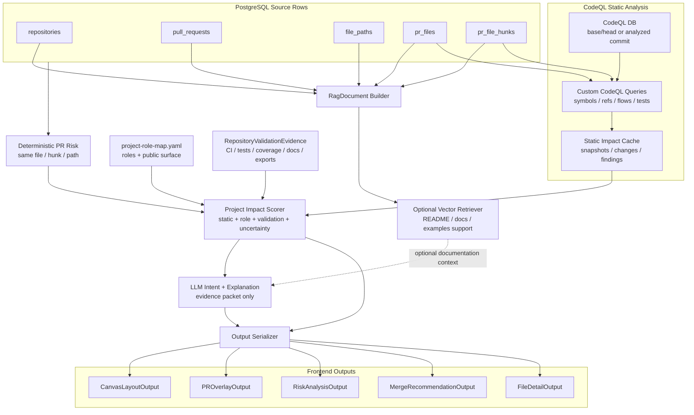
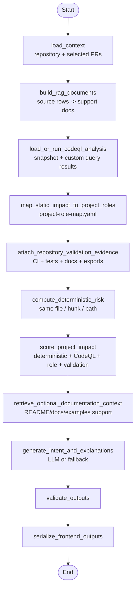

# PR Collision Atlas CodeQL Project Impact RAG Architecture

## 1. Purpose

이 문서는 PR Collision Atlas의 분석 계층을 **오픈소스 Python repository 기준의 CodeQL project impact 분석 구조**로 정의한다.

이 시스템은 일반적인 문서 검색 RAG나 챗봇이 아니다. 목적은 GitHub PR import 데이터, CodeQL 분석 결과, repository 역할 맵, 검증 근거를 함께 사용해 다음 질문에 답하는 것이다.

```text
이 PR은 코드 의미상 무엇을 바꾸는가?
그 변경은 어떤 module, symbol, public API, CLI entrypoint에 닿는가?
그 영역은 repository에서 core 역할인가, 부가 역할인가?
관련 테스트, 문서, 예제, export 근거가 있는가?
리뷰어는 무엇을 먼저 확인해야 하는가?
```

최종 output은 기존 PR Collision Atlas 계약을 유지한다.

- `CanvasLayoutOutput`: 파일/폴더/영향 영역 캔버스 layout
- `PROverlayOutput`: 선택 PR의 파일 변경 overlay
- `RiskAnalysisOutput`: 위험 파일, 위험도, 근거
- `MergeRecommendationOutput`: merge/rebase/review 순서 제안
- `FileDetailOutput`: 파일별 상세 위험 설명과 hunk/static/project/validation 근거

핵심 변경은 판단의 중심이다.

```text
Before:
  query text -> vector similarity -> related documents -> semantic risk bonus

Rejected graph plan:
  changed file/hunk -> 자체 Python/C indexer -> code graph -> graph impact

Current:
  PR source rows
  -> CodeQL static analysis
  -> static impact evidence
  -> project role / public surface mapping
  -> repository validation evidence
  -> project impact scorer
  -> optional docs/examples vector retrieval
  -> LLM intent/explanation reporter
  -> frontend outputs
```

Vector DB와 LLM은 제거하지 않는다. 다만 둘 다 최종 판단 엔진이 아니다.

```text
CodeQL = 정적 코드 의미 분석의 authoritative source
Project role map = core module/public API/CLI/adapter/docs 역할 판단 기준
Repository validation evidence = 테스트, coverage, docs/examples/export 근거
Deterministic PR risk = CodeQL 실패 시에도 남는 기본 근거
Vector retrieval = README/docs/examples 설명 문맥 검색, 기본 OFF
LLM = evidence packet 기반 의도 분류와 설명자
```

상용 서비스 repository에서 실제 운영 신호를 근거로 쓰는 확장 버전은 `docs/commercial-service-rag.md`에 따로 둔다. 이 문서는 오픈소스 Python repository를 기본 대상으로 한다.

## 2. Architecture Decision

### 2.1 Core Decision

PR Collision Atlas의 위험 판단은 다음 흐름을 기준으로 한다.

```text
PostgreSQL PR source rows
  -> CodeQL static analysis
  -> static impact evidence cache
  -> project role mapping
  -> repository validation evidence attachment
  -> project impact scorer
  -> optional documentation retrieval
  -> LLM intent/explanation reporter
  -> frontend serializers
```

역할을 명확히 분리한다.

| Component | Role |
| --- | --- |
| PostgreSQL source rows | repository, PR, file, hunk의 source of truth |
| CodeQL database | 정적 코드 의미 분석의 authoritative source |
| CodeQL custom queries | changed symbol, import/call/reference, data/control-flow, test relation 추출 |
| Static impact cache | CodeQL query result와 PR diff 매핑 결과 저장 |
| Project role map | 코드 영향 범위를 core module/public API/CLI/adapter/docs 역할과 연결 |
| Repository validation evidence | CI result, related tests, coverage hint, docs/examples/export 근거 제공 |
| Project impact scorer | deterministic + CodeQL + project role + validation 근거로 점수 계산 |
| Vector retriever | README/docs/examples/changelog/API docs 설명 문맥 검색, 기본 OFF |
| LLM reporter | 근거 기반 change intent 분류와 설명 생성 |

LLM에게 전체 코드를 던져서 위험도를 묻지 않는다. LLM은 이미 계산된 evidence packet만 읽는다.

### 2.2 CodeQL Authority

이번 범위에서 자체 Python/C indexer는 만들지 않는다.

CodeQL이 담당한다.

- symbol 정의와 참조
- caller/callee 관계
- import/reference 관계
- data-flow/control-flow 관련 근거
- public API와 exported symbol 영향
- CLI entrypoint와 연결되는 symbol 영향
- test file/function relation
- PR diff와 변경 symbol 매핑

CodeQL이 실패하거나 해당 언어를 분석하지 못하면 정적 의미 분석은 `degraded` 상태가 된다. 이 경우 시스템은 자체 call graph를 만들지 않고 기존 PR/file/hunk/path-category 기반 deterministic risk만 사용한다.

### 2.3 Framework Choice

이 프로젝트는 기존 선택을 유지하되 책임을 재배치한다.

| 영역 | 선택 | 역할 |
| --- | --- | --- |
| Workflow orchestration | LangGraph | 고정 분석 pipeline을 state 기반 node로 실행 |
| Source storage | PostgreSQL | PR source rows와 static impact cache 저장 |
| Static analysis | CodeQL CLI + custom queries | 코드 의미/의존성/흐름 분석 |
| Project mapping | `project-role-map.yaml` | repository 역할과 코드/API/entrypoint/docs 매핑 |
| Document/retrieval helpers | LangChain | `Document`, optional Chroma retriever, structured output 사용 |
| Vector cache | Chroma | docs/examples 설명 문맥 검색용 optional cache |
| LLM structured output | LangChain structured output | evidence-bound report JSON 생성 |

LangGraph는 agent loop가 아니다. 분석 버튼을 누르면 정해진 node 순서로 state를 채우는 workflow다.

### 2.4 V1 Scope

v1 scope는 다음으로 고정한다.

```text
PR metadata/hunk risk
+ CodeQL static impact evidence
+ project-role-map.yaml role/public-surface mapping
+ repository validation evidence
+ optional documentation retrieval
+ LLM intent/explanation reporter
```

포함:

- 기존 PR/file/hunk deterministic risk
- CodeQL DB 생성 또는 기존 DB 로드
- custom CodeQL query 실행
- PR diff와 CodeQL 결과의 changed symbol 매핑
- CodeQL 기반 impact path, public surface, test relation evidence
- `project-role-map.yaml` 기반 core/important/internal/low 역할 매핑
- CI/test/coverage/docs/examples/export 근거 공통 입력 계약
- project impact score 계산
- frontend output에 additive evidence 필드 추가

제외:

- 자체 Python/C AST parser
- 자체 call graph extractor
- 자체 symbol graph builder
- CodeQL 없이 정밀 data-flow를 재구현하는 작업
- 상용 서비스 관측 신호를 기본 아키텍처에 포함하는 작업
- 자동 merge conflict resolution
- 코드 자동 수정

### 2.5 Vector DB Authority

Vector DB는 reasoning engine이 아니다. 기본값은 OFF다.

사용 위치:

- README, docs, examples, changelog, API docs에서 관련 설명 문맥 검색
- public API가 사용자 문서에 어떻게 설명되는지 찾기
- LLM 설명에 붙일 supporting document 검색
- file detail에서 관련 사용 예제나 문서 링크를 보여주기

사용하지 않는 위치:

- 호출 관계 판정
- symbol dependency 생성
- public surface 판정의 hard evidence
- core 역할 판정
- hard risk score의 기본 가산점

예시:

```text
CodeQL:
  package.Client.request 변경이 package.Session과 cli.main에 영향을 준다.

Vector retrieval:
  README quickstart와 docs/api.md에서 Client.request가 public API로 설명된 문맥을 찾는다.

Scorer:
  Vector 결과만으로 점수를 올리지 않는다. CodeQL/public-surface/validation 근거가 점수를 만든다.

LLM:
  찾은 문서 문맥을 사용해 "이 변경은 사용자-facing API 설명과 연결된다"라고 설명한다.
```

Semantic retrieval은 기본적으로 위험 점수를 올리지 않는다. 실험 옵션으로 semantic bonus를 켤 수는 있지만, 기본 v1 점수는 deterministic + CodeQL + project role + validation evidence 중심이다.

### 2.6 LLM Authority

LLM은 위험도 단독 판정자가 아니다.

LLM이 하는 일:

- evidence packet 기반 change intent 분류
- static/project/validation/documentation evidence 요약
- 사용자에게 보일 위험 설명 작성
- merge/rebase/review action 문장화
- 빠진 테스트나 수동 리뷰 포인트 제안

LLM이 하지 않는 일:

- CodeQL edge 생성
- impact path 생성
- 실제 호출 관계 판정
- risk score 계산
- hard evidence 낮추기
- 전체 코드베이스 context window 안에서 추론하기

## 3. High-Level Architecture



정신 모델은 다음이다.

```text
PR source rows tell us what changed.
CodeQL tells us what the changed code means and can affect.
Project role map tells us whether that area is core/public/internal/supporting.
Validation evidence tells us whether tests/docs/exports support the change.
Risk scorer turns evidence into priority.
Vector retrieval only finds docs/examples wording for explanations.
LLM explains intent and review focus; it does not invent evidence.
```

## 4. Source Data

기존 import table은 계속 source of truth다.

| Source table | 사용 목적 |
| --- | --- |
| `repositories` | repository boundary, owner/name |
| `pull_requests` | PR title, state, base/head ref, labels, URL |
| `file_paths` | path map, directory hierarchy, path category |
| `pr_files` | PR-file change event, additions/deletions/changes, patch |
| `pr_file_hunks` | old/new line range, hunk header, patch excerpt |
| `raw_payloads` | 필요 시 원본 GitHub payload 확인 |

기존 PR metadata graph 성격의 정보도 유지한다.

```text
PR -> changed file -> hunk
PR -> label
file -> directory
file -> path category
hunk -> hunk overlap/proximity
```

이 source data는 CodeQL이 없어도 동작해야 하는 기본 위험 분석의 근거다. CodeQL은 이 데이터를 대체하지 않고, PR diff를 코드 의미와 연결하는 정적 분석 계층으로 추가된다.

## 5. CodeQL Static Analysis Layer

### 5.1 Why CodeQL Exists

파일 수나 vector similarity는 코드 파급력을 직접 말해주지 않는다.

```text
1개 파일의 core parser 변경
  -> project impact high

30개 파일의 docs/example rename
  -> integration risk low-to-medium
```

CodeQL 계층은 다음 질문에 답하기 위해 존재한다.

```text
이 PR이 바꾼 symbol은 무엇인가?
그 symbol을 누가 call/import/reference 하는가?
변경이 public API, CLI entrypoint, core module, test까지 이어지는가?
관련 테스트 파일이나 테스트 함수는 무엇인가?
```

### 5.2 CodeQL Snapshot Policy

CodeQL 분석 결과는 repository와 commit 기준으로 snapshot된다.

| Concept | Meaning |
| --- | --- |
| `repository_id` | repository boundary |
| `commit_sha` | 분석 대상 commit |
| `codeql_database_uri` | CodeQL DB 위치 또는 artifact key |
| `query_pack_version` | custom query pack 버전 |
| `status` | `ready`, `partial`, `failed` |
| `created_at` | snapshot 생성 시각 |

Rules:

- `ready` snapshot만 hard static evidence로 사용한다.
- `partial` snapshot은 사용 가능하지만 uncertainty를 추가한다.
- `failed` snapshot은 CodeQL impact를 비활성화하고 deterministic risk로 fallback한다.
- snapshot은 `repository_id + commit_sha + query_pack_version` 조합으로 식별한다.

### 5.3 Static Impact Cache Tables

PostgreSQL은 자체 graph indexer의 저장소가 아니라 CodeQL 분석 결과 cache다.

#### `static_analysis_snapshots`

| Column | Meaning |
| --- | --- |
| `id` | row id |
| `repository_id` | repository boundary |
| `commit_sha` | analyzed commit |
| `codeql_database_uri` | CodeQL DB artifact or path |
| `query_pack_version` | CodeQL query pack version |
| `status` | `ready`, `partial`, `failed` |
| `metadata` | JSONB details |
| `created_at` | snapshot time |

#### `pr_codeql_changes`

| Column | Meaning |
| --- | --- |
| `id` | row id |
| `pull_request_id` | PR that changed the symbol |
| `file_path_id` | changed file |
| `hunk_id` | related hunk when known |
| `snapshot_id` | CodeQL snapshot used for mapping |
| `symbol_key` | stable CodeQL-backed symbol id |
| `symbol_name` | function/class/method/type/name |
| `symbol_kind` | function, class, method, module, type, field, query-specific kind |
| `change_type` | `added`, `modified`, `deleted`, `signature_changed`, `behavior_changed`, `unknown` |
| `confidence` | PR hunk to CodeQL symbol mapping confidence |
| `metadata` | JSONB CodeQL result details |

#### `static_impact_findings`

| Column | Meaning |
| --- | --- |
| `id` | row id |
| `repository_id` | repository boundary |
| `pull_request_id` | originating PR |
| `file_path_id` | primary changed or affected file |
| `snapshot_id` | CodeQL snapshot |
| `finding_type` | `reverse_dependency`, `data_flow`, `control_flow`, `public_surface`, `test_relation`, `uncertainty` |
| `start_symbol_key` | changed symbol |
| `end_symbol_key` | affected symbol, public surface, or test |
| `impact_path` | JSONB ordered path |
| `affected_paths` | JSONB file paths reached |
| `affected_roles` | JSONB project role ids or tags reached |
| `related_tests` | JSONB test identifiers when found |
| `confidence` | 0-1 confidence |
| `query_id` | CodeQL query id |
| `query_version` | CodeQL query version |
| `metadata` | JSONB raw and normalized details |

### 5.4 CodeQL Query Responsibilities

Custom CodeQL queries should emit only evidence they can justify.

| Query family | Expected evidence |
| --- | --- |
| changed symbol mapping | PR hunk/file range to CodeQL symbol |
| reverse references | callers/importers/references of changed symbols |
| data-flow | value path from changed source to affected sink |
| control-flow | branch or guard changes affecting reachable behavior |
| public surface | exported symbol, package API, module boundary, CLI entrypoint |
| test relation | test files or test functions referencing changed/affected code |

Confidence rules:

```text
confidence = 1.0
  CodeQL-resolved symbol/ref/flow with precise location

confidence = 0.7-0.9
  CodeQL result is precise, but PR hunk-to-symbol mapping is approximate

confidence = 0.5-0.7
  query identifies a likely candidate path with partial location precision

confidence < 0.5
  uncertainty signal only; do not use as hard impact
```

### 5.5 Static Impact Contract

Graph retrieval is replaced by CodeQL-backed static impact retrieval.

#### `StaticImpactQuery`

```json
{
  "repository_id": 1,
  "selected_pr_ids": [10, 12],
  "focus_file_path_id": 33,
  "snapshot_id": 901,
  "changed_symbol_keys": [
    "codeql:symbol:src/package/client.py:Client.request",
    "codeql:symbol:src/package/config.py:get_settings"
  ],
  "max_depth": 4,
  "finding_types": [
    "reverse_dependency",
    "data_flow",
    "control_flow",
    "public_surface",
    "test_relation"
  ],
  "include_tests": true
}
```

Rules:

- `repository_id` is required.
- selected PR analysis uses `selected_pr_ids`.
- file detail view may set `focus_file_path_id`.
- `changed_symbol_keys` comes from `pr_codeql_changes`.
- traversal depth is a query/result limit, not an invitation to build an independent call graph.
- low-confidence findings are returned as uncertainty signals, not hard proof.

#### `StaticImpactPath`

```json
{
  "source_kind": "codeql",
  "finding_type": "public_surface",
  "start_symbol_key": "codeql:symbol:src/package/client.py:Client.request",
  "end_symbol_key": "codeql:public_api:package.Client.request",
  "path": [
    "codeql:symbol:src/package/client.py:Client.request",
    "codeql:module:src/package/__init__.py",
    "codeql:public_api:package.Client.request"
  ],
  "edge_types": ["exports", "public_api"],
  "depth": 2,
  "confidence": 0.91,
  "affected_file_path_ids": [33, 41],
  "affected_roles": ["public_api"],
  "related_tests": ["test:tests/test_client.py::test_request"],
  "query_id": "pr-impact/public-surface"
}
```

#### `StaticImpactEvidence`

```json
{
  "source": "codeql",
  "finding_type": "reverse_dependency",
  "path": [
    "codeql:symbol:src/package/client.py:Client.request",
    "codeql:symbol:src/package/session.py:Session.send"
  ],
  "confidence": 0.88,
  "query_id": "pr-impact/reverse-dependencies",
  "reason": "changed client request symbol is referenced by session send path"
}
```

### 5.6 Failure And Degraded Mode

CodeQL failure should not break the analysis pipeline.

| Failure | Behavior |
| --- | --- |
| CodeQL DB missing | mark static analysis `degraded`; use deterministic risk only |
| CodeQL query fails | store query error; continue with successful query results |
| snapshot partial | use findings but add uncertainty |
| language unsupported | mark files as static-analysis-uncovered |
| PR hunk cannot map to symbol | keep file-level deterministic finding and add uncertainty |

The system must not silently replace CodeQL with an ad hoc parser. If CodeQL cannot provide static evidence, the report should say that static impact evidence is unavailable or partial.

## 6. Project Role / Public Surface Layer

### 6.1 Why Project Role Map Exists

CodeQL can say what code depends on what changed. It does not know whether the affected code is a core library path, public API, CLI entrypoint, adapter, test helper, or docs/example area.

```text
CodeQL:
  Client.request affects Session.send and package.__init__ export.

Project role map:
  Client.request belongs to public_api and core_engine, criticality=core.
```

v1 uses a repository-local configuration file such as `project-role-map.yaml`. It is easier to inspect and evolve than a database schema at this stage.

### 6.2 Project Role Map Shape

```yaml
version: 1
roles:
  - role_id: core_engine
    name: Core Engine
    criticality: core
    paths:
      - src/package/core/**
      - src/package/runtime/**
    public_api:
      - package.run
      - package.Client
    risk_tags:
      - execution_core
      - correctness

  - role_id: public_api
    name: Public API
    criticality: core
    paths:
      - src/package/__init__.py
      - src/package/client.py
    public_api:
      - package.Client
      - package.Client.request
    docs:
      - README.md
      - docs/api.md
    risk_tags:
      - public_api
      - backwards_compatibility

  - role_id: cli_entrypoint
    name: CLI Entrypoint
    criticality: important
    entrypoints:
      - package.cli:main
    paths:
      - src/package/cli.py
    risk_tags:
      - cli

  - role_id: adapters
    name: Adapters
    criticality: important
    paths:
      - src/package/adapters/**

  - role_id: tests
    name: Tests
    criticality: internal
    paths:
      - tests/**

  - role_id: docs_examples
    name: Docs And Examples
    criticality: low
    paths:
      - docs/**
      - examples/**
      - README.md
```

### 6.3 Criticality Levels

| Criticality | Meaning |
| --- | --- |
| `core` | core execution path, public API, compatibility-sensitive package surface |
| `important` | CLI, adapters, commonly imported internal modules, integration boundaries |
| `internal` | tests, scripts, internal tooling |
| `low` | docs, examples, comments, low-risk supporting files |

### 6.4 Public Surface Signals

Public surface can be identified by:

- `project-role-map.yaml` explicit `public_api`
- CodeQL export/reference evidence
- package `__init__.py` exports
- `pyproject.toml` scripts and entrypoints
- docs/API references from optional documentation retrieval
- README or examples usage context

Docs/examples references are explanatory support. Hard public-surface evidence should come from CodeQL, packaging metadata, or explicit project role mapping.

### 6.5 Mapping Rules

Static impact findings map to project roles by:

- changed file path
- affected file path
- symbol key or symbol name
- public API name
- entrypoint name
- test relation
- risk tag from CodeQL finding
- explicit metadata in `project-role-map.yaml`

When multiple roles match, keep all matches and use the highest criticality for scoring. Ambiguous matches should add uncertainty rather than inventing a single owner.

## 7. Repository Validation Evidence

### 7.1 Scope

Open-source repository impact should be judged by repository-local validation and exposure evidence.

This layer does not require production observability. It focuses on whether the changed code is covered, exported, documented, or widely referenced inside the repository.

### 7.2 RepositoryValidationEvidence

```json
{
  "repository_id": 1,
  "commit_sha": "abc123",
  "collected_at": "2026-06-15T00:00:00Z",
  "signals": [
    {
      "signal_type": "ci_test_result",
      "target": "tests/test_client.py::test_request",
      "status": "passed",
      "confidence": 1.0
    },
    {
      "signal_type": "coverage_hint",
      "target": "src/package/client.py:Client.request",
      "value": 0.82,
      "confidence": 0.7
    },
    {
      "signal_type": "docs_reference",
      "target": "package.Client.request",
      "document_id": "docs:api.md",
      "confidence": 0.8
    },
    {
      "signal_type": "package_export",
      "target": "package.Client",
      "source": "src/package/__init__.py",
      "confidence": 0.95
    },
    {
      "signal_type": "entrypoint_reference",
      "target": "package.cli:main",
      "source": "pyproject.toml",
      "confidence": 0.95
    },
    {
      "signal_type": "internal_reference_count",
      "target": "src/package/client.py:Client.request",
      "value": 18,
      "confidence": 0.9
    }
  ]
}
```

### 7.3 Validation Signal Types

| Signal | Effect |
| --- | --- |
| `ci_test_result` | related passing tests can reduce verification risk |
| `coverage_hint` | related coverage can reduce uncertainty |
| `test_missing` | expected tests missing raises verification risk |
| `docs_reference` | supports explanation that symbol/API is user-visible |
| `examples_reference` | supports explanation that API appears in examples |
| `package_export` | raises public-surface importance |
| `entrypoint_reference` | raises CLI/public command importance |
| `internal_reference_count` | high reference count raises blast radius |
| `downstream_reference` | downstream usage raises compatibility caution when available |

Validation evidence cannot override CodeQL hard evidence. It changes exposure, public-surface confidence, and verification confidence.

## 8. Algorithms

### 8.1 Hunk Overlap

Existing hunk logic remains.

```text
range_start = new_start
range_end = new_start + max(new_lines, 1)
range = [range_start, range_end)
```

Two hunks overlap when:

```text
left.start < right.end and right.start < left.end
```

Same-file hunk overlap remains a hard high-risk signal.

### 8.2 Hunk Proximity

```text
distance = min(abs(a.end - b.start), abs(b.end - a.start))
```

| Distance | Signal |
| --- | --- |
| `0` | overlap |
| `1-20 lines` | near hunk |
| `21-80 lines` | same file proximity |
| `> 80 lines` | weak same-file signal |

### 8.3 Path Category Classification

The existing path category rule remains as deterministic fallback and supplemental risk signal.

| Category | Path pattern |
| --- | --- |
| `migration` | `migration`, `migrations`, `schema`, `.sql` |
| `config` | `.env`, `config`, `deploy`, `docker`, `k8s`, `yaml`, `yml`, `toml` |
| `auth` | `auth`, `login`, `permission`, `token`, `session` |
| `api` | `api`, `controller`, `route`, `schema`, `response`, `request` |
| `dependency` | `lock`, `package-lock`, `yarn.lock`, `pnpm-lock`, `requirements` |
| `docs` | `readme`, `docs`, `.md`, `.rst` |
| `test` | `test`, `tests`, `spec`, `snapshot` |

### 8.4 Changed Symbol Detection

Changed symbol detection is CodeQL-backed.

Process:

1. Use PR source rows to identify changed files and hunks.
2. Run CodeQL query results against analyzed commit.
3. Map hunk line ranges to CodeQL symbols by location.
4. Classify change type from diff and CodeQL symbol metadata.
5. Store mapping in `pr_codeql_changes` with confidence.

Change types:

```text
added
modified
deleted
signature_changed
behavior_changed
unknown
```

Rules:

- signature or exported contract changes receive higher risk.
- hunk-to-symbol mapping below confidence threshold becomes uncertainty.
- file-level changes without symbol mapping still remain deterministic PR risk.
- no non-CodeQL parser should create replacement symbol edges.

### 8.5 Static Impact Retrieval

Static impact starts from CodeQL-mapped changed symbols and reads CodeQL-backed findings.

```text
changed symbol
  -> CodeQL reverse references / callers / importers
  -> CodeQL data-flow or control-flow evidence
  -> public API / CLI / core module / related tests
  -> project role mapping
```

Defaults:

- max depth: `4`
- ignore findings with confidence below `0.5` for hard impact
- include low-confidence findings as uncertainty signals
- dedupe paths by end symbol and shortest high-confidence path
- keep `query_id` and `query_version` on every static evidence item

### 8.6 Project Impact Scoring

Final scoring combines five evidence families.

```text
final_score =
  deterministic_pr_score
  + static_blast_radius_score
  + project_role_score
  + public_surface_score
  + change_risk_score
  + uncertainty_score
  - verification_score
```

#### Static Blast Radius

| Signal | Score |
| --- | ---: |
| exported/public symbol changed | `+12` |
| CodeQL reverse dependency finding exists | `+5` per affected file, capped at `+25` |
| CodeQL data/control-flow finding exists | `+15` |
| related test found by CodeQL | `-8` |
| high internal reference count | `+10` |

#### Project Role

| Signal | Score |
| --- | ---: |
| matched `core` role | `+25` |
| matched `important` role | `+15` |
| matched `internal` role | `+6` |
| matched `low` role | `+0` |
| correctness/backwards-compatibility risk tag | `+12` |

#### Public Surface

| Signal | Score |
| --- | ---: |
| package export affected | `+15` |
| CLI entrypoint affected | `+12` |
| docs/API reference exists | `+8` |
| examples reference exists | `+5` |
| downstream reference exists when available | `+15` |

#### Change Risk

| Signal | Score |
| --- | ---: |
| config/dependency/build file touched | `+15` |
| high change volume | `+10` |
| signature changed | `+12` |
| behavior changed | `+10` |
| test-only or docs-only path | cap or discount unless static impact says otherwise |

#### Uncertainty

| Signal | Score |
| --- | ---: |
| CodeQL snapshot partial | `+8` |
| CodeQL unsupported/unavailable for changed file | `+8` |
| hunk could not map to symbol | `+6` |
| ambiguous project role mapping | `+5` |
| validation evidence missing for core/public surface | `+5` |

#### Verification

| Signal | Score |
| --- | ---: |
| related passing CI/test evidence | `-8` |
| related coverage hint >= 0.8 | `-5` |
| expected test missing for core/static impact | `+8` |

Risk level:

| Score | Risk level |
| --- | --- |
| `0-24` | `low` |
| `25-49` | `medium` |
| `50-79` | `high` |
| `80+` | `critical` |

Public surface level:

| Level | Meaning |
| --- | --- |
| `public` | package export, public API, or CLI entrypoint affected |
| `core_internal` | core internal module or widely referenced internal symbol affected |
| `internal` | internal tool/test/adapter path affected |
| `low` | docs, examples, comments, isolated low-risk area |

Semantic retrieval:

- default: OFF
- when enabled: supporting documentation context only
- semantic evidence cannot raise or lower hard evidence by default

## 9. RiskFinding Extensions

Existing `RiskFinding` remains file-centered for frontend compatibility. Project impact fields are additive.

```json
{
  "file_path_id": 33,
  "path": "src/package/client.py",
  "score": 82,
  "risk_level": "critical",
  "related_prs": [10, 12],
  "reasons": [
    "CodeQL found that changed Client.request is exported as public API.",
    "The affected symbol appears in README/API documentation and related tests."
  ],
  "static_impact_paths": [],
  "affected_project_roles": [],
  "public_surface_level": "public",
  "validation_signals": [],
  "documentation_context": [],
  "change_intent": "unknown",
  "uncertainty_signals": [],
  "codeql_queries": []
}
```

New fields:

| Field | Meaning |
| --- | --- |
| `static_impact_paths` | CodeQL-backed impact paths from changed symbols |
| `affected_project_roles` | matched roles from `project-role-map.yaml` |
| `public_surface_level` | `public`, `core_internal`, `internal`, or `low` |
| `validation_signals` | tests, coverage, exports, docs/examples evidence |
| `documentation_context` | optional vector/lexical matches from README/docs/examples |
| `change_intent` | LLM-classified intent when available |
| `uncertainty_signals` | partial CodeQL/role/validation facts |
| `codeql_queries` | query ids and versions that produced static evidence |

Frontend can ignore these fields until UI support is added.

## 10. RAG Document Contract

RAG documents still exist, but they are not the source of code dependency truth.

### 10.1 RagDocument

```json
{
  "document_id": "diff_hunk:501",
  "document_type": "diff_hunk",
  "repository_id": 1,
  "pull_request_id": 10,
  "file_path_id": 33,
  "path": "src/package/client.py",
  "title": "PR #1201 hunk src/package/client.py:42",
  "content": "short retrieval text",
  "metadata": {
    "pr_number": 1201,
    "status": "modified",
    "new_start": 42,
    "new_lines": 12,
    "path_categories": ["code"]
  }
}
```

Rules:

- `document_id` must be stable.
- patch 전체를 embedding하지 않는다.
- document content is for retrieval/report support.
- dependency truth comes from CodeQL static impact evidence.
- documentation context can support explanation but not hard dependency.

### 10.2 Document Types

| Document type | Source | Role |
| --- | --- | --- |
| `repository_summary` | repository + aggregate paths | selected repository context |
| `pr_summary` | pull_request + changed paths | PR overview |
| `pr_file_change` | pr_files + file_paths | file-level change evidence |
| `diff_hunk` | pr_file_hunks | line range and patch excerpt evidence |
| `path_context` | file_paths + aggregates | layout and category context |
| `documentation_context` | README/docs/examples/changelog/API docs | optional explanation context |

## 11. LLM Usage

### 11.1 LLM Input

LLM receives compact evidence packets.

Included:

- selected PR metadata
- changed files/hunks
- CodeQL changed symbols
- CodeQL static impact paths
- affected project roles and criticality
- public surface signals
- validation evidence
- deterministic risk signals
- short patch excerpts
- optional documentation context from vector/lexical retrieval

Excluded:

- entire repository
- full patch set
- unrelated files
- raw GitHub payloads
- repository outside selected boundary
- unbounded CodeQL raw output

### 11.2 LLM Structured Output

```json
{
  "change_type": "bug_fix",
  "public_surface_level": "public",
  "risk_level": "high",
  "confidence": 0.78,
  "evidence": [
    "CodeQL found changed Client.request is exported through package.__init__.",
    "project-role-map.yaml marks public_api as core.",
    "docs/api.md describes Client.request as part of the public API."
  ],
  "review_focus": [
    "Confirm Client.request remains backward compatible.",
    "Review related Session.send behavior and error handling."
  ],
  "recommended_tests": [
    "Run tests/test_client.py.",
    "Run CLI integration tests if cli.main uses Client.request."
  ]
}
```

Allowed `change_type` values:

```text
intended_feature_change
bug_fix
refactor
suspicious_behavior_change
unknown
```

Allowed `public_surface_level` values:

```text
public
core_internal
internal
low
```

### 11.3 LLM Not Used

LLM must not:

- create CodeQL edges
- create impact paths
- judge function call relationships alone
- compute risk score
- lower deterministic or CodeQL hard evidence
- claim safety without static/test/export evidence
- process whole codebase dumps as the main strategy

### 11.4 Failure Rule

LLM failure should not break analysis.

- deterministic + CodeQL + role/validation risk output remains
- fallback summary is generated without LLM
- frontend output schema remains stable

Semantic retrieval failure is not CodeQL failure.

- CodeQL/project impact path can run without `OPENAI_API_KEY`.
- Optional semantic retrieval may fail fast only when explicitly enabled.

## 12. LangGraph Workflow



### 12.1 Analysis State

```json
{
  "repository_id": 1,
  "selected_pr_ids": [10, 12],
  "focus_file_path_id": 33,
  "use_llm": true,
  "use_semantic_retrieval": false,
  "source_context": {},
  "rag_documents": [],
  "codeql_snapshot": {},
  "static_impact_results": [],
  "project_role_matches": [],
  "repository_validation_evidence": {},
  "deterministic_findings": [],
  "project_impact_findings": [],
  "documentation_context": [],
  "llm_analysis": {},
  "outputs": {},
  "errors": []
}
```

### 12.2 Node Responsibilities

| Node | Responsibility | State output |
| --- | --- | --- |
| `load_context` | DB에서 repository, PR, file, hunk row를 가져온다 | `source_context` |
| `build_rag_documents` | optional retrieval/report용 documents 생성 | `rag_documents` |
| `load_or_run_codeql_analysis` | CodeQL snapshot을 로드하거나 query를 실행한다 | `codeql_snapshot`, `static_impact_results` |
| `map_static_impact_to_project_roles` | CodeQL impact를 `project-role-map.yaml` role에 매핑한다 | `project_role_matches` |
| `attach_repository_validation_evidence` | CI/test/coverage/docs/export evidence를 붙인다 | `repository_validation_evidence` |
| `compute_deterministic_risk` | same file, hunk overlap, path category 계산 | `deterministic_findings` |
| `score_project_impact` | deterministic + CodeQL + role + validation 점수 병합 | `project_impact_findings` |
| `retrieve_optional_documentation_context` | 필요 시 README/docs/examples supporting context 조회 | `documentation_context` |
| `generate_intent_and_explanations` | LLM 또는 fallback으로 의도와 설명 생성 | `llm_analysis` |
| `validate_outputs` | schema 누락 방어 | `llm_analysis` |
| `serialize_frontend_outputs` | frontend JSON 계약 생성 | `outputs` |

## 13. Frontend Output Contracts

Existing contracts remain stable. CodeQL/project/validation evidence is added as optional extension fields.

### 13.1 CanvasLayoutOutput

```json
{
  "repository_id": 1,
  "layout_version": "temporary-v1",
  "nodes": [
    {
      "id": "file:33",
      "node_type": "file",
      "file_path_id": 33,
      "path": "src/package/client.py",
      "label": "client.py",
      "group": "src/package",
      "x": 120,
      "y": 300,
      "width": 120,
      "height": 32,
      "semantic_cluster": "client",
      "base_style": {
        "opacity": 1.0,
        "label_color": "default"
      }
    },
    {
      "id": "role:public_api",
      "node_type": "project_role",
      "label": "Public API",
      "criticality": "core"
    }
  ],
  "edges": [
    {
      "id": "static:file:33-role:public_api",
      "edge_type": "affects_project_role",
      "source": "file:33",
      "target": "role:public_api",
      "weight": 0.91,
      "reason": "CodeQL impact maps to public API role"
    }
  ]
}
```

### 13.2 RiskAnalysisOutput

```json
{
  "analysis_id": "temporary-v1:repo-1:prs-10-12",
  "repository_id": 1,
  "selected_pr_ids": [10, 12],
  "summary": "Selected PRs have high project impact around package.Client.",
  "risk_counts": {
    "low": 1,
    "medium": 2,
    "high": 1,
    "critical": 0
  },
  "files": [
    {
      "file_path_id": 33,
      "path": "src/package/client.py",
      "node_id": "file:33",
      "risk_level": "high",
      "score": 72,
      "public_surface_level": "public",
      "change_intent": "bug_fix",
      "related_prs": [10, 12],
      "reasons": [
        "CodeQL found a public API export path from changed Client.request.",
        "The affected symbol is documented and has related tests."
      ],
      "evidence": [
        {
          "source": "codeql",
          "finding_type": "public_surface",
          "path": [
            "codeql:symbol:src/package/client.py:Client.request",
            "codeql:module:src/package/__init__.py",
            "codeql:public_api:package.Client.request"
          ],
          "confidence": 0.91,
          "query_id": "pr-impact/public-surface",
          "reason": "changed symbol is exported as public package API"
        }
      ],
      "static_impact_paths": [],
      "affected_project_roles": [
        {
          "role_id": "public_api",
          "criticality": "core",
          "match_reason": "affected package export package.Client.request"
        }
      ],
      "validation_signals": [],
      "documentation_context": [],
      "uncertainty_signals": [],
      "codeql_queries": [
        "pr-impact/public-surface@v1"
      ]
    }
  ]
}
```

### 13.3 MergeRecommendationOutput

Merge recommendations should prefer CodeQL/project-role-backed ordering.

```json
{
  "recommendation_id": "temporary-v1:repo-1:prs-10-12",
  "repository_id": 1,
  "selected_pr_ids": [10, 12],
  "recommended_order": [
    {
      "pull_request_id": 10,
      "reason": "This PR changes a public API used by core client/session paths.",
      "required_before": [12],
      "risk_if_delayed": "Consumer PR may be reviewed against stale public API behavior."
    }
  ],
  "blocking_files": [
    {
      "path": "src/package/client.py",
      "risk_level": "high",
      "public_surface_level": "public",
      "related_prs": [10, 12]
    }
  ],
  "recommended_actions": [
    {
      "action": "manual_review",
      "file_path": "src/package/client.py",
      "reason": "Review CodeQL impact paths and related tests before merge.",
      "confidence": "medium",
      "evidence": ["CodeQL public surface path", "core project role"]
    }
  ],
  "llm_summary": "Review the Client.request behavior before dependent PRs."
}
```

Allowed action values remain:

- `merge_first`
- `merge_after`
- `rebase_before_merge`
- `rebase_after_merge`
- `manual_review`
- `split_pr`
- `run_tests`
- `defer`

### 13.4 FileDetailOutput

File detail should show CodeQL/project/validation evidence beside hunk evidence.

```json
{
  "analysis_id": "temporary-v1:repo-1:prs-10-12",
  "repository_id": 1,
  "file_path_id": 33,
  "path": "src/package/client.py",
  "risk_level": "high",
  "public_surface_level": "public",
  "related_prs": [10, 12],
  "conflict_points": [],
  "static_explanation": {
    "source": "codeql",
    "impact_paths": [
      {
        "path": [
          "codeql:symbol:src/package/client.py:Client.request",
          "codeql:public_api:package.Client.request"
        ],
        "finding_type": "public_surface",
        "confidence": 0.91,
        "query_id": "pr-impact/public-surface"
      }
    ],
    "affected_roles": ["public_api"],
    "uncertainty_signals": []
  },
  "project_explanation": {
    "affected_project_roles": [
      {
        "role_id": "public_api",
        "name": "Public API",
        "criticality": "core"
      }
    ]
  },
  "validation_explanation": {
    "signals": [
      {
        "signal_type": "ci_test_result",
        "target": "tests/test_client.py::test_request",
        "status": "passed"
      },
      {
        "signal_type": "docs_reference",
        "target": "package.Client.request",
        "document_id": "docs:api.md"
      }
    ]
  },
  "rag_explanation": {
    "summary": "Optional documentation support only.",
    "supporting_documents": ["docs:api.md", "diff_hunk:501"]
  }
}
```

## 14. Storage And Cache Strategy

| Storage | Role |
| --- | --- |
| PostgreSQL source tables | PR/file/hunk source rows |
| PostgreSQL static analysis cache | CodeQL snapshots, changed symbols, static impact findings |
| `project-role-map.yaml` | project role, public surface, and criticality mapping |
| RepositoryValidationEvidence input | CI/test/coverage/docs/export evidence |
| `RagDocument` in memory | support docs for optional retrieval/reporting |
| `.chroma/pr_collision_rag` | optional vector cache for documentation context |

Chroma is not the source of dependency truth. CodeQL results are not stored as a generic hand-built graph; they are stored as query-backed static impact evidence.

### 14.1 CodeQL Cache Identity

```text
cache_key =
  repository_id
  + commit_sha
  + codeql_database_uri
  + query_pack_version
  + query_id
```

Rules:

- query results must keep `query_id` and `query_version`
- cache invalidates when commit or query pack changes
- partial query failure does not invalidate successful query results
- raw CodeQL result can be stored in metadata, but normalized fields drive scoring

### 14.2 Chroma Cache Policy

Chroma cache remains optional and defaults to OFF.

Cache identity:

```text
cache_key = document_id + content_hash + embedding_model
```

Use:

- README/docs/examples/changelog/API docs support search
- report context
- file detail documentation context

Non-use:

- risk score by default
- call/dependency truth
- code meaning proof
- project role proof
- public surface hard proof

## 15. Testing Plan

### 15.1 CodeQL Result Tests

- CodeQL snapshot status distinguishes `ready`, `partial`, and `failed`.
- `pr_codeql_changes` maps PR hunks to CodeQL symbols with confidence.
- static impact findings preserve `query_id`, `query_version`, confidence, and path.
- low-confidence CodeQL findings become uncertainty, not hard impact.
- CodeQL failure falls back to deterministic hunk/path risk.

### 15.2 Project Role Map Tests

- file path matches map to configured roles.
- public API matches map to configured roles.
- CLI entrypoint matches map to configured roles.
- multiple matching roles are retained.
- `core` role raises project impact more than `internal` or `low`.
- ambiguous mapping adds uncertainty.

### 15.3 Repository Validation Evidence Tests

- related passing CI/test evidence applies verification discount.
- related coverage hint reduces uncertainty.
- missing expected test for core/static impact raises verification risk.
- package export raises public-surface importance.
- docs/examples references populate documentation context but do not create hard dependency.
- validation evidence cannot remove CodeQL hard evidence.

### 15.4 Risk Algorithm Tests

- same-file hunk overlap remains high or above without LLM.
- CodeQL impact path can raise risk even across different files.
- public API/export evidence can raise a single-file change to high.
- docs-only path without CodeQL/project-role impact remains low.
- semantic retrieval does not raise score by default.
- CodeQL unavailable state is visible in errors or uncertainty signals.

### 15.5 LLM / Structured Output Tests

- LLM output validates against schema.
- LLM classifies `change_type` only from evidence packet.
- LLM failure returns deterministic + CodeQL/project/validation fallback output.
- LLM cannot lower deterministic or CodeQL hard evidence.
- LLM evidence bundle contains compact CodeQL paths, not full repository code.

### 15.6 Frontend Contract Tests

- existing output keys remain stable.
- new CodeQL/project/validation fields are additive.
- frontend can render risk output without understanding new fields.
- file detail can show static evidence when present and hunk-only evidence when absent.

## 16. Implementation Order

Current implementation already has:

1. `RagDocument` builder from DB rows
2. deterministic hunk/path risk engine
3. lexical/semantic retrieval interfaces
4. LangGraph state and node skeleton
5. LLM/fallback structured output
6. frontend-facing serializers for risk/recommendation/detail

Next implementation order:

1. Add static analysis cache tables: `static_analysis_snapshots`, `pr_codeql_changes`, `static_impact_findings`.
2. Add CodeQL snapshot loader/runner interface.
3. Add custom CodeQL query result parser and normalizer.
4. Add PR hunk to CodeQL symbol mapping.
5. Add `StaticImpactQuery`, `StaticImpactPath`, and `StaticImpactEvidence` models.
6. Add `load_or_run_codeql_analysis` LangGraph node.
7. Add `project-role-map.yaml` parser and `map_static_impact_to_project_roles` node.
8. Add `RepositoryValidationEvidence` models and `attach_repository_validation_evidence` node.
9. Replace semantic score merge with `score_project_impact`.
10. Move semantic retrieval after project scoring as optional documentation support.
11. Update LLM evidence bundle to include CodeQL/project/validation evidence and change intent schema.
12. Extend frontend output serializers with additive fields.

## 17. Non-Goals

Current CodeQL project impact plan excludes:

- 자체 Python/C indexer
- 자체 AST parser
- 자체 call graph 구현
- CodeQL 없는 정밀 data-flow 재구현
- 상용 서비스 관측 신호를 기본 오픈소스 문서에 포함하는 것
- actual merge execution
- automatic conflict resolution
- code auto-modification
- repository-crossing historical search
- persisted analysis history UI
- manual canvas layout editing
- LLM-only risk judgment

Core rule:

```text
Risk should be evidence-bound to source rows, CodeQL findings,
project role mappings, and repository validation signals.
```
