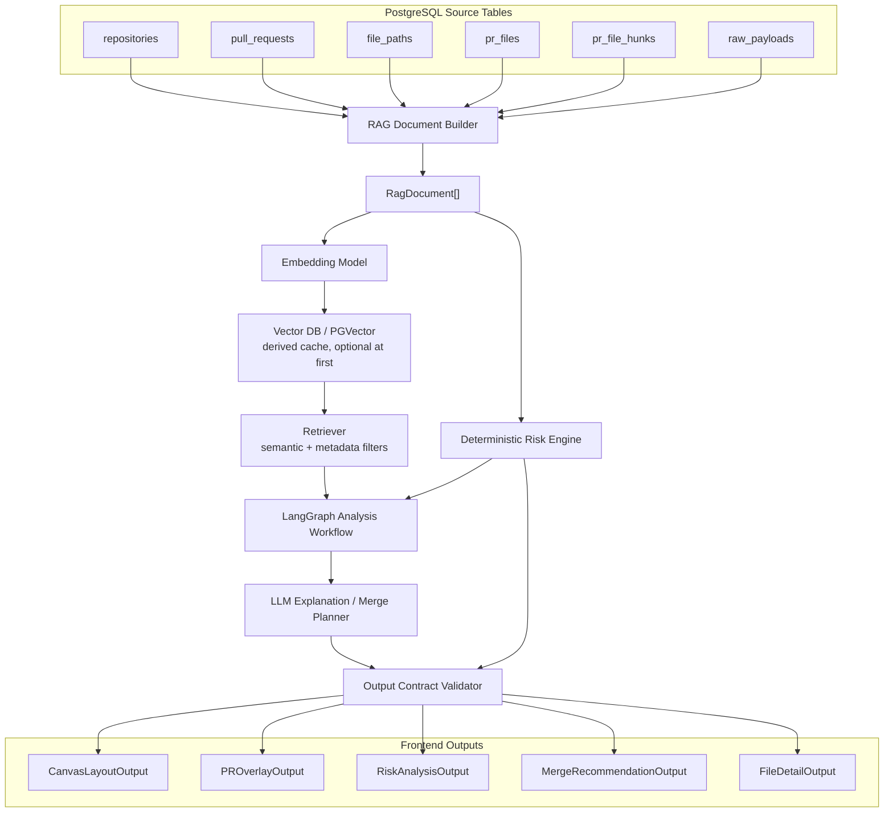
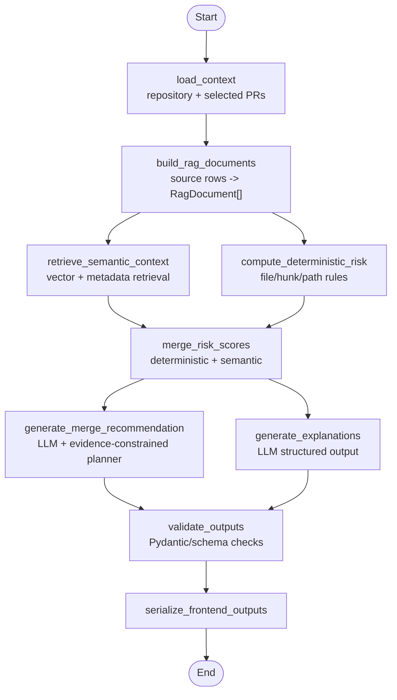

# PR Collision Atlas RAG Architecture Plan

## 1. Purpose

이 문서는 PR Collision Atlas의 RAG/분석 계층을 구현 가능한 수준으로 고정하기 위한 설계 문서다.

이 시스템의 목적은 일반적인 질문 답변 챗봇을 만드는 것이 아니다. 목적은 기존 GitHub PR import 데이터에서 `repository`, `PR`, `file`, `diff hunk`, `path context`를 추출하고, 사용자가 원하는 프런트 동작에 맞는 구조화된 output을 만드는 것이다.

RAG/분석 계층이 만들어야 하는 최종 output은 다음이다.

- `CanvasLayoutOutput`: Figma 같은 2D 파일/폴더 캔버스
- `PROverlayOutput`: 선택 PR의 파일 변경 overlay
- `RiskAnalysisOutput`: 위험 파일, 위험도, 근거
- `MergeRecommendationOutput`: 어떤 PR을 어떤 순서로 merge/rebase/review하면 좋은지
- `FileDetailOutput`: 파일별 상세 위험 설명과 코드/hunk 근거

프런트는 이 output을 소비한다. 프런트가 DB 구조나 RAG 내부 동작을 직접 알아야 하면 안 된다.

## 2. Architecture Decision

### 2.1 Framework Choice

이 프로젝트는 **LangGraph + LangChain** 조합을 사용한다.

| 영역 | 선택 | 이유 |
| --- | --- | --- |
| Workflow orchestration | LangGraph | 상태 기반 graph로 고정된 분석 단계를 관리하기 좋다. |
| Document / retriever components | LangChain | document, embedding, retriever, PGVector, structured output을 구성요소로 쓰기 좋다. |
| Vector storage | PGVector via LangChain integration | PostgreSQL 중심 구조와 잘 맞고, embedding cache가 필요할 때 확장 가능하다. |
| LLM structured output | LangChain structured output | 프런트가 바로 쓰는 JSON 계약을 강제해야 한다. |

LangGraph는 전체 분석 workflow를 조율한다. LangChain은 LangGraph node 안에서 필요한 component를 제공한다.

초기 구현은 open-ended agent loop가 아니다. 사용자가 원하는 output shape가 고정되어 있으므로, `load -> build -> retrieve -> score -> recommend -> explain -> validate -> serialize` 순서를 갖는 fixed graph workflow로 시작한다.

공식 문서 기준:

- [LangGraph Overview](https://docs.langchain.com/oss/python/langgraph/overview)
- [LangChain Overview](https://docs.langchain.com/oss/python/langchain/overview)
- [LangChain Retrieval](https://docs.langchain.com/oss/python/langchain/retrieval)
- [LangChain Structured Output](https://docs.langchain.com/oss/python/langchain/structured-output)

### 2.2 Vector DB Is Not An LLM

Vector DB는 LLM이 아니다.

역할은 다음처럼 분리한다.

| 구성요소 | 역할 |
| --- | --- |
| Embedding model | 텍스트를 벡터로 변환한다. |
| Vector DB | 벡터와 metadata를 저장하고 유사 문서를 검색한다. |
| Retriever | query와 filter를 받아 관련 document를 가져온다. |
| LLM | 검색 결과와 deterministic evidence를 읽고 설명, semantic 판단, merge 제안을 만든다. |

Vector DB는 reasoning을 하지 않는다. 유사도 검색만 한다.

### 2.3 LLM Authority

LLM은 위험도 단독 판정자가 아니다.

LLM의 역할은 `근거 + 제안`이다.

- deterministic risk engine이 hard evidence와 minimum risk를 만든다.
- LLM은 semantic conflict 해석, merge 순서 제안, 자연어 설명, structured explanation 생성을 담당한다.
- LLM은 명확한 hard evidence를 임의로 낮출 수 없다.
- LLM은 hunk overlap, shared file, critical path 같은 deterministic signal을 무시할 수 없다.

예를 들어 같은 파일의 hunk range가 겹치면 deterministic engine이 최소 `high`를 보장한다. LLM은 그 위험이 왜 중요한지 설명하거나, 관련 API/migration 맥락을 추가할 수 있지만, 근거 없이 `low`로 낮출 수 없다.

## 3. High-Level Architecture



## 4. Source Data

기존 import table이 source of truth다.

초기 RAG 구현은 새 product table을 만들지 않고 기존 table에서 document를 동적으로 생성한다.

| Source table | 사용 목적 |
| --- | --- |
| `repositories` | repository boundary, owner/name, board entry |
| `pull_requests` | PR title, state, base/head ref, labels, URL, raw GraphQL |
| `file_paths` | path map, directory hierarchy, path category |
| `pr_files` | PR-file change event, additions/deletions/changes, patch |
| `pr_file_hunks` | line range, hunk header, hunk JSON |
| `raw_payloads` | 필요 시 원본 GitHub payload 확인 |

`rag_documents` table은 지금 만들지 않는다.

추가 조건은 다음이다.

- embedding 재사용이 필요하다.
- document rebuild 비용이 커진다.
- retrieval 결과 audit가 필요하다.
- document versioning이 필요하다.
- background embedding job이 필요하다.

## 5. RAG Input Contract

### 5.1 RagBuildInput

RAG document builder는 repository와 선택 PR 범위를 입력으로 받는다.

```json
{
  "repository_id": 1,
  "selected_pr_ids": [10, 12, 18],
  "include_document_types": [
    "repository_summary",
    "pr_summary",
    "pr_file_change",
    "diff_hunk",
    "path_context"
  ],
  "path_prefixes": ["src/auth", "migrations"],
  "base_ref": "main"
}
```

규칙:

- `repository_id`는 항상 필수다.
- `selected_pr_ids`가 없으면 repository-level layout 문서만 만든다.
- 분석 버튼 흐름에서는 `selected_pr_ids`가 필수다.
- document는 repository boundary를 넘지 않는다.

### 5.2 RagDocument

모든 RAG input document는 다음 형태를 따른다.

```json
{
  "document_id": "diff_hunk:501",
  "document_type": "diff_hunk",
  "repository_id": 1,
  "pull_request_id": 10,
  "file_path_id": 33,
  "path": "src/auth/service.ts",
  "title": "PR #1201 auth service hunk",
  "content": "embedding and retrieval text",
  "metadata": {
    "repo_key": "R_kgDOExample",
    "pr_number": 1201,
    "base_ref": "main",
    "head_ref": "feature/auth-refactor",
    "labels": ["auth", "refactor"],
    "status": "modified",
    "additions": 20,
    "deletions": 8,
    "new_start": 42,
    "new_lines": 12,
    "path_category": "auth"
  }
}
```

규칙:

- `document_id`는 stable해야 한다.
- 같은 source row에서 재생성하면 같은 `document_id`가 나와야 한다.
- `content`는 embedding 대상이다.
- `metadata`는 filtering, scoring, 상세 화면 근거 표시용이다.
- patch 전체를 무조건 embedding하지 않는다.
- hunk document는 hunk header, line range, 변경 라인 요약을 우선 포함한다.

### 5.3 Document Types

| Document type | Source | Content 구성 | Metadata 핵심 |
| --- | --- | --- | --- |
| `repository_summary` | `repositories` + aggregate queries | repository 이름, import된 PR 수, 주요 path category, 변경 집중 폴더 | `repository_id`, `owner`, `name`, counts |
| `pr_summary` | `pull_requests` + `pr_files` aggregate | PR title, state, labels, base/head, changed path summary | `pull_request_id`, `pr_number`, `labels`, `base_ref` |
| `pr_file_change` | `pr_files` + `file_paths` | PR title, file path, extension, status, change volume, hunk headers | `pull_request_id`, `file_path_id`, `path`, `changes` |
| `diff_hunk` | `pr_file_hunks` + `pr_files` | file path, hunk header, old/new range, changed line summary | `hunk_id`, `new_start`, `new_lines`, `header` |
| `path_context` | `file_paths` + path aggregate | directory, extension, co-change paths, category | `file_path_id`, `path_tree`, `path_category` |

## 6. Retrieval Contract

### 6.1 RetrievalRequest

```json
{
  "repository_id": 1,
  "query_type": "risk_evidence",
  "selected_pr_ids": [10, 12, 18],
  "focus_file_path_id": 33,
  "query_text": "auth token validation conflict near service.ts",
  "filters": {
    "base_ref": "main",
    "document_types": ["pr_file_change", "diff_hunk"],
    "path_prefixes": ["src/auth"],
    "path_categories": ["auth", "api"]
  },
  "limit": 20
}
```

`query_type`은 다음 중 하나다.

| Query type | 목적 |
| --- | --- |
| `layout_similarity` | 파일/폴더를 의미적으로 가깝게 배치하기 위한 관계 검색 |
| `pr_similarity` | 선택 PR과 비슷한 PR 검색 |
| `risk_candidate` | 선택 PR 사이의 위험 후보 검색 |
| `risk_evidence` | 위험 파일의 근거 문서 검색 |
| `file_detail` | 상세 페이지에 필요한 hunk/file/PR 근거 검색 |

규칙:

- retrieval은 반드시 `repository_id`로 제한한다.
- 선택 PR 분석에서는 `selected_pr_ids`를 사용한다.
- 파일 상세에서는 `focus_file_path_id`를 사용한다.
- vector similarity만 사용하지 않는다. metadata filter와 deterministic candidate를 함께 쓴다.

### 6.2 RetrievalResult

```json
{
  "query_type": "risk_evidence",
  "matches": [
    {
      "document_id": "diff_hunk:501",
      "document_type": "diff_hunk",
      "score": 0.84,
      "reason": "same file and nearby changed line range",
      "metadata": {
        "repository_id": 1,
        "pull_request_id": 10,
        "pr_number": 1201,
        "file_path_id": 33,
        "path": "src/auth/service.ts",
        "new_start": 42,
        "new_lines": 12
      }
    }
  ]
}
```

retrieval 결과는 최종 판단이 아니다. 최종 위험도는 deterministic evidence와 semantic retrieval evidence를 병합해 만든다.

## 7. Algorithms

### 7.1 Hunk Overlap

각 hunk의 new range를 다음처럼 정의한다.

```text
range_start = new_start
range_end = new_start + max(new_lines, 1)
range = [range_start, range_end)
```

두 PR의 hunk가 같은 파일에서 겹치면 `hunk_overlap = true`다.

```text
overlap = a.start < b.end and b.start < a.end
```

같은 파일에서 hunk가 겹치면 최소 `high` 위험 후보가 된다.

### 7.2 Hunk Proximity

같은 파일에서 hunk가 겹치지 않아도 가까우면 위험 후보가 된다.

```text
distance = min(abs(a.end - b.start), abs(b.end - a.start))
```

초기 threshold:

| Distance | Signal |
| --- | --- |
| `0` | overlap |
| `1-20 lines` | near hunk |
| `21-80 lines` | same file proximity |
| `> 80 lines` | weak same file signal |

Threshold는 repository/language별 튜닝 전까지 고정값으로 시작한다.

### 7.3 Path Category Classification

초기 path category는 문자열 기반으로 분류한다.

| Category | Path pattern |
| --- | --- |
| `migration` | `migration`, `migrations`, `schema`, `.sql` |
| `config` | `.env`, `config`, `deploy`, `docker`, `k8s`, `yaml`, `yml`, `toml` |
| `auth` | `auth`, `login`, `permission`, `token`, `session` |
| `api` | `api`, `controller`, `route`, `schema`, `response`, `request` |
| `dependency` | `lock`, `package-lock`, `yarn.lock`, `pnpm-lock`, `requirements` |
| `docs` | `readme`, `docs`, `.md`, `.rst` |
| `test` | `test`, `tests`, `spec`, `snapshot` |

하나의 path가 여러 category에 걸릴 수 있다. 위험도 계산에서는 고위험 category를 우선한다.

### 7.4 Deterministic Risk Score

초기 deterministic score는 0-100 범위를 사용한다.

| Signal | Score add |
| --- | --- |
| same file | `+35` |
| hunk overlap | `+45` |
| near hunk within 20 lines | `+30` |
| same directory | `+15` |
| same base branch | `+10` |
| shared label | `+8` |
| high change volume | `+10` |
| migration/config/auth/api/dependency category | `+20` |
| docs-only category | `-25` |

Risk mapping:

| Score | Risk level |
| --- | --- |
| `0-24` | `low` |
| `25-49` | `medium` |
| `50-79` | `high` |
| `80+` | `critical` |

Hard floor rules:

- same file + hunk overlap: minimum `high`
- migration/config/dependency + same file: minimum `high`
- migration + API path semantic link: minimum `medium`
- docs-only without code path: maximum `low` unless same hunk overlap exists

### 7.5 Embedding Similarity

Embedding similarity는 semantic evidence다.

사용 위치:

- path/file layout similarity
- PR similarity
- risk evidence enrichment
- file detail supporting documents
- merge recommendation context

Embedding similarity는 deterministic evidence를 대체하지 않는다.

### 7.6 Hybrid Risk Merge

최종 위험도는 deterministic score와 semantic score를 결합한다.

```text
final_score = deterministic_score + semantic_bonus
semantic_bonus = round(embedding_similarity * 15)
```

제약:

- LLM은 deterministic hard floor를 낮출 수 없다.
- LLM은 evidence가 있을 때 semantic risk reason을 추가할 수 있다.
- LLM이 `critical`로 올리는 경우 supporting evidence가 필요하다.

### 7.7 Layout Similarity

Path Atlas layout을 위한 similarity는 다음 값을 결합한다.

```text
layout_similarity =
  0.40 * path_hierarchy_similarity +
  0.25 * co_change_similarity +
  0.25 * embedding_similarity +
  0.10 * category_match
```

RAG는 임의의 x/y 좌표를 단독 결정하지 않는다.

RAG/analysis 계층은 가까이 둬야 할 node pair와 weight를 제공한다. 실제 x/y는 deterministic layout algorithm이 fixed seed로 계산한다.

초기 layout algorithm은 다음 중 하나로 시작한다.

- folder-level grid + force-directed refinement
- path prefix group layout + semantic edge attraction

### 7.8 Evidence Packing

LLM에 전달하는 evidence는 제한한다.

포함:

- 관련 PR title/number/url
- 관련 file path
- deterministic risk signals
- hunk header
- line range
- 짧은 patch excerpt
- retrieval match reason

제외:

- 전체 patch
- 전체 raw payload
- unrelated file
- repository 밖 문서

## 8. Where LLM Is Used

### 8.1 LLM Used

LLM은 다음 지점에서 사용한다.

| Use case | Input | Output |
| --- | --- | --- |
| hunk semantic summary | hunk header + short patch excerpt | hunk 의미 요약 |
| risk explanation | deterministic evidence + retrieval matches | 사용자에게 보여줄 위험 설명 |
| semantic conflict interpretation | related PR/file/hunk context | 직접 overlap 외 의미적 충돌 설명 |
| merge strategy recommendation | risk graph + file categories + PR metadata | merge/rebase/review 순서 제안 |
| file detail explanation | file-specific evidence bundle | 상세 페이지 설명 |
| query refinement | selected PR metadata | retrieval query 보강 |
| structured output generation | evidence bundle | schema-conforming JSON |

### 8.2 LLM Not Used

LLM은 다음을 하지 않는다.

- GitHub API 데이터 추출
- DB row 정규화
- hunk range 계산
- hunk overlap/proximity 계산
- repository boundary filtering
- hard evidence 판정
- 코드 자동 수정
- 실제 merge 실행

### 8.3 Failure Rule

LLM 호출이 실패해도 분석은 실패하면 안 된다.

- deterministic result는 그대로 반환한다.
- `rag_explanation`은 `null` 또는 빈 summary로 둔다.
- `MergeRecommendationOutput`은 deterministic action만으로 축소해서 반환한다.
- output schema는 유지한다.

## 9. LangGraph Workflow



### 9.1 Graph State

```json
{
  "repository_id": 1,
  "selected_pr_ids": [10, 12, 18],
  "focus_file_path_id": 33,
  "source_rows": {},
  "rag_documents": [],
  "retrieval_results": [],
  "deterministic_findings": [],
  "hybrid_findings": [],
  "merge_recommendation": {},
  "explanations": {},
  "outputs": {},
  "errors": []
}
```

### 9.2 Node Responsibilities

| Node | Responsibility |
| --- | --- |
| `load_context` | DB에서 repository, PR, file, hunk row를 가져온다. |
| `build_rag_documents` | source row를 stable `RagDocument`로 변환한다. |
| `retrieve_semantic_context` | vector retrieval과 metadata filter를 수행한다. |
| `compute_deterministic_risk` | shared file, hunk overlap, path category 기반 위험 후보를 계산한다. |
| `merge_risk_scores` | deterministic risk와 semantic retrieval evidence를 병합한다. |
| `generate_merge_recommendation` | LLM이 evidence-bound merge/rebase/review 전략을 제안한다. |
| `generate_explanations` | LLM이 파일/PR별 설명을 structured output으로 만든다. |
| `validate_outputs` | output contract를 검증하고 fallback을 적용한다. |
| `serialize_frontend_outputs` | 프런트가 소비할 JSON으로 직렬화한다. |

## 10. Frontend Output Contracts

### 10.1 CanvasLayoutOutput

```json
{
  "repository_id": 1,
  "layout_version": "temporary-v1",
  "nodes": [
    {
      "id": "file:33",
      "node_type": "file",
      "file_path_id": 33,
      "path": "src/auth/service.ts",
      "label": "service.ts",
      "group": "src/auth",
      "x": 120,
      "y": 300,
      "width": 120,
      "height": 32,
      "semantic_cluster": "auth",
      "base_style": {
        "opacity": 1.0,
        "label_color": "default"
      }
    }
  ],
  "edges": [
    {
      "id": "semantic:file:33-file:41",
      "edge_type": "semantic_similarity",
      "source": "file:33",
      "target": "file:41",
      "weight": 0.72,
      "reason": "similar path and co-change history"
    }
  ]
}
```

### 10.2 PROverlayOutput

```json
{
  "repository_id": 1,
  "selected_prs": [
    {
      "pull_request_id": 10,
      "number": 1201,
      "title": "auth refactor",
      "color": "#2563eb"
    }
  ],
  "dim_unrelated_nodes": true,
  "overlays": [
    {
      "pull_request_id": 10,
      "file_path_id": 33,
      "node_id": "file:33",
      "change_type": "modified",
      "additions": 20,
      "deletions": 8,
      "color": "#2563eb"
    }
  ],
  "connections": [
    {
      "id": "pr:10:file:33-file:41",
      "pull_request_id": 10,
      "source": "file:33",
      "target": "file:41",
      "color": "#2563eb",
      "reason": "same PR changed both files"
    }
  ]
}
```

### 10.3 RiskAnalysisOutput

```json
{
  "analysis_id": "temporary-v1:repo-1:prs-10-12",
  "repository_id": 1,
  "selected_pr_ids": [10, 12],
  "summary": "Selected PRs have high risk around src/auth/service.ts.",
  "risk_counts": {
    "low": 1,
    "medium": 2,
    "high": 1,
    "critical": 0
  },
  "files": [
    {
      "file_path_id": 33,
      "path": "src/auth/service.ts",
      "node_id": "file:33",
      "risk_level": "high",
      "icon": "exclamation",
      "display": {
        "label_color": "red",
        "emphasis": true
      },
      "related_prs": [10, 12],
      "reasons": [
        "Both PRs modify the same file.",
        "Changed hunk ranges are close."
      ],
      "evidence": [
        {
          "pull_request_id": 10,
          "hunk_id": 501,
          "new_start": 42,
          "new_lines": 12,
          "source": "deterministic"
        },
        {
          "document_id": "diff_hunk:501",
          "score": 0.84,
          "source": "rag"
        }
      ]
    }
  ]
}
```

### 10.4 MergeRecommendationOutput

```json
{
  "recommendation_id": "temporary-v1:repo-1:prs-10-12-18",
  "repository_id": 1,
  "selected_pr_ids": [10, 12, 18],
  "recommended_order": [
    {
      "pull_request_id": 18,
      "reason": "DB migration should stabilize schema before API changes.",
      "required_before": [12],
      "risk_if_delayed": "API PR may be reviewed against an unstable schema."
    },
    {
      "pull_request_id": 12,
      "reason": "API response change depends on the migration shape.",
      "required_before": [10],
      "risk_if_delayed": "Frontend or auth consumer changes may target the wrong response contract."
    },
    {
      "pull_request_id": 10,
      "reason": "Consumer-side changes should be reviewed after schema and API contract are stable.",
      "required_before": [],
      "risk_if_delayed": "Lower than schema/API delay risk."
    }
  ],
  "blocking_files": [
    {
      "path": "migrations/20260601_add_user_status.sql",
      "risk_level": "critical",
      "related_prs": [18, 12]
    }
  ],
  "recommended_actions": [
    {
      "action": "merge_first",
      "pull_request_id": 18,
      "confidence": "medium",
      "evidence": ["migration path category", "API PR touches dependent response file"]
    },
    {
      "action": "manual_review",
      "file_path": "src/api/users/response.ts",
      "reason": "API response and frontend consumer may diverge."
    },
    {
      "action": "rebase_after_merge",
      "pull_request_id": 10,
      "reason": "Consumer PR should be rebased after API contract stabilizes."
    }
  ],
  "llm_summary": "Merge the schema-changing PR first, then the API PR, then the dependent consumer change."
}
```

Allowed `recommended_actions.action` values:

- `merge_first`
- `merge_after`
- `rebase_before_merge`
- `rebase_after_merge`
- `manual_review`
- `split_pr`
- `run_tests`
- `defer`

### 10.5 FileDetailOutput

```json
{
  "analysis_id": "temporary-v1:repo-1:prs-10-12",
  "repository_id": 1,
  "file_path_id": 33,
  "path": "src/auth/service.ts",
  "risk_level": "high",
  "related_prs": [
    {
      "pull_request_id": 10,
      "number": 1201,
      "title": "auth refactor",
      "url": "https://github.com/example/repo/pull/1201",
      "color": "#2563eb"
    }
  ],
  "conflict_points": [
    {
      "risk_level": "high",
      "reason": "nearby changed hunks in the same file",
      "pull_request_ids": [10, 12],
      "line_ranges": [
        {
          "pull_request_id": 10,
          "new_start": 42,
          "new_lines": 12,
          "header": "@@ -40,8 +42,12 @@"
        }
      ],
      "code_context": [
        {
          "pull_request_id": 10,
          "patch_excerpt": "+ updated auth token validation"
        }
      ]
    }
  ],
  "rag_explanation": {
    "summary": "Both PRs touch authentication validation logic in nearby hunks.",
    "supporting_documents": ["diff_hunk:501", "pr_file_change:10:33"]
  }
}
```

## 11. Storage Strategy

초기에는 기존 import table에서 document를 동적으로 만든다.

추가 table은 다음 조건이 생길 때만 만든다.

| Table | 추가 시점 |
| --- | --- |
| `rag_documents` | embedding cache, document versioning, retrieval audit가 필요할 때 |
| `collision_edges` | PR pair risk를 반복 계산하지 않고 저장해야 할 때 |
| `analysis_runs` | 분석 결과를 다시 열거나 공유해야 할 때 |
| `analysis_file_findings` | 파일별 위험 결과를 저장해야 할 때 |

`rag_documents`가 생길 경우 저장해야 할 최소 필드는 다음이다.

```json
{
  "document_id": "diff_hunk:501",
  "document_type": "diff_hunk",
  "repository_id": 1,
  "source_table": "pr_file_hunks",
  "source_id": 501,
  "content_hash": "sha256:...",
  "content": "embedding text",
  "metadata": {},
  "embedding_model": "text-embedding-model-name",
  "embedded_at": "2026-06-12T00:00:00Z"
}
```

## 12. Future: Code Suggestion Layer

설명과 함께 코드 수정안을 제안하는 기능은 현재 RAG plan의 필수 범위가 아니다.

이 기능은 별도 layer로 분리한다.

미래 output 후보:

- `SuggestedPatchOutput`
- `ResolutionSuggestionOutput`
- `CodeExplanationOutput`

원칙:

- 코드 제안은 자동 적용하지 않는다.
- 반드시 사람이 확인하는 UI를 거친다.
- suggested patch는 원본 patch/hunk와 연결되어야 한다.
- 테스트 또는 static check 결과가 없는 code suggestion은 낮은 confidence로 표시한다.
- merge recommendation과 code suggestion은 분리한다.

## 13. Testing Plan

### 13.1 Document Builder Tests

- 기존 `pull_requests`에서 `pr_summary` document가 생성되어야 한다.
- 기존 `pr_files`에서 `pr_file_change` document가 생성되어야 한다.
- 기존 `pr_file_hunks`에서 `diff_hunk` document가 생성되어야 한다.
- 같은 source row는 항상 같은 `document_id`를 가져야 한다.
- repository boundary를 넘는 document가 섞이면 안 된다.

### 13.2 Retrieval Tests

- retrieval은 반드시 `repository_id`로 제한되어야 한다.
- `selected_pr_ids`가 있으면 해당 PR 범위가 우선되어야 한다.
- `focus_file_path_id`가 있으면 해당 파일 중심 근거를 반환해야 한다.
- vector similarity 결과와 metadata filter 결과가 함께 적용되어야 한다.

### 13.3 Risk Algorithm Tests

- 같은 파일의 hunk overlap은 LLM 없이도 `high` 이상이어야 한다.
- migration/config/auth/API/dependency path는 risk score에 가중되어야 한다.
- docs-only 변경은 기본적으로 `low`여야 한다.
- hard floor rule은 LLM 결과보다 우선해야 한다.

### 13.4 LLM / Structured Output Tests

- LLM output은 schema validation을 통과해야 한다.
- LLM 실패 시 deterministic fallback output이 유지되어야 한다.
- `MergeRecommendationOutput`은 deterministic evidence와 LLM summary를 구분해야 한다.
- LLM은 근거 없이 hard risk를 낮출 수 없어야 한다.

### 13.5 Frontend Contract Tests

- `CanvasLayoutOutput`만으로 캔버스 node/edge를 그릴 수 있어야 한다.
- `PROverlayOutput`만으로 단일/다중 PR overlay를 그릴 수 있어야 한다.
- `RiskAnalysisOutput`만으로 위험 파일 빨간 표시와 느낌표 아이콘을 표시할 수 있어야 한다.
- `MergeRecommendationOutput`만으로 merge 순서와 추천 action을 보여줄 수 있어야 한다.
- `FileDetailOutput`만으로 상세 분석 페이지를 구성할 수 있어야 한다.

## 14. Implementation Order

1. 기존 DB row에서 `RagDocument`를 생성하는 builder를 만든다.
2. deterministic risk engine을 만든다.
3. retrieval interface를 만든다.
4. LangGraph state와 node skeleton을 만든다.
5. LLM 없이 deterministic output serializer를 먼저 만든다.
6. embedding/vector retrieval을 붙인다.
7. LLM explanation node를 붙인다.
8. merge recommendation node를 붙인다.
9. output contract validation을 붙인다.
10. 프런트 API로 연결한다.

## 15. Non-Goals

현재 RAG plan에서 제외하는 것은 다음이다.

- 실제 merge 실행
- 자동 conflict resolution
- 코드 자동 수정
- repository를 넘는 과거 사례 검색
- 모든 언어의 AST 기반 semantic merge 분석
- 분석 결과 게시판 저장
- 사용자 수동 캔버스 배치 저장

이 항목들은 제품 방향과 충돌하지 않지만 현재 RAG/분석 파이프라인의 첫 구현 범위는 아니다.
