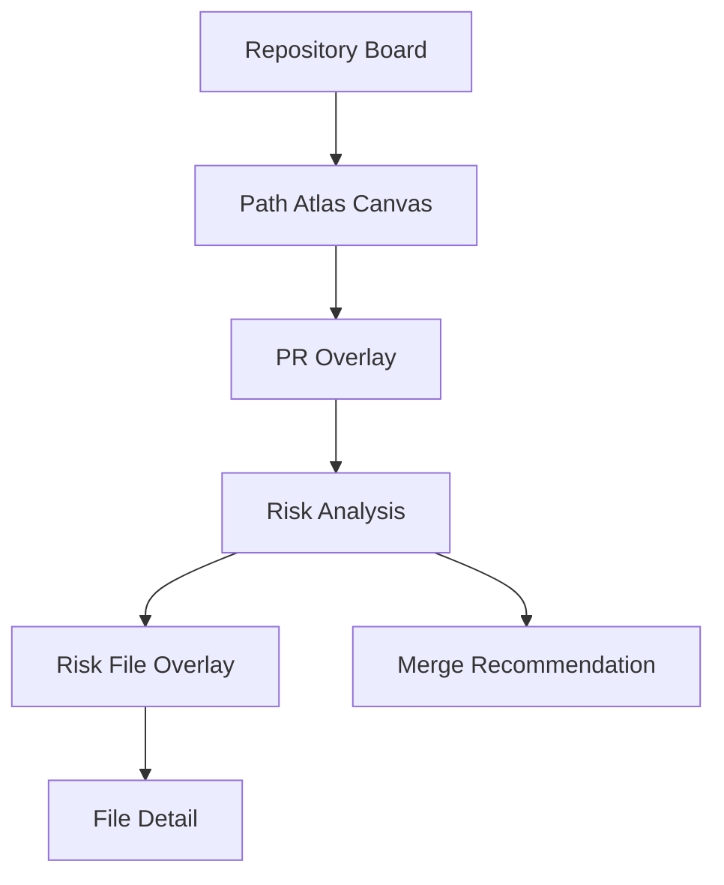
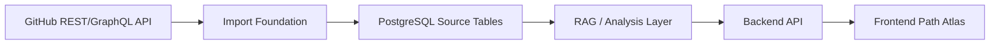

# PR Collision Atlas System Spec

## 1. One-Line Architecture

PR Collision Atlas는 GitHub PR 데이터를 PostgreSQL에 수집한 뒤, RAG/analysis layer가 파일/폴더 지도, PR overlay, merge 위험 분석, merge 제안을 만들고, frontend가 이를 Path Atlas 캔버스와 상세 분석 화면으로 보여주는 시스템이다.

상세 제품 기준은 `PR_COLLISION_ATLAS_BRIEF.md`를 보고, RAG/analysis 세부 계약은 `rag.md`를 본다.

## 2. Product Flow

사용자가 보는 핵심 흐름은 다음이다.

1. 로그인 후 repository board를 본다.
2. repository에 들어가 Path Atlas 캔버스를 본다.
3. PR sidebar에서 PR 하나 또는 여러 개를 선택한다.
4. 선택된 PR이 건드린 파일이 캔버스 위에 색상 overlay로 표시된다.
5. 분석 버튼을 누르면 위험 파일이 빨간 파일명과 느낌표 아이콘으로 표시된다.
6. 위험 파일을 클릭하면 file detail 화면에서 관련 PR, hunk, line range, patch 근거를 본다.
7. 분석 결과는 어떤 PR을 먼저 merge, rebase, review하면 좋은지 제안한다.

## 3. Current Implementation

현재 완료된 것은 `GitHub PR Import Foundation`이다.

이미 구현된 범위:

- GitHub GraphQL/REST API에서 PR metadata, changed files, patch를 가져온다.
- 단일 PR import와 REST PR 목록 기반 batch import를 지원한다.
- patch를 hunk line range로 파싱한다.
- PostgreSQL에 충돌 분석 가능한 원천 데이터를 저장한다.
- GitHub 원본 GraphQL/REST payload를 보존한다.

현재 source of truth 테이블:

| Table | Role |
| --- | --- |
| `repositories` | repository 자체 |
| `pull_requests` | PR metadata snapshot |
| `file_paths` | repository의 파일 경로 기준 레이어 |
| `pr_files` | PR이 특정 파일 위에 남긴 변경 이벤트 |
| `pr_file_hunks` | diff hunk의 old/new line range |
| `raw_payloads` | GitHub GraphQL/REST 원본 응답 |

아직 없는 것:

- RAG/analysis API
- frontend Path Atlas
- persisted analysis history
- report board
- code suggestion layer

## 4. System Architecture

시스템은 다섯 계층으로 본다.

| Layer | Responsibility |
| --- | --- |
| Backend import layer | GitHub PR 데이터를 가져와 정규화하고 저장한다. |
| PostgreSQL source data layer | PR, file, hunk, raw payload의 source of truth를 보관한다. |
| RAG / analysis layer | RAG documents, retrieval, deterministic risk, merge recommendation을 만든다. |
| API layer | frontend가 소비할 구조화 output을 제공한다. |
| Frontend visualization layer | Path Atlas, PR overlay, risk overlay, file detail을 렌더링한다. |

## 5. Data Flow

데이터는 아래 순서로 흐른다.

1. GitHub API에서 PR metadata, changed files, patch를 가져온다.
2. import layer가 repository, PR, file path, PR file event, hunk로 나눠 저장한다.
3. RAG document builder가 기존 테이블에서 `RagDocument`를 만든다.
4. deterministic risk engine이 shared file, shared directory, hunk overlap, path category를 계산한다.
5. retriever가 vector similarity와 metadata filter로 관련 문서를 가져온다.
6. LLM이 semantic conflict 해석, merge 순서 제안, 자연어 설명을 만든다.
7. output serializer가 frontend contract로 변환한다.
8. frontend가 캔버스, overlay, 위험 표시, 상세 화면을 그린다.

## 6. Major Components

### Import Foundation

현재 구현된 Python 기반 import 계층이다. GitHub public repository에서 PR 데이터를 가져와 PostgreSQL에 저장한다.

### PostgreSQL Source Tables

초기 제품의 기준 데이터 저장소다. 새 테이블을 먼저 만들지 않고, 기존 테이블에서 분석에 필요한 데이터를 최대한 계산한다.

### RAG / Analysis Layer

`rag.md`의 중심 계층이다.

- LangGraph는 workflow orchestration을 맡는다.
- LangChain은 document, embedding, retriever, PGVector, structured output component로 쓴다.
- Vector DB는 LLM이 아니라 embedding 저장/검색 계층이다.
- LLM은 semantic conflict 해석, merge 순서 제안, 설명 생성에 개입한다.
- deterministic risk engine은 hunk overlap, path category, change volume 같은 hard evidence를 계산한다.

### API Layer

frontend가 DB를 직접 알지 않도록 output contract를 제공한다.

초기 API 방향:

- repository board data
- PR sidebar data
- canvas layout output
- PR overlay output
- risk analysis output
- file detail output
- merge recommendation output

### Frontend Visualization Layer

frontend는 분석 로직을 소유하지 않는다.

frontend의 책임:

- repository board 표시
- Path Atlas 캔버스 렌더링
- PR별 색상 overlay 표시
- 선택되지 않은 node dim 처리
- 위험 파일 빨간 표시와 느낌표 아이콘 표시
- file detail 화면 표시
- merge recommendation 표시

## 7. RAG / Analysis Role

RAG/analysis layer는 frontend가 원하는 시각화와 의사결정 데이터를 만든다.

주요 output:

- `CanvasLayoutOutput`: 파일/폴더 캔버스 layout
- `PROverlayOutput`: 선택 PR 변경 파일 overlay
- `RiskAnalysisOutput`: 위험 파일과 근거
- `MergeRecommendationOutput`: merge/rebase/review 순서 제안
- `FileDetailOutput`: 파일별 상세 위험 설명

중요한 원칙:

- RAG는 목적이 아니라 수단이다.
- LLM은 위험도 단독 판정자가 아니다.
- deterministic evidence는 항상 남는다.
- LLM 실패 시에도 최소 위험 분석 output은 반환되어야 한다.
- 코드 수정 제안은 현재 범위가 아니며, 나중에 별도 code suggestion layer로 분리한다.

## 8. Frontend Role

frontend는 RAG/analysis output을 사용자 경험으로 바꾼다.

frontend가 하지 않는 것:

- hunk overlap 계산
- vector retrieval
- risk score 계산
- merge 순서 판단
- DB table 직접 해석

frontend가 하는 것:

- API output을 받아 Path Atlas를 그린다.
- PR 선택 상태를 UI로 관리한다.
- overlay, risk marker, file detail, merge recommendation을 보여준다.
- 사용자가 분석 버튼, 파일 클릭, PR 선택을 할 수 있게 한다.

## 9. Storage Strategy

현재 전략은 기존 테이블 우선이다.

초기에는 다음을 새 테이블 없이 계산한다.

- repository board 집계
- RAG document 동적 생성
- PR overlay
- shared file/shared directory 후보
- hunk overlap/proximity
- 위험 파일 상세 근거

새 테이블은 구체적인 저장 요구가 생길 때만 추가한다.

| Future table | Add when |
| --- | --- |
| `rag_documents` | embedding cache와 document versioning이 필요할 때 |
| `collision_edges` | PR pair risk를 반복 계산하지 않고 저장해야 할 때 |
| `analysis_runs` | 분석 결과를 다시 열거나 공유해야 할 때 |
| `analysis_file_findings` | 파일별 위험 결과를 저장해야 할 때 |
| `atlas_layouts`, `atlas_nodes` | 캔버스 좌표를 고정하거나 사용자가 배치를 수정해야 할 때 |

## 10. Milestones

### Completed

- PR Import Foundation
- PostgreSQL source tables
- PR/file/hunk import and parsing
- RAG architecture plan in `rag.md`

### Next

1. RAG document builder
2. deterministic risk engine
3. retrieval interface
4. analysis output serializers
5. backend API layer
6. frontend Path Atlas

### Later

- persisted analysis history
- report board
- resolution notes
- private repository support
- code suggestion layer
- actual merge simulation or integration

## 11. Non-Goals For Now

현재 범위에서 제외한다.

- 실제 merge 실행
- 자동 conflict resolution
- 코드 자동 수정
- 모든 언어의 AST 기반 semantic merge 분석
- repository를 넘는 과거 사례 검색
- GitHub App 설치 방식
- private repository 지원
- 사용자 수동 캔버스 배치 저장

## 12. Related Documents

- `PR_COLLISION_ATLAS_BRIEF.md`: 제품 기준, 사용자 흐름, 마일스톤, output contract의 상세 기획
- `rag.md`: RAG/analysis architecture, LangGraph/LangChain 역할, 알고리즘, output contract 상세
- `../pr_atlas_mvp/lesson/TOP_DOWN_POSTGRES_IMPORT.md`: 현재 import foundation의 코드 읽기 문서
