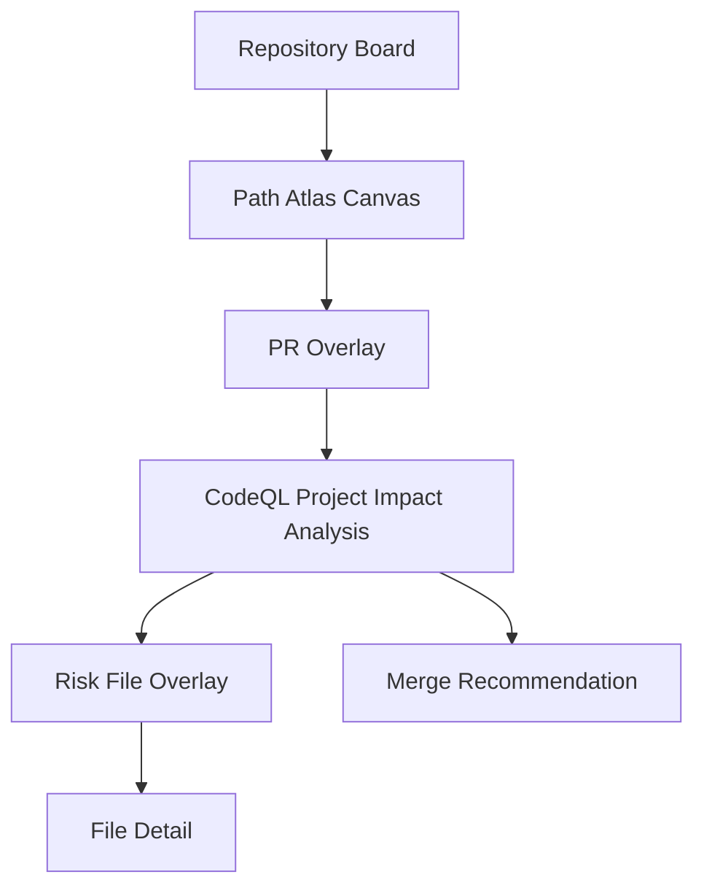
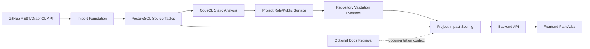

# PR Collision Atlas System Spec

## 1. One-Line Architecture

PR Collision Atlas는 GitHub open-source repository의 PR 데이터를 PostgreSQL에 수집한 뒤, CodeQL 기반 RAG/analysis layer가 PR 간 코드 의미 영향도와 merge/review 위험을 계산하고, frontend가 이를 Path Atlas 캔버스와 상세 분석 화면으로 보여주는 시스템이다.

상세 사용자 기획은 `PR_COLLISION_ATLAS_BRIEF.md`를 보고, RAG/analysis 세부 계약은 `rag.md`를 본다. 상용 서비스의 운영 관측 신호 기반 확장안은 `commercial-service-rag.md`에 따로 둔다.

## 2. Open Source Repository Analysis Flow

사용자가 보는 핵심 흐름은 다음이다.

1. 로그인 후 open-source repository board를 본다.
2. repository에 들어가 Path Atlas 캔버스를 본다.
3. PR sidebar에서 PR 하나 또는 여러 개를 선택한다.
4. 선택된 PR이 건드린 파일이 캔버스 위에 색상 overlay로 표시된다.
5. 분석 버튼을 누르면 CodeQL-backed project impact 분석이 실행된다.
6. 위험 파일은 빨간 파일명과 느낌표 아이콘으로 표시된다.
7. 위험 파일을 클릭하면 file detail 화면에서 관련 PR, hunk, CodeQL impact path, project role, validation evidence를 본다.
8. 분석 결과는 어떤 PR을 먼저 review, merge, rebase하면 좋은지 제안한다.



분석 기준은 서비스 기능이나 운영 트래픽이 아니다. 기준은 open-source repository 안에서의 역할이다.

```text
public API
core module
CLI entrypoint
adapter/plugin boundary
widely imported internal module
tests/docs/examples
dependency/config/build metadata
```

## 3. Current Implementation

현재 완료된 것은 `GitHub PR Import Foundation`이다.

이미 구현된 범위:

- GitHub GraphQL/REST API에서 PR metadata, changed files, patch를 가져온다.
- 단일 PR import와 REST PR 목록 기반 batch import를 지원한다.
- patch를 hunk line range로 파싱한다.
- PostgreSQL에 충돌 분석 가능한 원천 데이터를 저장한다.
- GitHub 원본 GraphQL/REST payload를 보존한다.

현재 source of truth 테이블:

| Table | Role |
| --- | --- |
| `repositories` | repository 자체 |
| `pull_requests` | PR metadata snapshot |
| `file_paths` | repository의 파일 경로 기준 레이어 |
| `pr_files` | PR이 특정 파일 위에 남긴 변경 이벤트 |
| `pr_file_hunks` | diff hunk의 old/new line range |
| `raw_payloads` | GitHub GraphQL/REST 원본 응답 |

아직 없는 것:

- CodeQL static impact analysis API
- project role/public surface mapping
- repository validation evidence layer
- frontend Path Atlas
- persisted analysis history
- report board
- code suggestion layer

## 4. System Architecture

시스템은 다음 계층으로 본다.

| Layer | Responsibility |
| --- | --- |
| Backend import layer | GitHub PR 데이터를 가져와 정규화하고 저장한다. |
| PostgreSQL source data layer | PR, file, hunk, raw payload의 source of truth를 보관한다. |
| CodeQL static analysis layer | changed symbol, import/call/reference, data/control-flow, public surface, test relation을 추출한다. |
| Project role/public surface layer | `project-role-map.yaml`로 core module, public API, CLI, adapter, docs/examples 역할을 매핑한다. |
| Repository validation layer | CI result, related tests, coverage hint, docs/examples reference, package export, entrypoint evidence를 붙인다. |
| Optional documentation retrieval layer | README/docs/examples/API docs 문맥을 찾는다. 기본 OFF이며 위험 판단 엔진이 아니다. |
| Project impact scoring layer | deterministic risk + CodeQL evidence + project role + validation evidence로 위험도를 계산한다. |
| API layer | frontend가 소비할 구조화 output을 제공한다. |
| Frontend visualization layer | Path Atlas, PR overlay, risk overlay, file detail을 렌더링한다. |



## 5. Data Flow

데이터는 아래 순서로 흐른다.

```text
GitHub PR rows
  -> CodeQL static impact analysis
  -> project-role-map.yaml
  -> repository validation evidence
  -> project impact scoring
  -> optional docs/examples retrieval
  -> LLM explanation
  -> frontend outputs
```

구체적으로:

1. GitHub API에서 PR metadata, changed files, patch를 가져온다.
2. import layer가 repository, PR, file path, PR file event, hunk로 나눠 저장한다.
3. CodeQL layer가 changed symbol, import/call/reference, public surface, test relation evidence를 만든다.
4. project role layer가 CodeQL impact를 core module, public API, CLI entrypoint, adapter, tests/docs/examples 역할에 매핑한다.
5. repository validation layer가 CI/test/coverage/docs/export/entrypoint 근거를 붙인다.
6. deterministic risk engine이 shared file, shared directory, hunk overlap, path category를 계산한다.
7. project impact scorer가 hard evidence를 합쳐 위험도와 review 우선순위를 계산한다.
8. optional docs/examples retrieval이 LLM 설명용 문맥을 찾는다.
9. LLM이 change intent, 리뷰 포커스, merge/rebase/review 제안을 설명한다.
10. output serializer가 frontend contract로 변환한다.
11. frontend가 캔버스, overlay, 위험 표시, 상세 화면을 그린다.

## 6. Major Components

### Import Foundation

현재 구현된 Python 기반 import 계층이다. GitHub public repository에서 PR 데이터를 가져와 PostgreSQL에 저장한다.

### PostgreSQL Source Tables

초기 시스템의 기준 데이터 저장소다. PR/file/hunk source rows는 CodeQL과 scoring layer의 입력이다.

### CodeQL Static Analysis Layer

`rag.md`의 중심 정적 분석 계층이다.

- 자체 Python/C indexer는 만들지 않는다.
- CodeQL이 changed symbol, import/call/reference, data/control-flow, public surface, test relation의 authoritative source다.
- CodeQL 실패 시 static impact는 `degraded`가 되고, 기존 PR/file/hunk/path-category deterministic risk로 fallback한다.
- CodeQL result는 `static_analysis_snapshots`, `pr_codeql_changes`, `static_impact_findings` 같은 cache table에 저장될 수 있다.

### Project Role / Public Surface Layer

repository 안에서 변경된 코드의 역할을 판단한다.

- `core_engine`
- `public_api`
- `cli_entrypoint`
- `adapters`
- `tests`
- `docs_examples`

이 계층은 `project-role-map.yaml`을 기준으로 시작한다. public surface hard evidence는 CodeQL, package metadata, explicit role mapping에서 온다.

### Repository Validation Evidence Layer

오픈소스 repository 기준의 검증 근거를 붙인다.

- CI result
- related tests
- coverage hint
- README/docs/examples references
- `pyproject.toml` entrypoints
- `__init__.py` exports
- package public API surface
- internal reference count from CodeQL

### Optional Documentation Retrieval Layer

Vector DB/Chroma는 기본 OFF인 optional layer다.

사용한다:

- README/docs/examples/API docs 설명 문맥 검색
- LLM explanation에 넣을 supporting context 검색
- file detail의 documentation context 제공

사용하지 않는다:

- risk score 기본 계산
- dependency 판단
- public API 판정
- core role 판정
- CodeQL impact path 생성

### LLM Reporting Layer

LLM은 change intent와 리뷰 포커스를 설명한다.

LLM은 하지 않는다:

- CodeQL edge 생성
- impact path 생성
- risk score 계산
- hard evidence 하향 조정

## 7. API Layer

frontend가 DB와 analysis internals를 직접 알지 않도록 output contract를 제공한다.

초기 API 방향:

- repository board data
- PR sidebar data
- canvas layout output
- PR overlay output
- risk analysis output
- file detail output
- merge recommendation output

기존 frontend output 이름은 유지한다.

- `CanvasLayoutOutput`
- `PROverlayOutput`
- `RiskAnalysisOutput`
- `MergeRecommendationOutput`
- `FileDetailOutput`

새 필드는 additive로만 추가한다.

- `static_impact_paths`
- `affected_project_roles`
- `public_surface_level`
- `validation_signals`
- `documentation_context`
- `change_intent`
- `uncertainty_signals`
- `codeql_queries`

## 8. Frontend Role

frontend는 analysis output을 사용자 경험으로 바꾼다.

frontend가 하지 않는 것:

- hunk overlap 계산
- CodeQL query 실행
- vector retrieval
- project impact score 계산
- merge 순서 판단
- DB table 직접 해석

frontend가 하는 것:

- API output을 받아 Path Atlas를 그린다.
- PR 선택 상태를 UI로 관리한다.
- overlay, risk marker, file detail, merge recommendation을 보여준다.
- 사용자가 분석 버튼, 파일 클릭, PR 선택을 할 수 있게 한다.

## 9. Storage Strategy

현재 전략은 PR source table을 유지하고, CodeQL/project impact에 필요한 cache table을 요구가 생기는 시점에 추가하는 것이다.

초기에는 다음을 기존 테이블에서 계산한다.

- repository board 집계
- PR overlay
- shared file/shared directory 후보
- hunk overlap/proximity
- path category
- 위험 파일 상세 근거

새 테이블 후보:

| Future table | Add when |
| --- | --- |
| `static_analysis_snapshots` | CodeQL snapshot과 query pack version 추적이 필요할 때 |
| `pr_codeql_changes` | PR hunk와 CodeQL symbol mapping을 저장해야 할 때 |
| `static_impact_findings` | CodeQL impact path와 public surface/test relation evidence를 재사용해야 할 때 |
| `analysis_runs` | 분석 결과를 다시 열거나 공유해야 할 때 |
| `analysis_file_findings` | 파일별 위험 결과를 저장해야 할 때 |
| `documentation_context_cache` | README/docs/examples retrieval 결과를 재사용해야 할 때 |
| `atlas_layouts`, `atlas_nodes` | 캔버스 좌표를 고정하거나 사용자가 배치를 수정해야 할 때 |

## 10. Milestones

### Completed

- PR Import Foundation
- PostgreSQL source tables
- PR/file/hunk import and parsing
- CodeQL project impact architecture plan in `rag.md`

### Next

1. CodeQL snapshot/query runner
2. CodeQL result parser and normalizer
3. PR hunk to CodeQL symbol mapping
4. `project-role-map.yaml` parser
5. repository validation evidence models
6. project impact scorer
7. analysis output serializers
8. backend API layer
9. frontend Path Atlas

### Later

- persisted analysis history
- report board
- resolution notes
- private repository support
- code suggestion layer
- actual merge simulation or integration
- commercial service runtime extension from `commercial-service-rag.md`

## 11. Non-Goals For Now

현재 범위에서 제외한다.

- 실제 merge 실행
- 자동 conflict resolution
- 코드 자동 수정
- 자체 Python/C indexer
- 자체 call graph 구현
- CodeQL 없는 정밀 data-flow 재구현
- 상용 서비스 운영 관측 신호 기반 판단
- repository를 넘는 과거 사례 검색
- GitHub App 설치 방식
- private repository 지원
- 사용자 수동 캔버스 배치 저장

## 12. Related Documents

- `PR_COLLISION_ATLAS_BRIEF.md`: 오픈소스 repository 기준 사용자 흐름, 마일스톤, output contract의 기획
- `rag.md`: CodeQL project impact RAG architecture, 알고리즘, input/output contract 상세
- `commercial-service-rag.md`: 상용 서비스 repository용 runtime/product-flow 확장 참고 문서
