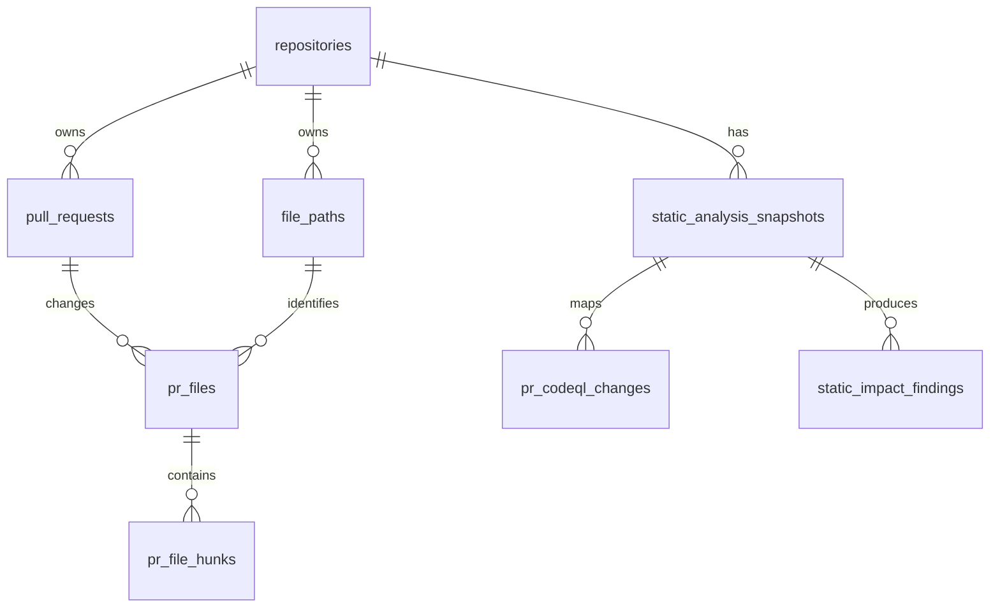
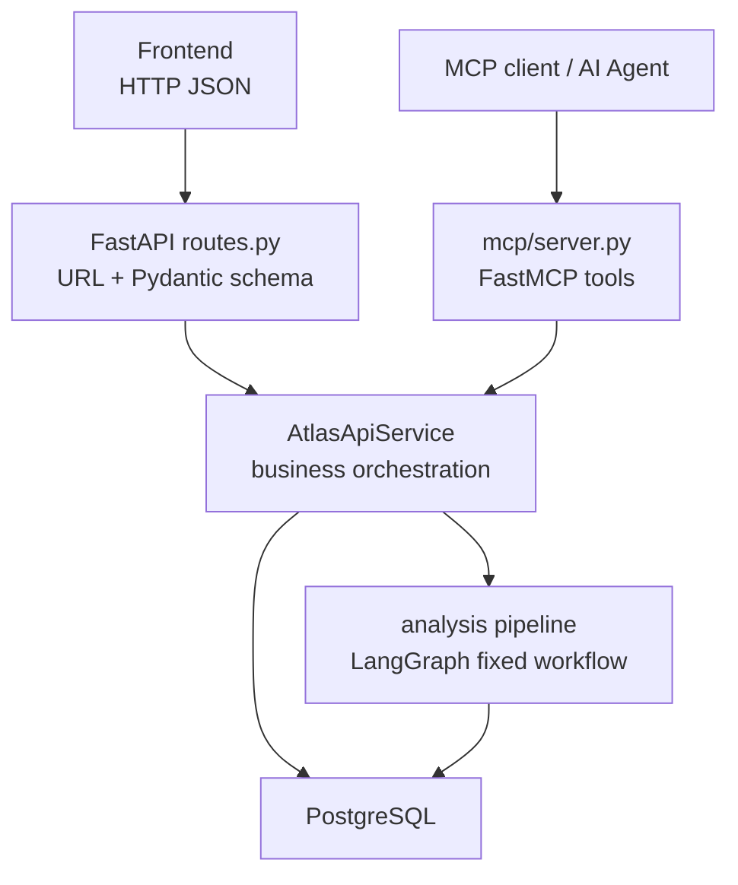
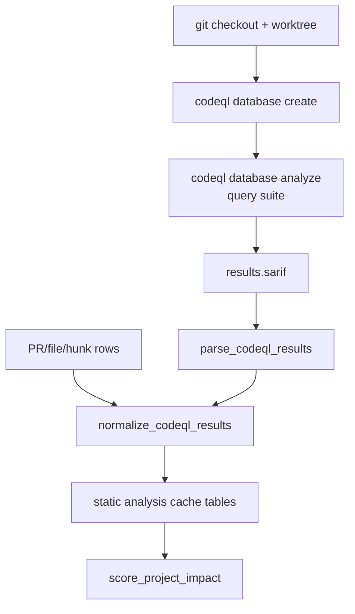
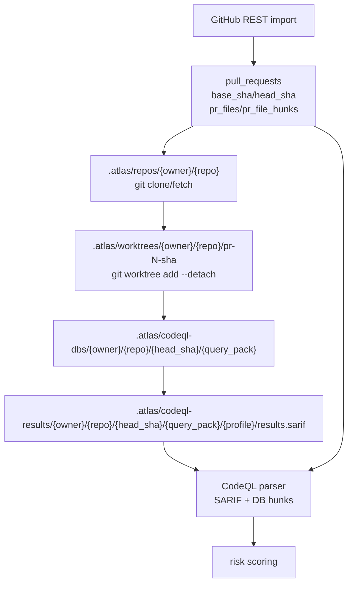

# PR Collision Atlas 구조 질문 답변

이 문서는 구현을 설명하기 위한 답변 문서입니다. 모든 답은 먼저 결론을 말하고, 그 뒤에 근거와 데이터 흐름을 붙입니다.

기준 문서:

- `docs/PR_COLLISION_ATLAS_BRIEF.md`: 제품 목적과 사용자 경험
- `docs/spec.md`: 전체 아키텍처와 계층 경계
- `docs/rag.md`: CodeQL/RAG/분석 계약

현재 코드 기준 근거:

- DB schema: `pr_atlas_mvp/postgres/schema.py`
- import 저장: `pr_atlas_mvp/postgres/store.py`, `pr_atlas_mvp/postgres/writes.py`
- API schema/route/service: `pr_atlas_mvp/api/schemas.py`, `pr_atlas_mvp/api/routes.py`, `pr_atlas_mvp/api/services.py`
- MCP wrapper: `pr_atlas_mvp/mcp/server.py`
- 분석 pipeline: `pr_atlas_mvp/analysis/pipeline.py`
- CodeQL runner/parser/cache: `pr_atlas_mvp/analysis/codeql_runner.py`, `pr_atlas_mvp/analysis/codeql_parser.py`, `pr_atlas_mvp/analysis/storage.py`
- risk 계산: `pr_atlas_mvp/analysis/deterministic.py`, `pr_atlas_mvp/analysis/scoring.py`

## 1. DB 테이블은 어떻게 나눴고 어떤 고민을 했는가

답: DB는 `repository -> PR -> changed file -> hunk`라는 import 원천 데이터 흐름을 source of truth로 두고, CodeQL 분석 결과는 별도 cache table로 분리했습니다. 핵심 고민은 "분석 결과를 먼저 저장하는 DB"가 아니라 "나중에 어떤 분석도 다시 만들 수 있는 PR/file/hunk 원천 데이터를 안정적으로 보존하는 DB"로 나누는 것이었습니다.

큰 구조는 다음과 같습니다.



source of truth 테이블은 다음처럼 나눴습니다.

| 테이블 | 답 | 근거 |
| --- | --- | --- |
| `repositories` | repository 경계입니다. | owner/name/repo_key를 기준으로 모든 PR, file path, analysis snapshot의 부모가 됩니다. |
| `pull_requests` | PR metadata snapshot입니다. | number/title/state/base/head SHA/labels/raw_graphql을 저장합니다. PR 목록과 분석 선택의 기준입니다. |
| `file_paths` | repository 안의 파일 경로 차원 테이블입니다. | 같은 파일을 여러 PR이 건드려도 file path identity는 하나로 유지합니다. `path_tree`는 Path Atlas와 폴더 계층 분석을 위한 ltree 값입니다. |
| `pr_files` | PR이 특정 파일에 남긴 변경 이벤트입니다. | status/additions/deletions/changes/patch/raw_rest를 갖습니다. 같은 파일이라도 PR마다 다른 변경 이벤트라 별도 row로 둡니다. |
| `pr_file_hunks` | diff hunk line range 근거입니다. | old/new start/lines/header/hunk_json을 저장해 hunk overlap, proximity, file detail 근거로 씁니다. |
| `raw_payloads` | GitHub 원본 응답 보존 테이블입니다. | GraphQL/REST payload를 보존해 normalizer 버그, 재분석, 디버깅 때 원본을 확인할 수 있습니다. |

분석 cache 테이블은 source table과 의도적으로 분리했습니다.

| 테이블 | 답 | 근거 |
| --- | --- | --- |
| `static_analysis_snapshots` | CodeQL 실행 단위 cache입니다. | repository, commit SHA, CodeQL DB URI, query pack version, status로 어떤 정적 분석 결과인지 식별합니다. |
| `pr_codeql_changes` | PR hunk/file과 CodeQL symbol 매핑 cache입니다. | 변경된 함수/클래스/심볼을 PR과 연결합니다. |
| `static_impact_findings` | CodeQL static impact 결과 cache입니다. | public surface, test relation, reverse dependency 같은 query-backed evidence를 저장합니다. |

중요한 설계 고민은 세 가지였습니다.

1. stable dimension과 event를 분리했습니다.
   `file_paths`는 repository 안의 파일 정체성이고, `pr_files`는 특정 PR의 변경 이벤트입니다. 이 분리 덕분에 여러 PR이 같은 파일을 건드렸는지 안정적으로 계산할 수 있습니다.

2. import refresh는 PR file snapshot을 교체합니다.
   `pull_requests`는 upsert하지만, 해당 PR의 `pr_files`와 `pr_file_hunks`는 `delete_pr_file_snapshot` 이후 다시 insert합니다. GitHub changed files 결과는 최신 snapshot 성격이 강하므로, 오래된 hunk row를 남겨두지 않는 선택입니다.

3. CodeQL 결과는 원천이 아니라 cache입니다.
   CodeQL query pack, commit, 결과 상태가 바뀌면 다시 만들 수 있어야 합니다. 그래서 source row를 대체하지 않고 `static_analysis_snapshots`, `pr_codeql_changes`, `static_impact_findings`에 저장합니다.

보조 테이블도 있습니다.

| 테이블 | 역할 |
| --- | --- |
| `users`, `auth_sessions` | API/프런트 사용자를 위한 인증 기반입니다. 현재 주요 인증 흐름은 Basic Auth입니다. |
| `change_comments` | 특정 PR의 특정 changed file에 다는 comment입니다. risk 계산 source of truth는 아닙니다. |

## 2. MCP, API의 경계는 어디이고, 데이터는 어떻게 전달되는가

답: API는 프런트엔드가 쓰는 HTTP 계약이고, MCP는 AI client나 agent가 같은 기능을 tool로 호출하게 해주는 wrapper입니다. 둘 다 core logic을 직접 소유하지 않고 `AtlasApiService`와 analysis pipeline으로 데이터를 넘깁니다.

경계는 다음과 같습니다.



API 경계의 책임은 다음입니다.

| 계층 | 책임 | 데이터 형태 |
| --- | --- | --- |
| `routes.py` | HTTP endpoint, 인증 dependency, response model 연결 | JSON request/response |
| `schemas.py` | 외부 API 계약 검증 | Pydantic `BaseModel` |
| `services.py` | import/list/atlas/analysis 업무 흐름 조립 | Python `dict`, ORM query result |
| `analysis/pipeline.py` | 분석 workflow 실행 | dataclass `AnalysisRequest`, `AnalysisState` |
| `serializers.py` | 프런트가 먹는 output contract 생성 | JSON-compatible `dict` |

MCP 경계의 책임은 다음입니다.

| MCP tool | 내부 호출 |
| --- | --- |
| `import_repository` | `AtlasApiService.create_repository`, 중복이면 refresh |
| `refresh_repository` | `AtlasApiService.refresh_repository` |
| `list_repositories` | `AtlasApiService.list_repositories` |
| `list_pull_requests` | `AtlasApiService.list_pull_requests` |
| `run_analysis` | `AtlasApiService.run_analysis` |

MCP는 별도 분석 엔진이 아닙니다. `mcp/server.py`는 tool argument를 검증하고, DB session을 열고, 같은 service를 호출한 뒤 `jsonable_encoder`로 JSON 가능한 결과를 반환합니다.

데이터 전달은 다음 순서입니다.

```text
Frontend API:
  HTTP JSON
  -> Pydantic request model
  -> AtlasApiService
  -> SQLAlchemy ORM / analysis dataclass
  -> serializer dict
  -> Pydantic response model
  -> HTTP JSON

MCP:
  tool arguments
  -> RepositoryImportRequest 또는 AnalysisRunRequest 재사용
  -> AtlasApiService
  -> jsonable_encoder
  -> MCP tool result JSON
```

핵심은 API와 MCP가 같은 business path를 공유한다는 점입니다. 그래서 프런트에서 실행한 분석과 MCP tool로 실행한 분석이 서로 다른 판단 로직을 갖지 않습니다.

## 3. CodeQL은 어떤 역할을 하고, 어떻게 썼는지

답: CodeQL은 "파일이 바뀌었다"를 "어떤 symbol/public surface/test relation에 닿았다"로 바꿔주는 정적 의미 분석의 authoritative source입니다. LLM이나 vector DB가 dependency를 추론하지 않도록, CodeQL query 결과를 SARIF로 받고 이를 분석 evidence로 정규화했습니다.

역할 분리는 다음과 같습니다.

```text
GitHub import rows = 무엇이 바뀌었는가
CodeQL = 바뀐 코드가 어떤 symbol/public surface/test와 연결되는가
project-role-map.yaml = 그 symbol/file이 repository에서 어떤 역할인가
validation evidence = 테스트/문서/export/entrypoint 근거가 있는가
scorer = 위 근거를 점수로 합친다
LLM = 이미 계산된 evidence packet을 설명한다
```

실제 사용 흐름은 다음입니다.



현재 query pack은 `codeql/pr-impact`입니다.

| 구성 | 역할 |
| --- | --- |
| `SymbolDefinitions.ql` | Python function definition을 symbol record로 emit합니다. |
| `ClassDefinitions.ql` | Python class definition을 symbol record로 emit합니다. |
| `PublicSurface.ql` | `__init__.py` 함수 export를 public surface evidence로 emit합니다. |
| `PublicSurfaceClasses.ql` | `__init__.py` class export를 public surface evidence로 emit합니다. |
| `TestRelations.ql` | test file/function 후보를 test relation evidence로 emit합니다. |
| `pr-impact-lite.qls` | symbol/class/public surface 중심 빠른 profile입니다. |
| `pr-impact.qls` | query 폴더 전체를 실행하는 full profile입니다. |

CodeQL 결과는 message 안의 `pr_atlas:{...}` JSON payload로 전달됩니다. `codeql_parser.py`가 이 payload를 읽어 두 종류로 정규화합니다.

| 정규화 결과 | 저장 위치 | 의미 |
| --- | --- | --- |
| `CodeQLChangeInput` | `pr_codeql_changes` | PR hunk/file과 CodeQL symbol을 연결합니다. |
| `StaticImpactFindingInput` | `static_impact_findings` | public surface, test relation 등 static impact 근거입니다. |

실패 처리도 중요한 설계입니다.

| 상황 | 처리 |
| --- | --- |
| CodeQL CLI 없음 | snapshot `failed`, deterministic risk fallback |
| 일부 PR/query 실패 | snapshot `partial`, 성공 결과는 사용하고 uncertainty 추가 |
| SARIF 파싱 실패 | error 기록, static evidence 없이 진행 |
| hunk가 symbol에 매핑되지 않음 | file-level deterministic risk 유지, uncertainty 추가 |

즉 CodeQL은 있으면 risk 판단을 강화하지만, 실패한다고 전체 분석을 중단하지 않습니다.

## 4. code의 risk는 어떻게 계산했는지

답: risk는 LLM이 계산하지 않고, deterministic file/hunk risk에 CodeQL static evidence, project role, public surface, validation, uncertainty를 더해 계산했습니다. 최종 점수는 `low/medium/high/critical`로 잘라 프런트 output에 넣습니다.

전체 공식은 `docs/rag.md`와 `analysis/scoring.py` 기준으로 다음입니다.

```text
final_score =
  deterministic_pr_score
  + static_blast_radius_score
  + project_role_score
  + public_surface_score
  + change_risk_score
  + uncertainty_score
  - verification_score
```

먼저 deterministic risk를 계산합니다.

| 근거 | 점수 |
| --- | ---: |
| 선택한 PR 여러 개가 같은 파일 수정 | +15 |
| 변경량 50줄 이상 | +5 |
| 변경량 200줄 이상 | +10 |
| config/dependency/migration 경로 | +15 |
| auth/session/token 경로 | +12 |
| api/route/schema/request/response 경로 | +10 |
| test 경로 | +3 |
| 서로 다른 PR hunk overlap | +35 |
| 서로 다른 PR hunk 20줄 이내 | +20 |
| 서로 다른 PR hunk 80줄 이내 | +10 |
| 같은 파일의 먼 hunk | +3 |

hunk range는 다음처럼 봅니다.

```text
new range = [new_start, new_start + max(new_lines, 1))
overlap = left.start < right.end and right.start < left.end
distance = min(abs(a.end - b.start), abs(b.end - a.start))
```

그 다음 project impact scoring을 붙입니다.

| 근거 묶음 | 대표 가산/감산 |
| --- | --- |
| CodeQL public surface | +12 |
| CodeQL reverse dependency | affected file당 +5, 최대 +25 |
| CodeQL data/control-flow | +15 |
| CodeQL test relation | -8 |
| role `core` | +25 |
| role `important` | +15 |
| role `internal` | +6 |
| correctness/backwards compatibility tag | +12 |
| package export | +15 |
| public API role | +15 |
| CLI entrypoint role | +12 |
| docs reference | +8 |
| examples reference | +5 |
| rename/delete | +8 |
| related passing test | -8 |
| coverage hint >= 0.8 | -5 |
| expected test missing | +8 |
| CodeQL partial/failed | +8 uncertainty |
| code file인데 CodeQL mapping 없음 | +6 uncertainty |
| core/public 영향인데 validation 없음 | +5 uncertainty |

최종 risk level은 다음입니다.

| 점수 | level |
| ---: | --- |
| 0-24 | `low` |
| 25-49 | `medium` |
| 50-79 | `high` |
| 80+ | `critical` |

감산과 cap도 있습니다.

- docs-only 파일은 hard static/role evidence가 없으면 최대 `low`, 즉 24점 이하로 제한합니다.
- test-only 파일은 hard static/role evidence가 없으면 최대 35점으로 제한합니다.
- related test나 coverage 근거는 위험을 낮추지만, CodeQL hard evidence 자체를 지우지는 않습니다.

결론적으로 이 risk는 "같은 파일인가"만 보는 점수가 아닙니다. 같은 파일/hunk 겹침, CodeQL 의미 영향, repository 역할, 공개 표면, 검증 근거, 불확실성을 함께 계산합니다.

## 5. git을 어떤 식으로 사용해서 파이프라인이 코드를 분석하게 설계했는지

답: PR diff 자체는 GitHub API에서 받은 patch와 hunk를 DB에 저장하고, 실제 코드 의미 분석은 git checkout/worktree로 PR head commit을 재현한 뒤 CodeQL에 넘기도록 설계했습니다. 즉 DB의 hunk 근거와 git worktree의 실제 소스 트리를 CodeQL parser에서 다시 연결합니다.

설계 흐름은 다음입니다.



구체적으로는 다음 순서입니다.

1. import 단계에서 `pull_requests.base_sha`, `pull_requests.head_sha`를 저장합니다.
   이 값은 어떤 commit을 분석해야 하는지 결정하는 기준입니다.

2. 자동 CodeQL 분석이 필요하면 `.atlas/repos/{owner}/{repo}`에 repository checkout을 준비합니다.
   이미 checkout이 있으면 `git fetch --all --prune`으로 갱신하고, 없으면 GitHub remote를 clone합니다.

3. PR마다 head SHA 기준 detached worktree를 만듭니다.
   `ensure_worktree`는 `git fetch origin {commit_sha}`, `git worktree prune`, `git worktree add --detach --force {worktree_path} {commit_sha}`를 사용합니다.

4. CodeQL DB와 SARIF 결과는 commit SHA, query pack version, query profile로 cache key가 갈립니다.
   같은 PR head SHA와 query profile이면 기존 results를 재사용할 수 있습니다.

5. CodeQL 결과는 다시 DB source row와 합쳐집니다.
   SARIF location path/line과 DB의 `pr_file_hunks` line range를 비교해 hunk와 symbol을 매핑합니다.

이 구조의 핵심 고민은 두 가지입니다.

- GitHub API patch는 PR 변경 범위와 hunk overlap 판단에 좋습니다.
- CodeQL은 실제 checkout된 소스 트리와 commit 단위 분석이 필요합니다.

그래서 diff는 DB에 저장된 GitHub patch를 믿고, 정적 의미 분석은 git worktree에서 재현한 PR head 소스를 믿는 구조로 나눴습니다.

## 6. 각 API를 거칠 때 데이터 형태는 어떻게 되고 어떤 식으로 정의했는지

답: 외부 API 경계는 Pydantic schema로 정의하고, 내부 분석 경계는 dataclass로 정의하고, DB 경계는 SQLAlchemy ORM으로 정의했습니다. 프런트는 `frontend/src/types.ts`에서 API 응답 타입을 mirror합니다.

정의 방식은 다음과 같습니다.

| 경계 | 정의 파일 | 데이터 형태 |
| --- | --- | --- |
| DB row | `postgres/schema.py` | SQLAlchemy ORM model |
| GitHub import 내부 | `parsing/models.py` | dataclass `ImportBatch`, `PullRequestSnapshot`, `PullRequestFile`, `DiffHunk` |
| HTTP API request/response | `api/schemas.py` | Pydantic `BaseModel` |
| 분석 pipeline state | `analysis/models.py` | dataclass `AnalysisRequest`, `SourceContext`, `CodeQLEvidence`, `RiskFileFinding`, `AnalysisState` |
| frontend output | `analysis/serializers.py` | JSON-compatible dict |
| frontend TypeScript | `frontend/src/types.ts` | TypeScript type |
| MCP tool result | `mcp/server.py` | JSON-compatible dict via `jsonable_encoder` |

주요 API별 데이터 흐름은 다음입니다.

### Repository import API

답: repository import API는 GitHub owner/repo/page/limit 요청을 받아 GitHub payload를 `ImportBatch`로 정규화하고, source table에 저장한 뒤 import 요약을 반환합니다.

```text
POST /api/v1/repositories
RepositoryImportRequest
  { owner, repo, state, page, limit }
-> GitHub REST repository / PR numbers / PR files
-> ImportBatch
-> repositories, pull_requests, file_paths, pr_files, pr_file_hunks, raw_payloads
-> RepositoryImportResponse
  { repository, imported_pr_count, state, page, limit, message }
```

### Pull request list API

답: PR list API는 DB에 import된 PR snapshot을 목록 UI가 바로 쓸 수 있는 summary로 바꿉니다.

```text
GET /api/v1/repositories/{owner}/{repo}/pull-requests
query params
  { state, query, limit, offset }
-> pull_requests + pr_files
-> PullRequestListResponse
  {
    repository,
    pull_requests: [
      {
        pull_request_id,
        number,
        title,
        body_excerpt,
        color,
        base_ref,
        head_ref,
        base_sha,
        head_sha,
        labels,
        file_count,
        additions,
        deletions,
        changes,
        changed_files: [
          { file_path_id, path, status, additions, deletions, changes, hunk_count, patch_excerpt }
        ]
      }
    ],
    state,
    limit,
    offset,
    total
  }
```

### Atlas API

답: Atlas API는 선택 PR 번호를 `SourceContext`로 읽고, 아직 full risk 분석 없이도 캔버스 layout과 PR overlay를 반환합니다.

```text
GET /api/v1/repositories/{owner}/{repo}/atlas?prs=10,12
-> SourceContext
  { repository_id, pull_requests, file_changes, hunks }
-> AtlasResponse
  {
    canvas_layout: { repository_id, layout_version, nodes, edges },
    pr_overlay: { repository_id, selected_pr_ids, pull_requests }
  }
```

### Analysis API

답: Analysis API는 선택 PR과 optional CodeQL/role/validation 입력을 받아 LangGraph pipeline을 실행하고, 프런트가 그대로 렌더링할 수 있는 5개 output 묶음을 반환합니다.

```text
POST /api/v1/analysis
AnalysisRunRequest
  {
    owner,
    repo,
    pr_numbers,
    repo_root?,
    codeql_db?,
    codeql_results?,
    project_role_map?,
    validation_evidence?,
    query_pack_version,
    codeql_query_profile,
    skip_schema,
    use_llm
  }
-> AnalysisRequest dataclass
-> SourceContext
-> RagDocument[]
-> CodeQLEvidence
-> ValidationSignal[]
-> DeterministicFileRisk[]
-> RiskFileFinding[]
-> AnalysisOutputResponse
  {
    canvas_layout,
    pr_overlay,
    risk_analysis,
    merge_recommendation,
    file_details
  }
```

`risk_analysis.files[]`의 핵심 shape는 다음입니다.

```json
{
  "file_path_id": 33,
  "path": "src/package/client.py",
  "node_id": "file:33",
  "risk_level": "high",
  "score": 72,
  "public_surface_level": "public",
  "change_intent": "unknown",
  "related_prs": [10, 12],
  "reasons": [],
  "evidence": [],
  "static_impact_paths": [],
  "affected_project_roles": [],
  "validation_signals": [],
  "documentation_context": [],
  "uncertainty_signals": [],
  "codeql_queries": []
}
```

### Analysis job API

답: job API는 같은 analysis request를 background executor에 넣고, progress event와 결과를 따로 조회하게 합니다.

```text
POST /api/v1/analysis/jobs
AnalysisRunRequest
-> AnalysisJobStartResponse
  { job_id, status, owner, repo, pr_numbers }

GET /api/v1/analysis/jobs/{job_id}
-> AnalysisJobStatusResponse
  {
    job_id,
    status,
    current_step,
    percent,
    events,
    result?,
    error?,
    started_at,
    finished_at?
  }
```

### Comments API

답: comment API는 risk 계산용 데이터가 아니라 file detail 협업용 데이터입니다. comment 대상은 imported PR의 changed file로 제한됩니다.

```text
GET comments
-> CommentListResponse
  { comments: CommentResponse[] }

POST comments
CommentCreateRequest
  { body }
-> CommentResponse
  { id, pull_request_id, file_path_id, author_user_id, author_login_id, body, created_at, updated_at }
```

### MCP tools

답: MCP tool은 HTTP schema와 같은 개념의 입력을 tool argument로 받고, 같은 service 결과를 JSON으로 반환합니다.

```text
import_repository(owner, repo, limit, state, page)
-> RepositoryImportRequest
-> AtlasApiService.create_repository or refresh_repository
-> RepositoryImportResponse + { operation }

run_analysis(owner, repo, pr_numbers, use_llm)
-> AnalysisRunRequest
-> AtlasApiService.run_analysis
-> AnalysisOutputResponse-compatible JSON
```

정리하면, 이 프로젝트의 데이터 형태는 한 곳에서 임의로 만들어지지 않습니다. API boundary는 Pydantic, 내부 pipeline은 dataclass, DB는 SQLAlchemy ORM, frontend는 TypeScript type으로 각각 경계를 고정하고, serializer가 마지막에 프런트 계약으로 변환합니다.
