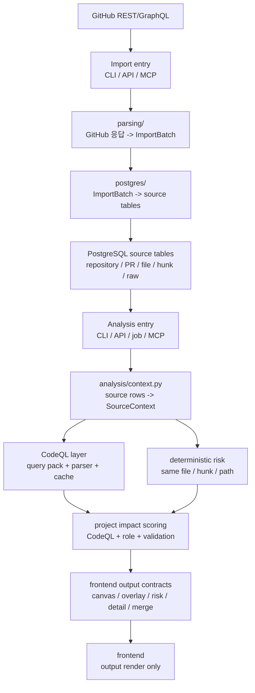
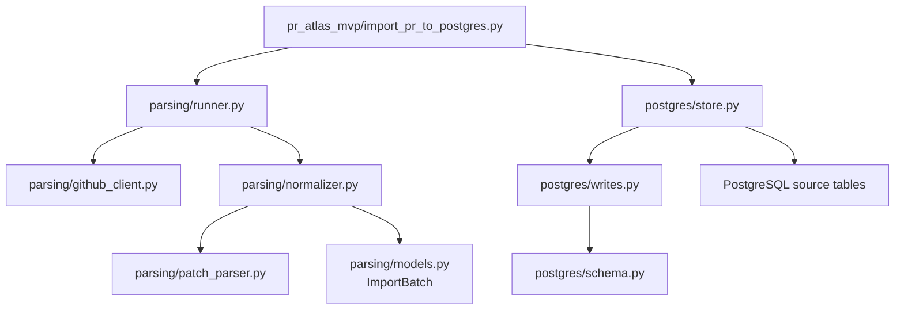
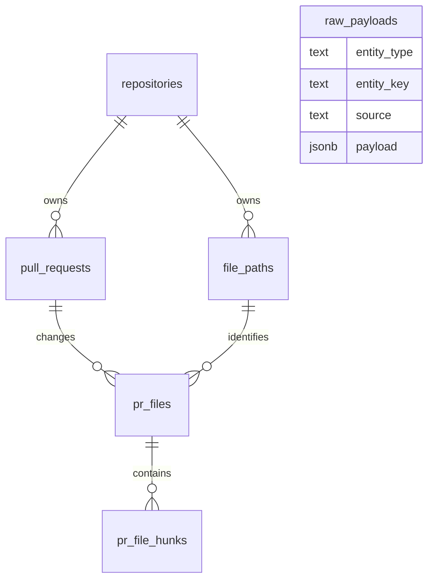
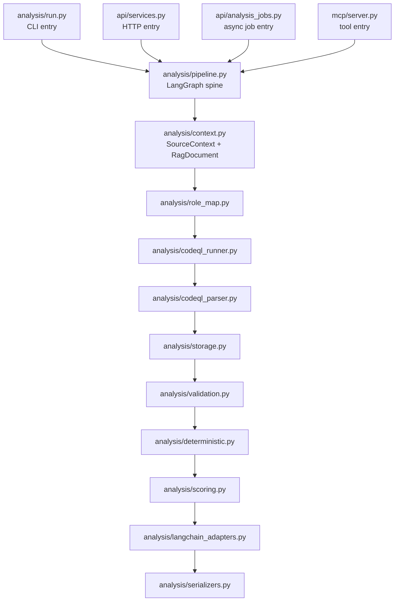
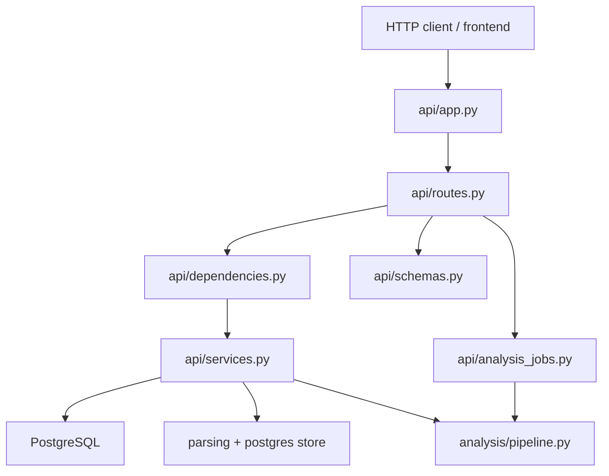
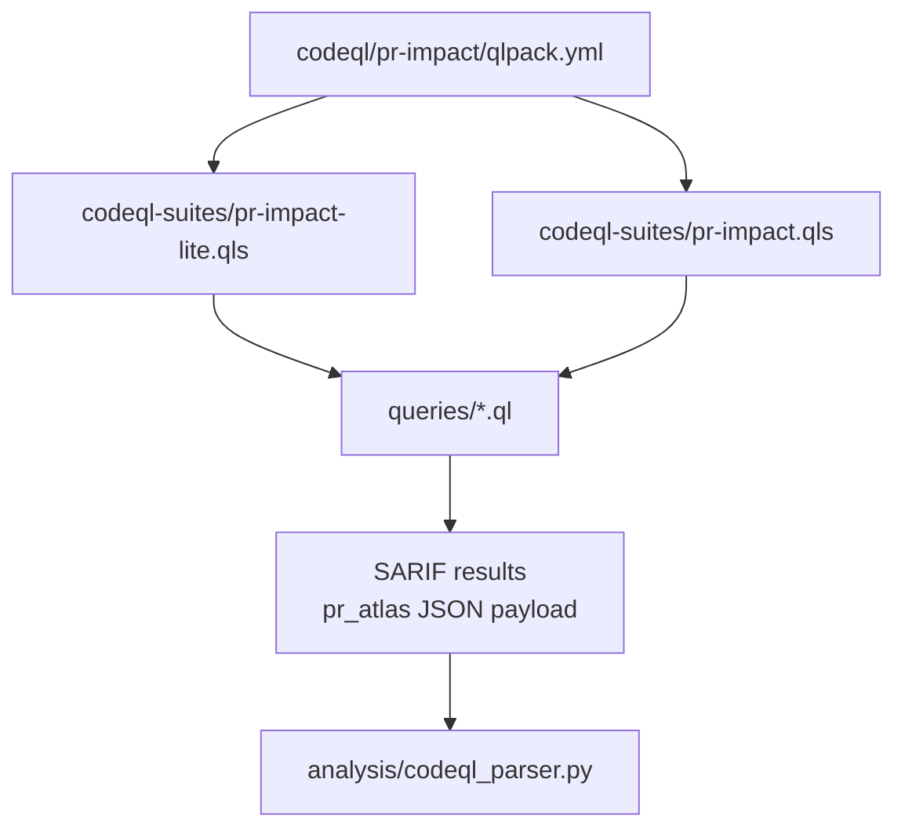
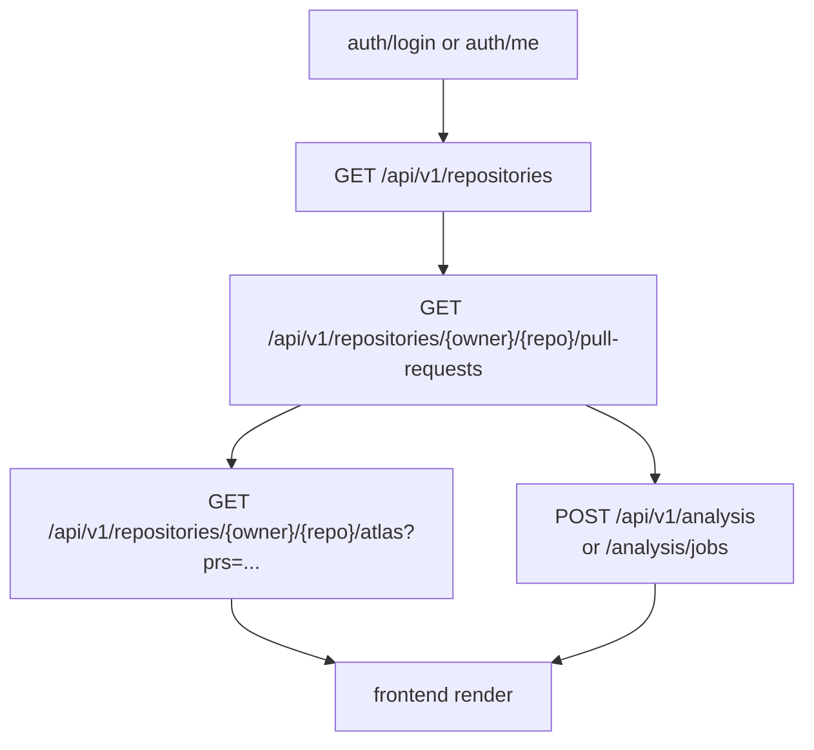

# Frontend와 AI Agent를 제외한 파일별 탑다운 읽기

이 문서는 소스 파일을 함수 순서대로 해설하지 않습니다.

먼저 PR Collision Atlas의 큰 데이터 흐름을 보고, 각 파일을 그 흐름의 어느 단계에 붙여서 읽어야 하는지 정리합니다. 함수 단위 세부 설명은 일부러 제외합니다.

## 제외 범위

이번 문서에서 깊게 보지 않는 범위입니다.

```text
frontend/
pr_atlas_mvp/ai_agent/
tests/test_ai_agent.py
```

단, API 파일 안에 AI agent endpoint나 설정이 섞여 있으면 "AI agent 경계"로만 표시합니다. frontend도 파일별 설명은 하지 않고, 어떤 API output을 받아서 어떤 식으로 그리는지만 짧게 봅니다.

## 0. 메인 데이터 줄기 먼저 보기



정신 모델은 이것입니다.

```text
1. import foundation은 GitHub PR을 PostgreSQL source row로 만든다.
2. analysis pipeline은 source row를 읽어서 위험 근거와 frontend output을 만든다.
3. CodeQL은 코드 의미 근거를 주지만, 실패해도 deterministic risk는 남는다.
4. API/MCP는 이 흐름을 밖에서 호출할 수 있게 감싼다.
5. frontend는 risk logic을 계산하지 않고 output을 렌더링한다.
```

## 1. 먼저 읽을 설계 문서

| 파일 | 탑다운으로 보는 역할 |
| --- | --- |
| `docs/PR_COLLISION_ATLAS_BRIEF.md` | 제품 목적과 사용자 경험 기준이다. "PR 목록이 아니라 maintainer merge planning board"라는 목표를 먼저 잡는다. |
| `docs/spec.md` | 전체 시스템 계층과 데이터 흐름이다. import foundation, PostgreSQL source data, CodeQL analysis, API, frontend 역할 경계를 확인한다. |
| `docs/rag.md` | 분석 계층의 실제 계약이다. RAG가 목적이 아니라 CodeQL/project role/validation/scoring을 돕는 보조 계층이라는 기준을 잡는다. |

이 세 문서를 읽은 뒤 코드를 보면, 파일들이 단순히 "백엔드 파일 묶음"이 아니라 아래 순서로 보입니다.

```text
GitHub import
-> PostgreSQL source of truth
-> CodeQL/static evidence
-> deterministic/project impact scoring
-> frontend contracts
```

## 2. 루트 실행/환경 파일

| 파일 | 읽는 위치 | 탑다운 역할 |
| --- | --- | --- |
| `AGENTS.md` | 작업 전 | 코드 수정 금지, 문서 우선, PostgreSQL import foundation을 source of truth로 보는 작업 규칙이다. |
| `requirements.txt` | 실행 환경 | Python runtime dependency 목록이다. FastAPI, SQLAlchemy, LangGraph, LangChain, OpenAI, MCP, CodeQL 연동 주변 패키지를 한 번에 파악한다. |
| `Dockerfile.api` | 배포/로컬 컨테이너 | API 컨테이너를 만들고 CodeQL CLI와 query pack을 설치한다. 컨테이너 안에서 analysis까지 돌리려는 실행 단위다. |
| `compose.yaml` | 로컬 통합 실행 | PostgreSQL과 API를 같이 띄우는 구성이다. DB port, API port, artifact volume, env 연결을 확인한다. |
| `.env.example` | 환경 변수 모양 | 필요한 env var 이름을 보는 파일이다. 값 자체는 문서화 대상이 아니며, template에는 실제 secret 대신 placeholder가 있어야 한다. |
| `.dockerignore` | 컨테이너 build 보조 | Docker build context에서 제외할 파일을 정하는 보조 파일이다. 실행 흐름의 핵심은 아니다. |
| `.gitignore` | repo hygiene | artifact, cache, local env를 git에서 제외하는 보조 파일이다. 실행 흐름의 핵심은 아니다. |
| `pr_atlas_mvp/__init__.py` | 패키지 시작점 | `pr_atlas_mvp`가 실험용 MVP 패키지라는 선언만 담는다. |

## 3. Import Foundation

이 단계는 현재 완료된 핵심 foundation입니다.



### Import 진입점

| 파일 | 입력 | 출력 | 탑다운 역할 |
| --- | --- | --- | --- |
| `pr_atlas_mvp/import_pr_to_postgres.py` | CLI args, `GITHUB_TOKEN`, `DATABASE_URL` | PostgreSQL 저장 결과 로그 | import 실행의 시작점이다. `--pr`이면 PR 하나, `--batch`이면 REST PR 목록 페이지에서 여러 PR 번호를 가져와 순서대로 저장한다. |

이 파일은 GitHub parsing이나 DB row 세부를 소유하지 않습니다. 사용자 입력, env, DB session, 반복 실행만 잡고 하위 패키지로 넘깁니다.

### `parsing/` 패키지

| 파일 | 읽는 위치 | 탑다운 역할 |
| --- | --- | --- |
| `pr_atlas_mvp/parsing/__init__.py` | 패키지 경계 | GitHub parsing/normalization 패키지라는 설명만 담는다. |
| `pr_atlas_mvp/parsing/runner.py` | import orchestration | GitHub에서 필요한 payload를 모아 normalizer로 넘기는 얇은 조립 계층이다. GraphQL 기반 batch와 REST 기반 batch 경로가 여기서 갈린다. |
| `pr_atlas_mvp/parsing/github_client.py` | 외부 GitHub 입력 | GitHub REST/GraphQL HTTP 호출을 담당한다. PR metadata, PR file list, repository payload, PR number page를 가져온다. |
| `pr_atlas_mvp/parsing/normalizer.py` | 외부 응답 -> 내부 모델 | GraphQL/REST 응답을 내부 `ImportBatch`로 통일한다. path를 `ltree` 친화적인 `path_tree`로 바꾸고 patch parser를 붙인다. |
| `pr_atlas_mvp/parsing/patch_parser.py` | diff patch -> hunk | REST patch 문자열에서 hunk header, old/new line range, line list를 뽑는다. 이후 hunk overlap/proximity 분석의 기반이다. |
| `pr_atlas_mvp/parsing/models.py` | import 단계 데이터 모양 | `DiffLine`, `DiffHunk`, `PullRequestFile`, `PullRequestSnapshot`, `ImportBatch` 같은 내부 표준 자료형을 둔다. |
| `pr_atlas_mvp/parsing/db_plan.py` | legacy preview | 실제 저장 전 단계에서 DB row 모양을 미리 만들던 설명용/출력용 파일이다. 현재 핵심 저장 경로는 `postgres/store.py`다. |
| `pr_atlas_mvp/parsing/printer.py` | legacy console 출력 | import 결과 요약, JSON preview, DB plan, 예시 SQL을 콘솔에 찍던 보조 파일이다. 현재 API/DB 저장 흐름의 핵심은 아니다. |

`parsing/`을 읽을 때 가장 중요한 구분은 이것입니다.

```text
github_client.py = 외부 GitHub payload 수집
normalizer.py = payload를 프로젝트 내부 표준 구조로 변환
patch_parser.py = patch 문자열을 line range 근거로 변환
models.py = 그 변환 결과의 shape
```

### `postgres/` 패키지

| 파일 | 읽는 위치 | 탑다운 역할 |
| --- | --- | --- |
| `pr_atlas_mvp/postgres/__init__.py` | 패키지 경계 | PostgreSQL persistence 패키지라는 설명만 담는다. |
| `pr_atlas_mvp/postgres/connection.py` | DB 접속 | `postgresql://` URL을 SQLAlchemy psycopg driver URL로 맞추고 session을 만든다. |
| `pr_atlas_mvp/postgres/schema.py` | source of truth schema | repository, user/auth, PR, file path, PR file, hunk, raw payload, static analysis cache table의 ORM schema다. |
| `pr_atlas_mvp/postgres/store.py` | ImportBatch 저장 orchestration | `ImportBatch` 하나를 트랜잭션 안에서 repository, PR, file, hunk, raw payload row로 저장한다. |
| `pr_atlas_mvp/postgres/writes.py` | 저장 단위 작업 | upsert/insert/delete 단위의 DB write를 모아둔다. PR file snapshot을 갈아끼우고 raw payload를 보존하는 기준을 확인한다. |

현재 source of truth는 아래 테이블입니다.



`schema.py`에는 future analysis cache도 이미 들어 있습니다.

```text
static_analysis_snapshots
pr_codeql_changes
static_impact_findings
```

이 셋은 source table을 대체하지 않고, CodeQL evidence를 재사용하기 위한 cache입니다.

## 4. Analysis Pipeline

분석 단계는 import된 source row를 읽은 뒤 frontend output으로 바꿉니다.



### Analysis model/state 파일

| 파일 | 읽는 위치 | 탑다운 역할 |
| --- | --- | --- |
| `pr_atlas_mvp/analysis/__init__.py` | 패키지 경계 | analysis pipeline 패키지라는 설명만 담는다. |
| `pr_atlas_mvp/analysis/models.py` | 분석 전체 vocabulary | `AnalysisRequest`, `SourceContext`, `CodeQLEvidence`, `ProjectRoleMap`, `ValidationSignal`, `RiskFileFinding`, `AnalysisState` 같은 분석 단계의 공통 데이터 shape를 둔다. |

`models.py`는 함수 구현보다 먼저 읽는 것이 좋습니다. 이후 파일들은 대부분 이 dataclass들을 채우거나 변환합니다.

### Analysis 실행 줄기

| 파일 | 입력 | 출력 | 탑다운 역할 |
| --- | --- | --- | --- |
| `pr_atlas_mvp/analysis/run.py` | CLI args, DB URL, CodeQL input path | JSON output file 또는 stdout | 분석 CLI entrypoint다. 이미 import된 PR 번호를 받아 `AnalysisRequest`를 만들고 pipeline을 실행한다. |
| `pr_atlas_mvp/analysis/pipeline.py` | `AnalysisRequest`, SQLAlchemy session | `AnalysisState` | LangGraph 기반 고정 node 순서를 정의한다. agent loop가 아니라 정해진 analysis workflow다. |
| `pr_atlas_mvp/analysis/progress.py` | 진행 상황 이벤트 | 현재 reporter로 event 전달 | API async job에서 pipeline 진행률을 모으기 위한 context-local progress hook이다. |

pipeline은 이 순서로 읽으면 됩니다.

```text
load_source_context
-> build_rag_documents
-> load_project_role_map
-> load_or_run_codeql_analysis
-> persist_static_evidence
-> collect_validation_signals
-> compute_deterministic_risk
-> score_project_impact
-> generate_intent_and_explanations
-> serialize_outputs
```

### Source context와 RAG support 문서

| 파일 | 읽는 위치 | 탑다운 역할 |
| --- | --- | --- |
| `pr_atlas_mvp/analysis/context.py` | pipeline 첫 단계 | PostgreSQL source row를 `SourceContext`로 읽고, optional retrieval/report용 `RagDocument`를 만든다. |
| `pr_atlas_mvp/analysis/langchain_adapters.py` | scoring 이후 | `RagDocument`를 LangChain `Document`로 바꾸고, 이미 계산된 evidence packet만 LLM에 넘겨 설명을 만든다. LLM이 위험 점수를 만들지는 않는다. |

여기서 RAG는 판단 엔진이 아닙니다.

```text
SourceContext = 분석이 실제로 의존하는 PR/file/hunk source data
RagDocument = 설명과 retrieval을 돕는 보조 문서
```

### CodeQL/static evidence 계층

| 파일 | 읽는 위치 | 탑다운 역할 |
| --- | --- | --- |
| `pr_atlas_mvp/analysis/artifacts.py` | 자동 CodeQL 실행 전 | `.atlas` 아래 repository checkout, worktree, CodeQL DB, SARIF result 경로를 관리한다. |
| `pr_atlas_mvp/analysis/codeql_runner.py` | pipeline CodeQL node | precomputed result를 읽거나 CodeQL CLI를 실행해서 SARIF를 만든다. 실패 시 `failed`/`partial` snapshot과 errors를 남긴다. |
| `pr_atlas_mvp/analysis/codeql_parser.py` | SARIF/JSON -> normalized evidence | CodeQL raw result를 `CodeQLChangeInput`과 `StaticImpactFindingInput`으로 정규화한다. PR hunk와 symbol location을 연결하는 경계다. |
| `pr_atlas_mvp/analysis/storage.py` | CodeQL node 직후 | static analysis snapshot, PR CodeQL changes, static impact findings cache를 DB에 저장/교체한다. |

CodeQL 계층을 볼 때의 기준입니다.

```text
CodeQL runner = 실행 또는 결과 로드
CodeQL parser = 결과를 PR/file/hunk/source context와 연결
analysis storage = static evidence cache 저장
```

CodeQL이 실패해도 pipeline은 끝까지 가야 합니다. 이때 정적 의미 근거는 degraded 상태가 되고, deterministic risk가 fallback 역할을 합니다.

### Role, validation, scoring

| 파일 | 읽는 위치 | 탑다운 역할 |
| --- | --- | --- |
| `pr_atlas_mvp/analysis/role_map.py` | CodeQL evidence 이후 | `project-role-map.yaml` 또는 기본 role map으로 파일/심볼/static finding을 project role과 criticality에 연결한다. |
| `pr_atlas_mvp/analysis/validation.py` | role/static 이후 | validation evidence JSON, pyproject entrypoint, docs/examples reference, CodeQL test/public signal을 `ValidationSignal`로 모은다. |
| `pr_atlas_mvp/analysis/deterministic.py` | scoring 전 fallback 근거 | 같은 파일, hunk overlap/proximity, path category, change volume 같은 deterministic risk를 계산한다. |
| `pr_atlas_mvp/analysis/scoring.py` | analysis 판단 중심 | deterministic risk, CodeQL evidence, project role, public surface, validation, uncertainty를 합쳐 `RiskFileFinding`을 만든다. |
| `pr_atlas_mvp/analysis/colors.py` | serializer 보조 | PR overlay 색상을 안정적으로 정한다. risk logic은 아니다. |

이 묶음에서 중요한 방향은 하나입니다.

```text
Frontend에 보낼 risk finding은 scoring.py에서 만들어진다.
frontend, serializer, LLM은 이 점수를 다시 계산하지 않는다.
```

### Frontend output serializer

| 파일 | 읽는 위치 | 탑다운 역할 |
| --- | --- | --- |
| `pr_atlas_mvp/analysis/serializers.py` | pipeline 마지막 | `RiskFileFinding`과 `SourceContext`를 frontend output contract로 바꾼다. `canvas_layout`, `pr_overlay`, `risk_analysis`, `merge_recommendation`, `file_details`를 만든다. |

serializer의 위치는 "계산"이 아니라 "계약 변환"입니다.

```text
analysis internal state
-> frontend stable JSON contract
```

## 5. API Layer

API는 frontend와 외부 호출자가 DB/analysis 내부를 직접 알지 않도록 막는 façade입니다.



| 파일 | 읽는 위치 | 탑다운 역할 |
| --- | --- | --- |
| `pr_atlas_mvp/api/__init__.py` | 패키지 import | `app`, `create_app` lazy import만 제공한다. |
| `pr_atlas_mvp/api/app.py` | FastAPI 시작 | FastAPI app 생성, CORS 설정, router 등록을 담당한다. |
| `pr_atlas_mvp/api/config.py` | 환경 설정 | DB URL, OpenAI 설정, CORS origin, AI agent MCP 설정 같은 env 값을 읽는다. AI agent 관련 값은 이번 문서에서 경계로만 본다. |
| `pr_atlas_mvp/api/dependencies.py` | route dependency | DB session, current user, auth service, API service, analysis runner를 주입한다. AI agent service dependency는 제외 범위 경계다. |
| `pr_atlas_mvp/api/routes.py` | HTTP endpoint map | health, auth, repository import/list/detail/delete, PR list, atlas load, analysis, analysis jobs, comments endpoint를 연결한다. AI agent message endpoint는 제외 범위다. |
| `pr_atlas_mvp/api/schemas.py` | request/response shape | Pydantic schema로 HTTP input/output을 고정한다. frontend가 보는 계약의 API쪽 모양이다. |
| `pr_atlas_mvp/api/services.py` | API business façade | repository import, refresh, delete, PR listing, atlas load, analysis run, comment CRUD, auth 흐름을 DB/pipeline/import 계층에 연결한다. |
| `pr_atlas_mvp/api/analysis_jobs.py` | async analysis wrapper | analysis를 background thread에서 실행하고 progress event/result/error를 메모리에 보관한다. |

API 파일을 읽는 순서는 보통 이렇게 잡으면 됩니다.

```text
routes.py에서 endpoint를 찾는다.
-> schemas.py에서 request/response 모양을 확인한다.
-> dependencies.py에서 session/service 주입 방식을 본다.
-> services.py에서 실제 DB/import/analysis 호출을 본다.
-> 필요한 경우 analysis_jobs.py에서 비동기 job 상태 흐름을 본다.
```

## 6. MCP Layer

| 파일 | 읽는 위치 | 탑다운 역할 |
| --- | --- | --- |
| `pr_atlas_mvp/mcp/__init__.py` | 패키지 경계 | export가 없는 MCP 패키지 경계 파일이다. |
| `pr_atlas_mvp/mcp/server.py` | MCP tool entry | import repository, refresh repository, list repositories, list PRs, run analysis를 MCP tool로 노출한다. 내부적으로는 `AtlasApiService`와 analysis pipeline을 재사용한다. |

MCP는 별도 분석 엔진이 아닙니다.

```text
MCP tool call
-> AtlasApiService
-> existing import/analysis code
```

## 7. CodeQL Query Pack

이 폴더는 Python 코드 의미 근거를 뽑기 위한 CodeQL query pack입니다.



| 파일 | 탑다운 역할 |
| --- | --- |
| `codeql/pr-impact/README.md` | query pack이 SARIF payload를 만들고 Python runner가 이를 static evidence로 파싱한다는 전체 설명이다. |
| `codeql/pr-impact/qlpack.yml` | CodeQL pack 이름, 버전, `codeql/python-all` dependency를 정의한다. |
| `codeql/pr-impact/codeql-pack.lock.yml` | CodeQL dependency lock file이다. query pack 설치 결과를 고정한다. |
| `codeql/pr-impact/codeql-suites/pr-impact-lite.qls` | 빠른 분석 profile이다. symbol/class/public surface 중심이고 test relation query는 제외한다. |
| `codeql/pr-impact/codeql-suites/pr-impact.qls` | full profile이다. `queries/` 전체를 실행한다. |
| `codeql/pr-impact/queries/SymbolDefinitions.ql` | Python function definition을 symbol record로 내보낸다. |
| `codeql/pr-impact/queries/ClassDefinitions.ql` | Python class definition을 symbol record로 내보낸다. |
| `codeql/pr-impact/queries/PublicSurface.ql` | `__init__.py`에 정의된 function을 public surface evidence로 내보낸다. |
| `codeql/pr-impact/queries/PublicSurfaceClasses.ql` | `__init__.py`에 정의된 class를 public surface evidence로 내보낸다. |
| `codeql/pr-impact/queries/TestRelations.ql` | test path에 있는 function을 test relation candidate로 내보낸다. |

현재 query pack은 "모든 reverse dependency/call graph를 완성한 상태"로 읽으면 안 됩니다. 지금 구현된 근거는 symbol definition, public surface, test relation 후보 중심이고, `docs/rag.md`의 더 넓은 CodeQL 계획은 확장 방향입니다.

## 8. Tests

AI agent 테스트는 제외하고 봅니다.

| 파일 | 검증하는 층 | 탑다운 역할 |
| --- | --- | --- |
| `tests/test_analysis_algorithms.py` | analysis algorithm | deterministic hunk overlap, CodeQL SARIF parsing, role map matching, scoring uncertainty, CodeQL command/profile 선택을 검증한다. |
| `tests/test_analysis_pipeline.py` | analysis pipeline | LangGraph pipeline이 output contract를 보존하고, LLM adapter가 risk score를 바꾸지 않는지 검증한다. |
| `tests/test_analysis_serializers.py` | frontend output serializer | canvas role lane, Korean summary, CodeQL metadata, merge recommendation, file detail 계약을 검증한다. |
| `tests/test_api_routes.py` | FastAPI route contract | auth, protected route, health, analysis request validation, analysis jobs, frontend contract, error sanitization, repository/PR/comment API를 검증한다. AI agent 관련 테스트 부분은 이번 읽기 범위에서 제외한다. |
| `tests/test_postgres_connection.py` | DB URL handling | plain PostgreSQL URL이 psycopg driver URL로 변환되는지 검증한다. |

테스트를 읽을 때는 함수 세부보다 "어떤 계약을 지키려고 하는가"를 먼저 보면 됩니다.

```text
analysis tests = risk/evidence/pipeline/output contract
api tests = HTTP status/request/response/error contract
postgres tests = DB connection URL contract
```

## 9. Frontend는 입력 흐름만 보기

frontend 파일별 설명은 이번 문서에서 제외합니다. 대신 입력 흐름만 보면 됩니다.



frontend가 받는 핵심 output입니다.

| Output | 어디서 만들어지는가 | frontend 역할 |
| --- | --- | --- |
| `canvas_layout` | `analysis/serializers.py` | 파일/role node와 edge를 캔버스에 배치한다. |
| `pr_overlay` | `analysis/serializers.py` | 선택 PR별 색상, 변경 파일, patch excerpt를 표시한다. |
| `risk_analysis` | `analysis/serializers.py` | 위험 파일 목록, score, level, evidence를 표시한다. |
| `merge_recommendation` | `analysis/serializers.py` | review/merge/rebase 액션 제안을 보여준다. |
| `file_details` | `analysis/serializers.py` | 특정 파일의 hunk/static/project/validation 근거를 상세로 보여준다. |

frontend의 기준은 이렇습니다.

```text
사용자가 repository/PR을 고른다.
-> API에서 atlas 또는 analysis output을 받는다.
-> canvas, overlay, risk marker, file detail을 그린다.
-> hunk overlap, CodeQL query, risk score, merge order 판단은 frontend가 하지 않는다.
```

## 10. 전체 파일별 읽는 순서 요약

처음부터 전체를 읽는다면 아래 순서가 가장 덜 헷갈립니다.

```text
1. docs/PR_COLLISION_ATLAS_BRIEF.md
2. docs/spec.md
3. docs/rag.md

4. pr_atlas_mvp/import_pr_to_postgres.py
5. pr_atlas_mvp/parsing/models.py
6. pr_atlas_mvp/parsing/runner.py
7. pr_atlas_mvp/parsing/github_client.py
8. pr_atlas_mvp/parsing/normalizer.py
9. pr_atlas_mvp/parsing/patch_parser.py
10. pr_atlas_mvp/postgres/schema.py
11. pr_atlas_mvp/postgres/store.py
12. pr_atlas_mvp/postgres/writes.py
13. pr_atlas_mvp/postgres/connection.py

14. pr_atlas_mvp/analysis/models.py
15. pr_atlas_mvp/analysis/pipeline.py
16. pr_atlas_mvp/analysis/context.py
17. pr_atlas_mvp/analysis/codeql_runner.py
18. pr_atlas_mvp/analysis/artifacts.py
19. pr_atlas_mvp/analysis/codeql_parser.py
20. pr_atlas_mvp/analysis/storage.py
21. pr_atlas_mvp/analysis/role_map.py
22. pr_atlas_mvp/analysis/validation.py
23. pr_atlas_mvp/analysis/deterministic.py
24. pr_atlas_mvp/analysis/scoring.py
25. pr_atlas_mvp/analysis/langchain_adapters.py
26. pr_atlas_mvp/analysis/serializers.py
27. pr_atlas_mvp/analysis/run.py
28. pr_atlas_mvp/analysis/progress.py
29. pr_atlas_mvp/analysis/colors.py

30. pr_atlas_mvp/api/app.py
31. pr_atlas_mvp/api/routes.py
32. pr_atlas_mvp/api/schemas.py
33. pr_atlas_mvp/api/dependencies.py
34. pr_atlas_mvp/api/services.py
35. pr_atlas_mvp/api/analysis_jobs.py
36. pr_atlas_mvp/api/config.py

37. pr_atlas_mvp/mcp/server.py
38. codeql/pr-impact/README.md
39. codeql/pr-impact/qlpack.yml
40. codeql/pr-impact/codeql-suites/*.qls
41. codeql/pr-impact/queries/*.ql

42. tests/test_analysis_algorithms.py
43. tests/test_analysis_pipeline.py
44. tests/test_analysis_serializers.py
45. tests/test_api_routes.py
46. tests/test_postgres_connection.py
```

## 11. 헷갈리기 쉬운 경계

| 헷갈리는 지점 | 이렇게 보면 된다 |
| --- | --- |
| RAG vs product goal | RAG는 판단 보조다. 제품 목표는 PR 관계와 merge/review 위험을 maintainer가 보게 하는 것이다. |
| frontend vs backend | frontend는 output render만 한다. risk logic은 analysis/scoring/serializer 이전에 끝난다. |
| CodeQL vs deterministic risk | CodeQL은 정적 의미 근거다. 실패해도 deterministic file/hunk/path risk는 남아야 한다. |
| source table vs cache table | `repositories`, `pull_requests`, `file_paths`, `pr_files`, `pr_file_hunks`, `raw_payloads`가 source of truth다. static analysis table은 재사용 cache다. |
| LLM vs scorer | LLM은 설명과 review focus를 만든다. score, CodeQL edge, impact path를 만들거나 낮추면 안 된다. |
| MCP vs API | MCP는 별도 core가 아니라 API service와 pipeline을 tool 형태로 감싼 wrapper다. |
| AI agent endpoint | `api/routes.py`, `api/dependencies.py`, `api/config.py`에 관련 경계가 있지만 이번 문서의 상세 읽기 대상은 아니다. |
