# 기능별 탑다운 흐름 읽기

이 문서는 파일 역할별 설명이 아니라 기능별 요청 흐름을 따라갑니다.

먼저 현재 프로젝트의 용어를 맞춥니다.

```text
회원가입 / 로그인 = 실제 users 테이블 기반 인증 흐름
게시물 CRUD = 일반 게시글이 아니라 Repository Board의 repository 항목 CRUD
댓글 = PR의 특정 변경 파일에 다는 change comment
태그 = 별도 tag 테이블이 아니라 GitHub PR labels 배열
페이징 = repository/PR 목록 limit-offset, GitHub import page-limit
검색 = repository 검색, PR 검색, PR label 포함 검색
MCP = 기존 API service를 tool로 감싼 외부 호출 경로
RAG = 분석 판단 엔진이 아니라 evidence/report 보조 문서 경계
AI Agent = OpenAI Agents SDK가 MCP tool을 호출하는 대화형 import/analysis 보조 흐름
```

## 0. 기능 흐름 전체 지도

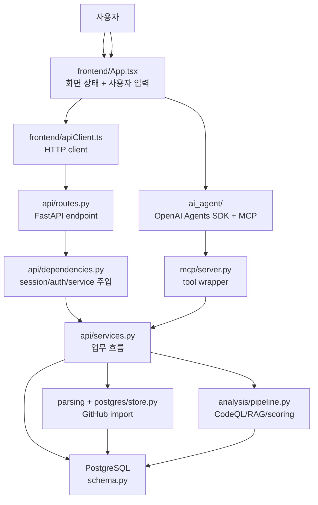

기본 원칙은 이것입니다.

```text
frontend는 사용자의 선택과 입력을 API 요청으로 바꾼다.
routes.py는 URL과 request/response schema를 고정한다.
services.py가 실제 업무 흐름을 조립한다.
DB schema는 source of truth와 보조 테이블을 가진다.
MCP와 AI Agent는 기존 service/pipeline을 우회하지 않고 감싼다.
```

## 1. 회원가입 / 로그인 흐름

### 1.1 회원가입

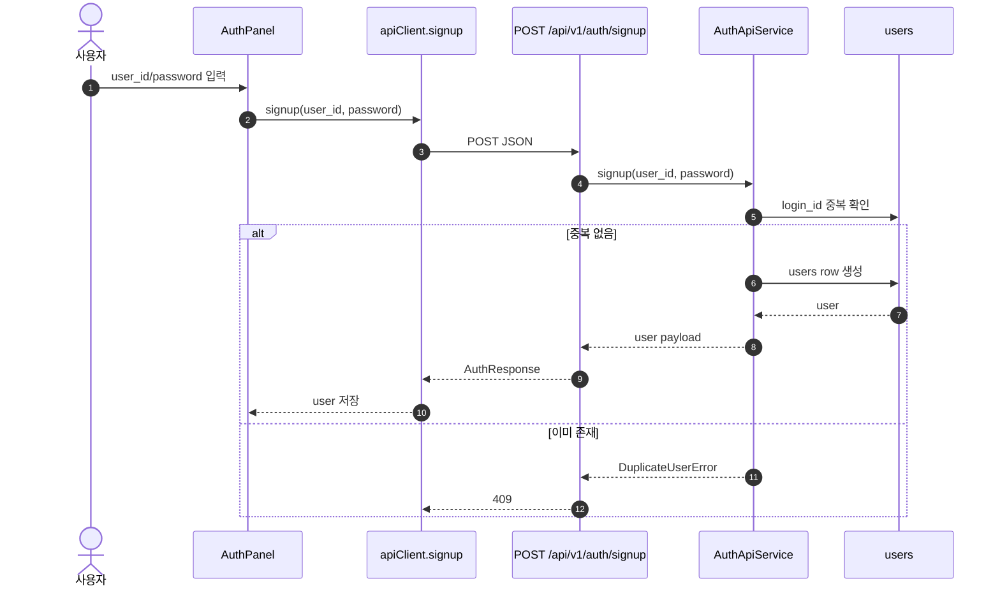

흐름에 붙는 파일입니다.

| 단계 | 파일 | 역할 |
| --- | --- | --- |
| 화면 입력 | `frontend/src/App.tsx` | 로그인/회원가입 모드를 고르고 submit한다. |
| HTTP client | `frontend/src/apiClient.ts` | `/api/v1/auth/signup`으로 JSON을 보낸다. |
| 요청/응답 schema | `pr_atlas_mvp/api/schemas.py` | `AuthRequest`, `AuthResponse`를 검증한다. |
| route | `pr_atlas_mvp/api/routes.py` | `/auth/signup` endpoint를 연결한다. |
| service | `pr_atlas_mvp/api/services.py` | `AuthApiService.signup`에서 중복 확인 후 user를 만든다. |
| table | `pr_atlas_mvp/postgres/schema.py` | `User` 테이블이 `login_id`, `password`, `created_at`을 가진다. |

현재 인증은 Basic Auth 기반입니다. signup/login 응답은 user만 반환하고 cookie를 발급하지 않습니다.

### 1.2 로그인 / 현재 사용자

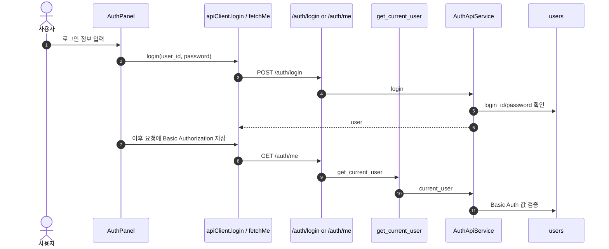

중요한 경계입니다.

```text
로그인 성공 = frontend가 Basic Auth credentials를 메모리에 저장
세션 쿠키 = 현재 사용하지 않음
auth_sessions 테이블 = schema에는 있지만 현재 주요 흐름에서는 사용하지 않음
```

## 2. 게시물 CRUD 흐름

현재 앱에는 일반적인 `posts` 테이블이 없습니다. 사용자가 말한 게시물 CRUD는 현재 화면 기준으로 `Repository Board`의 repository 항목 CRUD로 읽는 것이 맞습니다.

```text
Create = public GitHub repository import
Read = imported repository 목록/상세 조회
Update = repository refresh, 즉 GitHub PR 목록 재수집
Delete = imported repository와 관련 artifact 삭제
```

### 2.1 Repository 생성, 즉 import

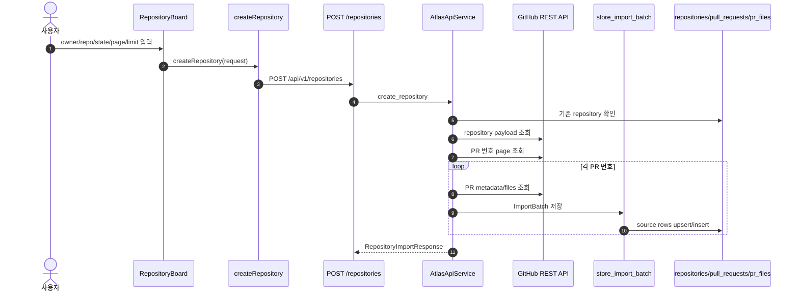

관련 파일입니다.

| 단계 | 파일 | 역할 |
| --- | --- | --- |
| 화면 | `frontend/src/App.tsx` | Repository import form을 관리한다. |
| client | `frontend/src/apiClient.ts` | `createRepository` 요청을 보낸다. |
| route/schema | `api/routes.py`, `api/schemas.py` | `/repositories` POST와 `RepositoryImportRequest`를 정의한다. |
| service | `api/services.py` | 중복 검사 후 `_import_repository`로 GitHub import를 실행한다. |
| GitHub 수집 | `parsing/github_client.py`, `parsing/runner.py`, `parsing/normalizer.py` | repository/PR/files payload를 내부 `ImportBatch`로 만든다. |
| 저장 | `postgres/store.py`, `postgres/writes.py`, `postgres/schema.py` | repository, PR, file, hunk, raw payload를 저장한다. |

### 2.2 Repository 조회

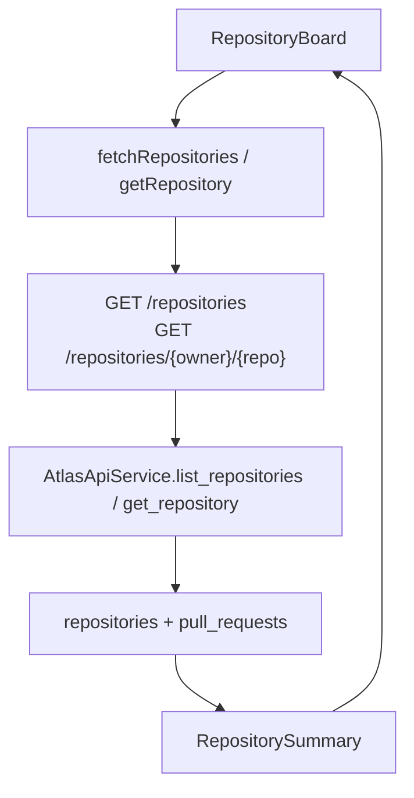

목록 조회는 `query`, `limit`, `offset`을 받습니다. 상세 조회는 artifact 상태까지 함께 보여줍니다.

### 2.3 Repository 갱신

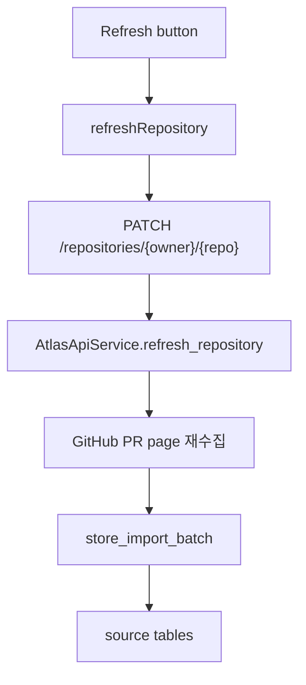

갱신은 repository row 자체를 수정하는 일반 update가 아니라, 같은 repository의 PR snapshot을 다시 import하는 흐름입니다.

### 2.4 Repository 삭제

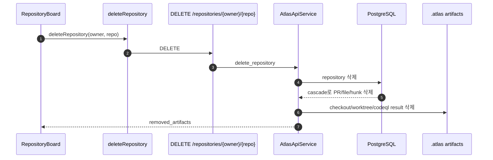

## 3. 댓글 흐름

댓글은 repository 전체나 PR 전체에 다는 것이 아니라, 특정 PR의 특정 file path에 달립니다.

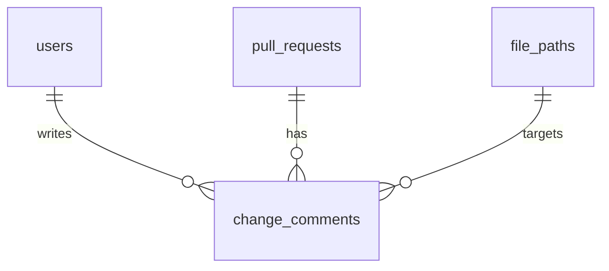

### 3.1 댓글 목록

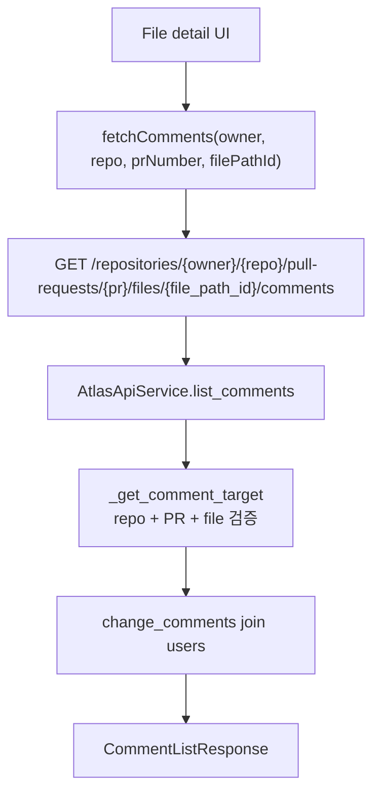

### 3.2 댓글 생성

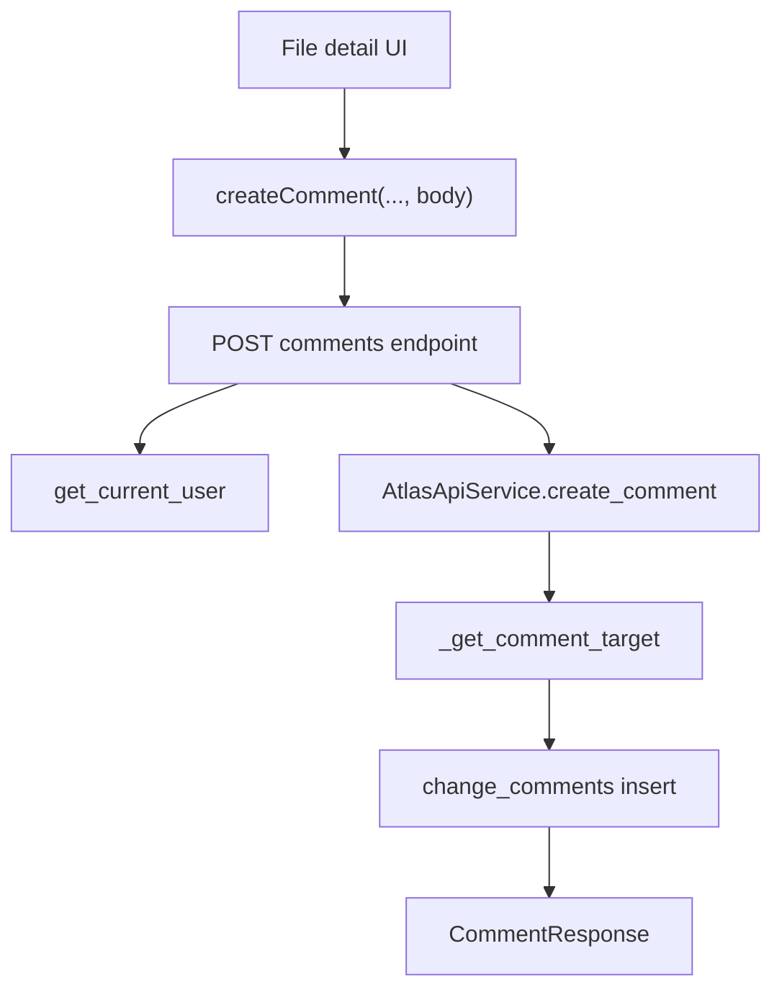

현재 댓글 기능의 범위입니다.

| 기능 | 상태 |
| --- | --- |
| 댓글 목록 조회 | 있음 |
| 댓글 생성 | 있음 |
| 댓글 수정 | 없음 |
| 댓글 삭제 | 없음 |
| 댓글 대상 | imported PR의 changed file만 가능 |

## 4. 태그 흐름

현재 별도 `tags` 테이블이나 tag CRUD는 없습니다. 태그처럼 보이는 값은 GitHub PR label입니다.

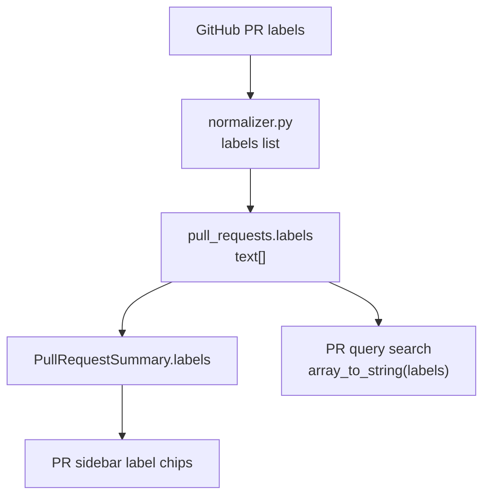

관련 파일입니다.

| 단계 | 파일 | 역할 |
| --- | --- | --- |
| 수집 | `parsing/github_client.py` | GraphQL/REST PR payload에서 label 정보를 가져온다. |
| 정규화 | `parsing/normalizer.py` | label name만 list로 뽑아 `PullRequestSnapshot.labels`에 넣는다. |
| 저장 | `postgres/schema.py`, `postgres/writes.py` | `pull_requests.labels` 배열에 저장한다. |
| 응답 | `api/services.py`, `api/schemas.py` | `PullRequestSummary.labels`로 내려준다. |
| 표시 | `frontend/src/App.tsx` | PR 목록에서 label chip처럼 보여준다. |
| 검색 | `api/services.py` | PR 검색에서 labels 배열을 문자열로 합쳐 `ilike` 검색한다. |

태그 기능을 독립 기능으로 확장하려면 새 table이나 label aggregate API가 필요합니다. 현재는 imported PR metadata의 일부입니다.

## 5. 페이징 흐름

현재 페이징은 두 종류입니다.

```text
1. 화면 목록 페이징: limit + offset
2. GitHub import 페이징: page + limit
```

### 5.1 Repository 목록 페이징

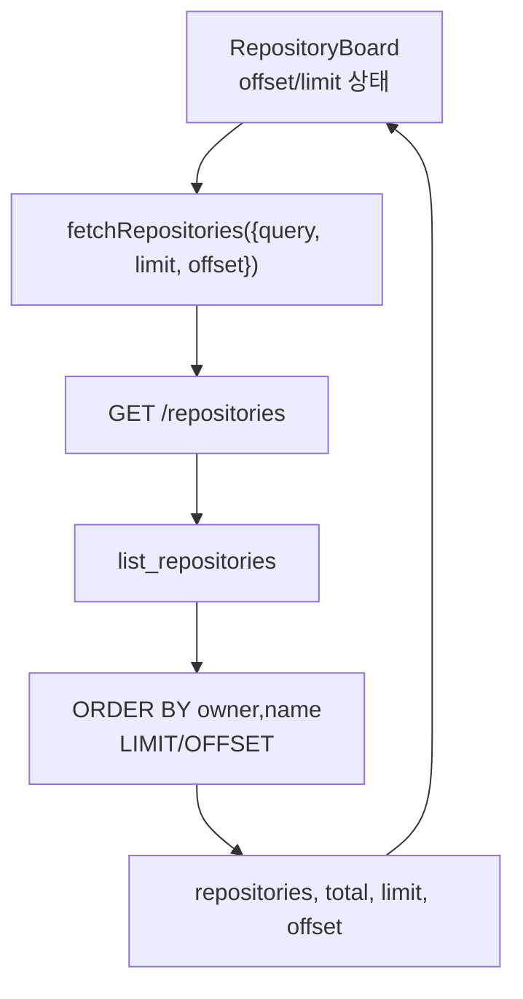

### 5.2 PR 목록 페이징

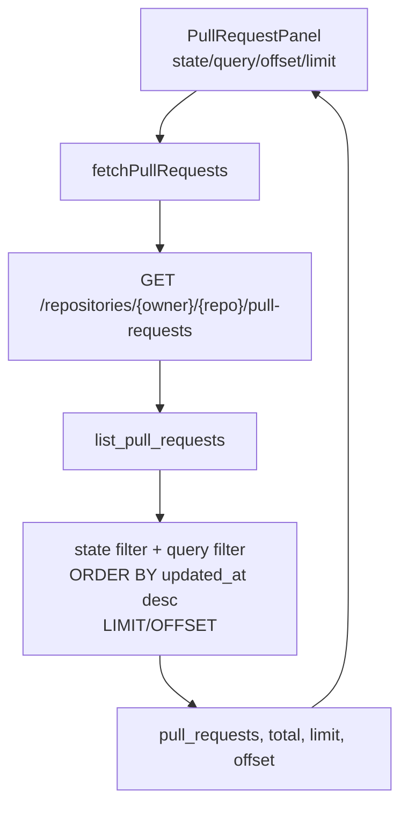

### 5.3 GitHub import page

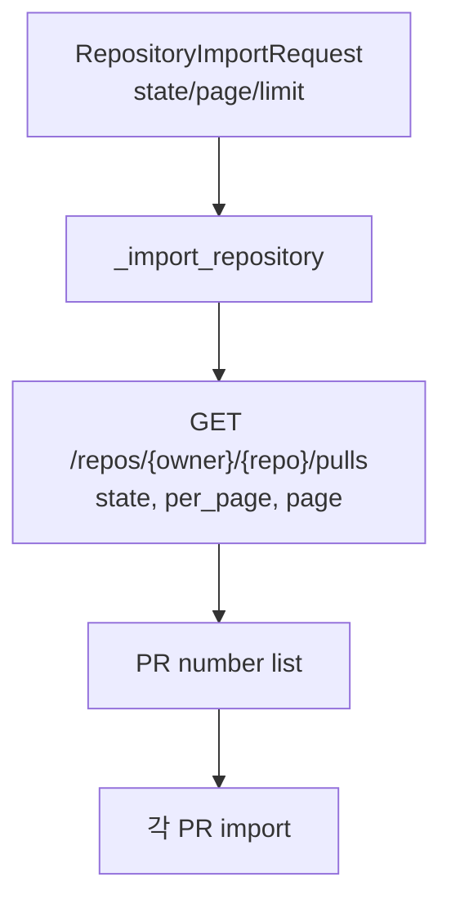

목록 페이징과 import 페이징은 목적이 다릅니다.

```text
limit/offset = 이미 import된 DB row를 나눠 보여준다.
page/limit = GitHub에서 어느 PR 목록 페이지를 가져올지 정한다.
```

## 6. 검색 흐름

검색도 두 군데에 있습니다.

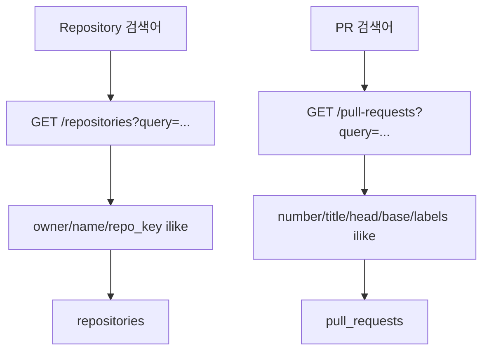

Repository 검색 대상입니다.

```text
repositories.owner
repositories.name
repositories.repo_key
```

PR 검색 대상입니다.

```text
pull_requests.number
pull_requests.title
pull_requests.head_ref
pull_requests.base_ref
pull_requests.labels
```

현재 검색은 단순 `ilike` 기반입니다. CodeQL/RAG 검색과는 다른 기능입니다.

## 7. MCP 흐름

MCP는 별도의 core logic이 아니라 기존 API service를 tool로 노출하는 wrapper입니다.

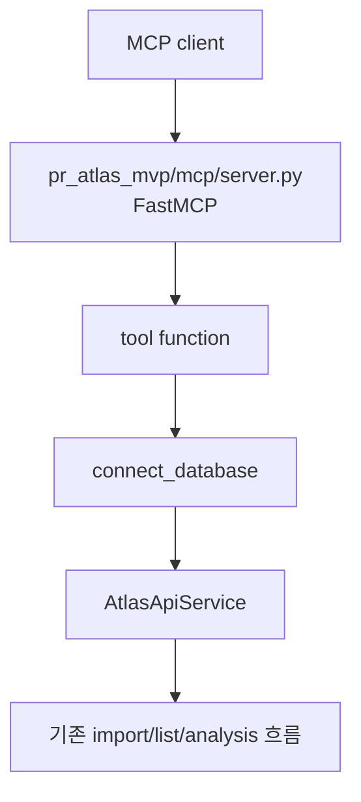

노출된 tool입니다.

| MCP tool | 내부로 이어지는 흐름 |
| --- | --- |
| `import_repository` | `AtlasApiService.create_repository`, 중복이면 refresh |
| `refresh_repository` | `AtlasApiService.refresh_repository` |
| `list_repositories` | `AtlasApiService.list_repositories` |
| `list_pull_requests` | `AtlasApiService.list_pull_requests` |
| `run_analysis` | `AtlasApiService.run_analysis` |

MCP validation은 API schema를 재사용하거나 같은 범위를 강제합니다.

```text
owner/repo 형식 검증
limit 1-100
page >= 1
offset >= 0
```

## 8. RAG 흐름

이 프로젝트의 RAG는 일반 챗봇 검색이 아닙니다. 분석의 중심은 source rows, CodeQL, role map, validation, scoring이고 RAG document는 설명/리포트 보조 경계입니다.

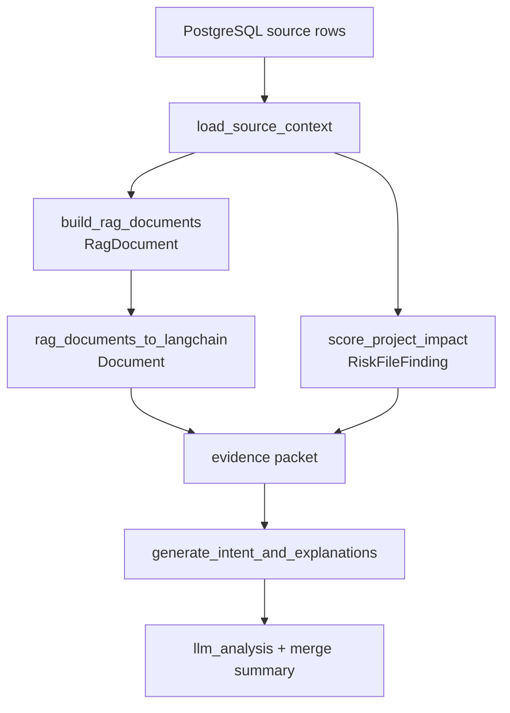

RAG document 종류입니다.

| Document type | 출처 | 역할 |
| --- | --- | --- |
| `repository_summary` | repository + selected PR count | 선택된 분석 범위 요약 |
| `pr_summary` | PR metadata + changed paths | PR 단위 설명 문맥 |
| `pr_file_change` | PR file row | 파일 변경량/상태 문맥 |
| `diff_hunk` | hunk row | hunk line range와 patch excerpt 문맥 |

중요한 제한입니다.

```text
RAG document는 dependency truth가 아니다.
Vector retrieval은 기본 판단 엔진이 아니다.
LLM은 evidence packet을 설명할 뿐 risk score를 만들지 않는다.
```

## 9. AI Agent 흐름

AI Agent는 사용자가 자연어로 repository import/list/analysis를 요청하면 OpenAI Agents SDK가 MCP tool을 호출하는 흐름입니다.

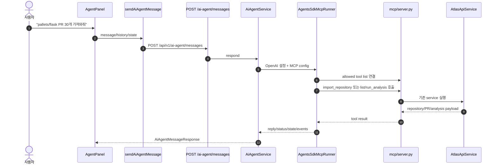

AI Agent 파일별 역할입니다.

| 파일 | 역할 |
| --- | --- |
| `ai_agent/models.py` | 대화 request/response, agent state, tool event shape |
| `ai_agent/service.py` | OpenAI 설정 확인 후 runner 실행 |
| `ai_agent/llm.py` | OpenAI Agents SDK와 MCP stdio server 연결 |
| `ai_agent/loop.py` | 최신 메시지/history/state를 agent input으로 만들고, tool event로 state/status를 갱신 |
| `ai_agent/repo_parser.py` | 자연어에서 `owner/repo`, GitHub URL, PR limit 추출 |
| `ai_agent/tools.py` | 허용 MCP tool 이름과 import/list tool 판별 |
| `ai_agent/prompts/repository_import.md` | agent가 지켜야 할 tool 사용 규칙 |

AI Agent의 상태는 frontend와 왕복합니다.

```json
{
  "owner": "pallets",
  "repo": "flask",
  "pr_limit": 30,
  "pr_state": "open",
  "page": 1,
  "imported": true,
  "last_repository_key": "pallets/flask"
}
```

AI Agent가 하지 않는 일입니다.

```text
risk score 계산
hunk overlap 계산
CodeQL evidence 생성
merge recommendation 직접 작성
import 결과 조작
```

필요한 판단은 MCP의 `run_analysis` tool을 통해 기존 analysis pipeline에 맡깁니다.

## 10. 기능별 현재 구현 범위

| 기능 | 현재 구현 | 없는 것 / 주의점 |
| --- | --- | --- |
| 회원가입 / 로그인 | Basic Auth 기반 signup/login/me/logout | password hashing, cookie session 사용은 없음 |
| 게시물 CRUD | repository create/list/detail/refresh/delete | 일반 게시글 `posts` 모델은 없음 |
| 댓글 | changed file 대상 list/create | update/delete 없음 |
| 태그 | PR labels 저장/표시/검색 | tag CRUD나 tag aggregate API 없음 |
| 페이징 | repository/PR `limit + offset`, import `page + limit` | cursor pagination API는 없음 |
| 검색 | repository/PR 단순 `ilike` 검색 | 전문 검색, semantic 검색 아님 |
| MCP | import/list/analysis tool wrapper | 별도 business logic 아님 |
| RAG | source row 기반 support documents + evidence-bound LLM 설명 | risk 판단 엔진 아님 |
| AI Agent | 자연어 -> MCP tool -> 기존 service/pipeline | 자체 분석 판단자 아님 |

## 11. 기능별로 코드를 찾는 순서

```text
회원가입 / 로그인
  frontend/src/App.tsx
  frontend/src/apiClient.ts
  pr_atlas_mvp/api/routes.py
  pr_atlas_mvp/api/dependencies.py
  pr_atlas_mvp/api/services.py
  pr_atlas_mvp/postgres/schema.py

게시물 CRUD(repository CRUD)
  frontend/src/App.tsx
  frontend/src/apiClient.ts
  pr_atlas_mvp/api/routes.py
  pr_atlas_mvp/api/services.py
  pr_atlas_mvp/parsing/*
  pr_atlas_mvp/postgres/*

댓글
  frontend/src/App.tsx
  frontend/src/apiClient.ts
  pr_atlas_mvp/api/routes.py
  pr_atlas_mvp/api/services.py
  pr_atlas_mvp/postgres/schema.py

태그
  pr_atlas_mvp/parsing/normalizer.py
  pr_atlas_mvp/postgres/schema.py
  pr_atlas_mvp/api/services.py
  frontend/src/App.tsx

페이징 / 검색
  frontend/src/App.tsx
  frontend/src/apiClient.ts
  pr_atlas_mvp/api/routes.py
  pr_atlas_mvp/api/services.py

MCP
  pr_atlas_mvp/mcp/server.py
  pr_atlas_mvp/api/services.py

RAG
  docs/rag.md
  pr_atlas_mvp/analysis/context.py
  pr_atlas_mvp/analysis/langchain_adapters.py
  pr_atlas_mvp/analysis/pipeline.py
  pr_atlas_mvp/analysis/scoring.py

AI Agent
  pr_atlas_mvp/ai_agent/models.py
  pr_atlas_mvp/ai_agent/service.py
  pr_atlas_mvp/ai_agent/llm.py
  pr_atlas_mvp/ai_agent/loop.py
  pr_atlas_mvp/ai_agent/repo_parser.py
  pr_atlas_mvp/ai_agent/tools.py
  pr_atlas_mvp/ai_agent/prompts/repository_import.md
  pr_atlas_mvp/mcp/server.py
```
