# pr_atlas_mvp를 구조도로 탑다운 읽기

이 문서는 `pr_atlas_mvp`를 코드 순서대로 한 줄씩 설명하지 않습니다. 먼저 데이터가 최종적으로 어떤 구조가 되는지 보고, 그 구조를 만들기 위해 실행 흐름이 어떻게 내려가는지 Mermaid 구조도 중심으로 읽습니다.

## 0. 최종 데이터 구조 먼저 보기

이 MVP의 핵심은 GitHub API 응답을 그대로 출력하는 것이 아닙니다. GraphQL 응답과 REST 응답을 합쳐서 `ImportBatch`라는 내부 표준 구조로 만들고, 그 구조를 다시 PostgreSQL에 넣을 row 묶음처럼 바꿔 보여줍니다.

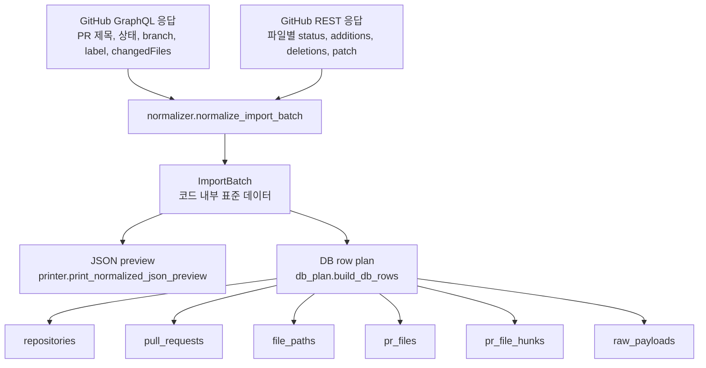

최종적으로 중요한 데이터 형식은 두 개입니다.

```text
1. 코드 내부 데이터:
   ImportBatch

2. DB 저장 계획 데이터:
   dict[str, list[dict[str, Any]]]
```

### `ImportBatch` 예시

`octocat/hello-world#42` PR이 `src/api/users.py`를 수정했다고 가정하면, 코드 내부에서는 핵심 정보가 이런 모양으로 정리됩니다.

```json
{
  "repository": {
    "owner": "octocat",
    "name": "hello-world"
  },
  "pull_request": {
    "number": 42,
    "title": "Fix user profile response",
    "url": "https://github.com/octocat/hello-world/pull/42",
    "state": "OPEN",
    "base_ref": "main",
    "head_ref": "fix-user-profile-response",
    "base_sha": "3f4a0c1b9e2d",
    "head_sha": "9b8c7d6e5f4a",
    "updated_at": "2026-06-10T08:15:30Z",
    "labels": ["api", "bug"],
    "files": [
      {
        "path": "src/api/users.py",
        "path_tree": "src.api.users.py",
        "status": "modified",
        "additions": 12,
        "deletions": 3,
        "changes": 15,
        "hunks": [
          {
            "header": "@@ -10,7 +10,12 @@ def get_user(user_id):",
            "old_start": 10,
            "old_lines": 7,
            "new_start": 10,
            "new_lines": 12,
            "lines": [
              {
                "type": "delete",
                "content": "    return {\"name\": user.name}",
                "old_line": 11,
                "new_line": null
              },
              {
                "type": "add",
                "content": "    return {\"name\": user.name, \"avatarUrl\": user.avatar_url}",
                "old_line": null,
                "new_line": 11
              }
            ]
          }
        ]
      }
    ]
  }
}
```

이 구조에서 충돌 분석에 직접 중요한 값은 `path`, `path_tree`, `status`, `additions`, `deletions`, `changes`, `hunks.old_start`, `hunks.new_start`, `hunks.lines`입니다.

### DB row plan 예시

`db_plan.build_db_rows()`는 위 데이터를 실제 INSERT 대신 테이블별 row 묶음으로 바꿉니다.

```json
{
  "repositories": [
    {
      "repo_key": "octocat/hello-world",
      "owner": "octocat",
      "name": "hello-world"
    }
  ],
  "pull_requests": [
    {
      "pr_key": "octocat/hello-world#42",
      "repo_key": "octocat/hello-world",
      "number": 42,
      "title": "Fix user profile response",
      "state": "OPEN",
      "base_ref": "main",
      "head_ref": "fix-user-profile-response",
      "head_sha": "9b8c7d6e5f4a",
      "labels": ["api", "bug"],
      "raw_graphql": "<jsonb: 전체 GraphQL PR 객체>"
    }
  ],
  "file_paths": [
    {
      "path": "src/api/users.py",
      "path_tree": "src.api.users.py"
    }
  ],
  "pr_files": [
    {
      "pr_file_key": "octocat/hello-world#42:src/api/users.py",
      "pr_key": "octocat/hello-world#42",
      "path": "src/api/users.py",
      "status": "modified",
      "additions": 12,
      "deletions": 3,
      "changes": 15,
      "raw_rest": "<jsonb: REST 파일 객체>"
    }
  ],
  "pr_file_hunks": [
    {
      "hunk_key": "octocat/hello-world#42:src/api/users.py:hunk-1",
      "pr_file_key": "octocat/hello-world#42:src/api/users.py",
      "old_start": 10,
      "old_lines": 7,
      "new_start": 10,
      "new_lines": 12,
      "line_count": 2,
      "hunk_json": "<jsonb: 파싱된 hunk와 라인 목록>"
    }
  ]
}
```

이 row 구조는 나중에 이런 질문을 하기 위한 기반입니다.

```text
같은 파일을 수정한 PR이 있는가?
같은 디렉토리에 변경이 몰렸는가?
두 PR의 hunk line range가 겹치는가?
원본 GitHub 응답을 다시 확인할 수 있는가?
```

## 1. 전체 실행 구조

실행은 `fetch_pr_main.py`에서 시작하지만, 실제 orchestration은 `runner.py`가 담당합니다.

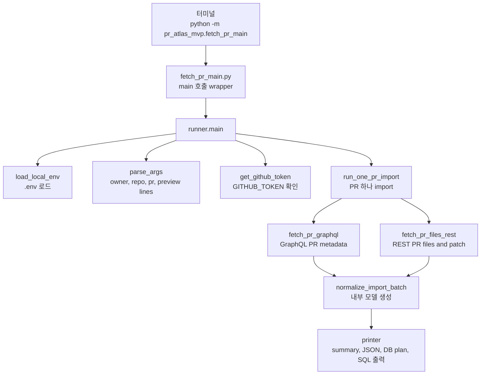

흐름을 한 문장으로 줄이면 다음입니다.

```text
CLI 입력과 토큰을 준비하고, GitHub에서 PR 데이터를 가져온 뒤, 내부 모델로 정규화해서 출력한다.
```

## 2. 실행 시퀀스

함수 호출 순서만 보면 아래 시퀀스가 가장 정확합니다.

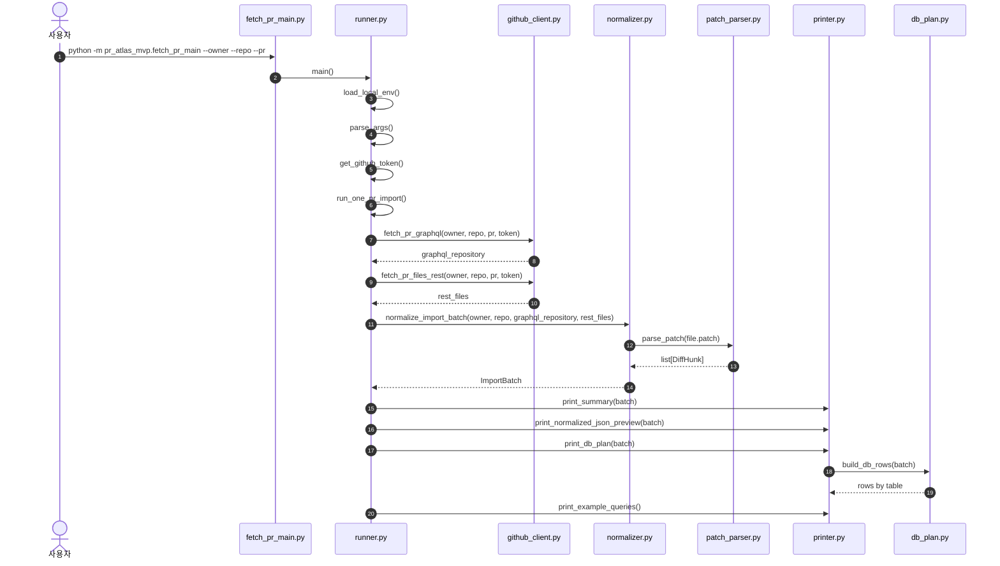

여기서 `fetch_pr_main.py`는 얇은 진입점입니다. 핵심 로직은 `runner.main()` 아래로 내려갑니다.

## 3. 모듈 책임 구조

파일별 책임은 아래처럼 나뉩니다.

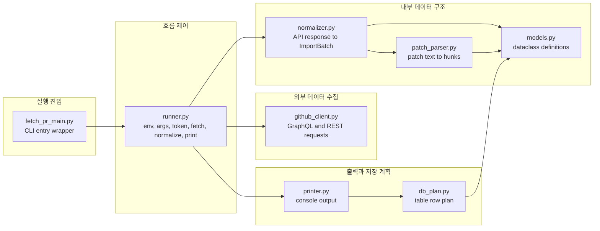

읽는 순서는 `fetch_pr_main.py`에서 시작해도 되지만, 데이터 구조를 먼저 잡고 싶다면 `models.py`를 `normalizer.py`보다 먼저 보는 것이 좋습니다.

## 4. 내부 데이터 모델 구조

`models.py`는 GitHub 응답을 프로젝트 내부에서 다루는 표준 형태로 정의합니다.

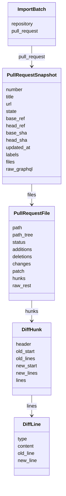

데이터의 깊이는 PR에서 파일로, 파일에서 hunk로, hunk에서 line으로 내려갑니다.

```text
PR 하나
  -> 변경 파일 여러 개
    -> 파일별 diff hunk 여러 개
      -> hunk 안의 add/delete/context line 여러 개
```

## 5. GitHub API 수집 구조

`github_client.py`는 GraphQL과 REST를 모두 사용합니다. 두 API가 주는 정보가 다르기 때문입니다.

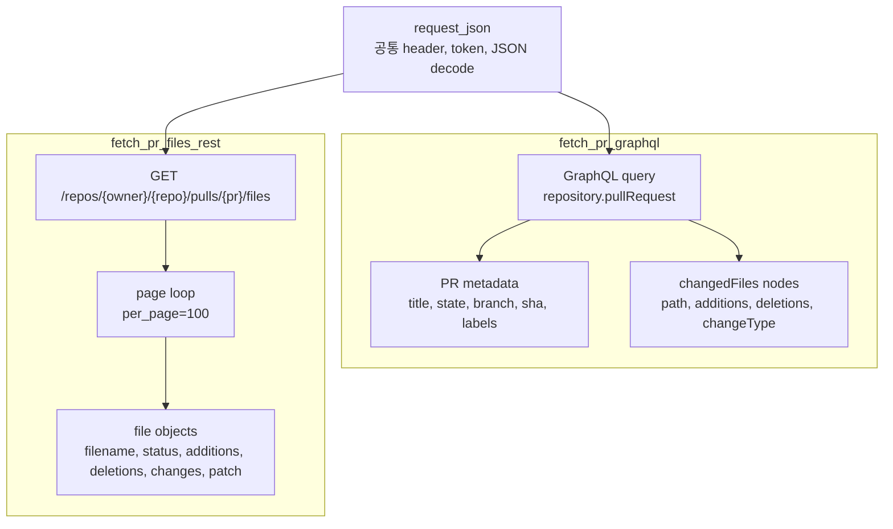

GraphQL은 PR 자체의 큰 정보를 가져오고, REST는 파일별 `patch` 문자열을 가져오는 역할이 큽니다.

## 6. GraphQL과 REST 응답을 합치는 구조

`normalizer.normalize_import_batch()`는 서로 다른 API 응답을 path 기준으로 합칩니다.

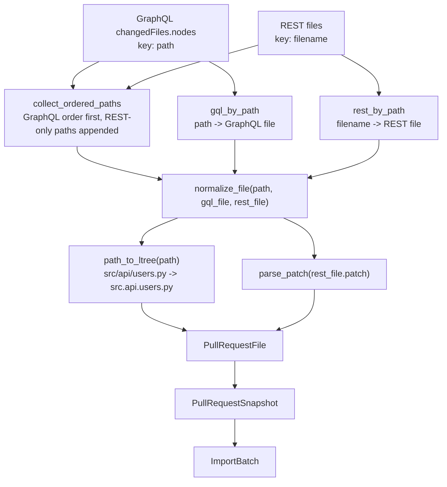

중요한 key 차이는 이것입니다.

```text
GraphQL 파일 객체:
  item["path"]

REST 파일 객체:
  item["filename"]
```

그래서 정규화 단계에서 둘을 같은 path 기준으로 다시 맞춥니다.

## 7. patch 파싱 구조

REST의 `patch`는 문자열입니다. `patch_parser.parse_patch()`는 이 문자열을 `DiffHunk`와 `DiffLine` 구조로 바꿉니다.

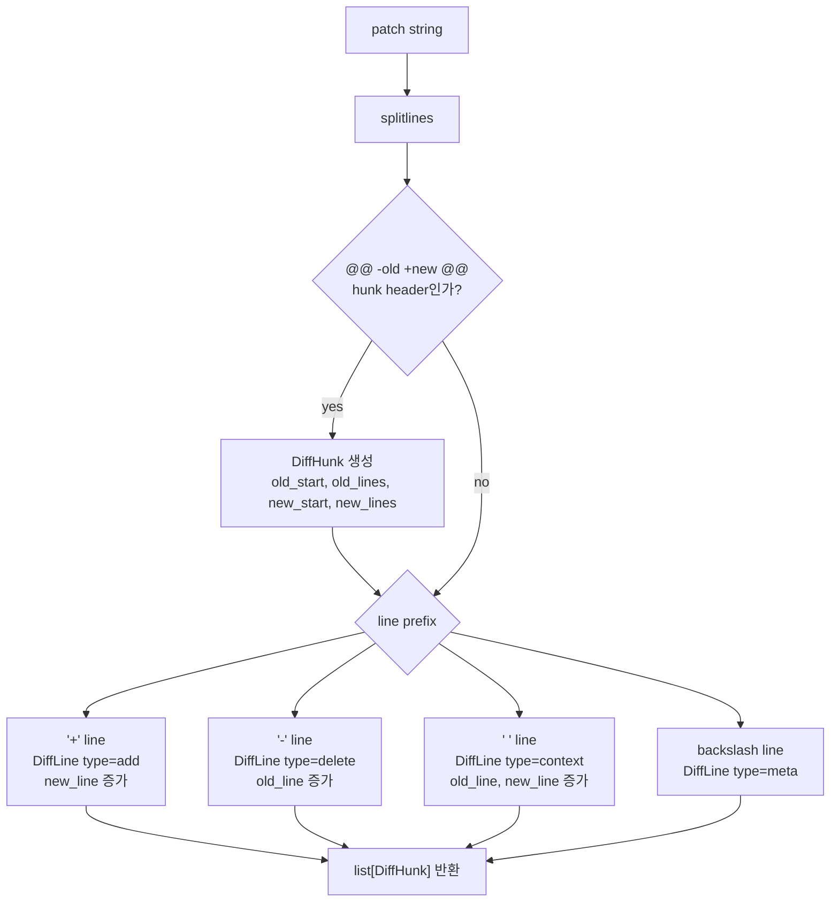

라인 번호는 old/new를 따로 추적합니다.

```text
add:
  old_line = None
  new_line 사용

delete:
  old_line 사용
  new_line = None

context:
  old_line, new_line 둘 다 사용
```

이 구조 덕분에 나중에 PR 간 hunk range가 겹치는지 비교할 수 있습니다.

## 8. DB row 구조

`db_plan.build_db_rows()`는 `ImportBatch`를 테이블별 row 묶음으로 바꿉니다.

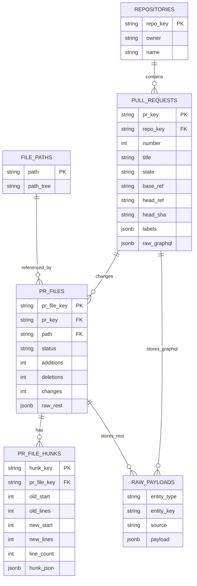

현재 코드는 실제 PostgreSQL에 연결하지 않습니다. 위 ERD는 `print_db_plan()`이 콘솔에 보여주는 row 계획의 논리 구조입니다.

## 9. 출력 구조

`printer.py`는 데이터 처리 결과를 사람이 읽을 수 있게 콘솔에 출력합니다.

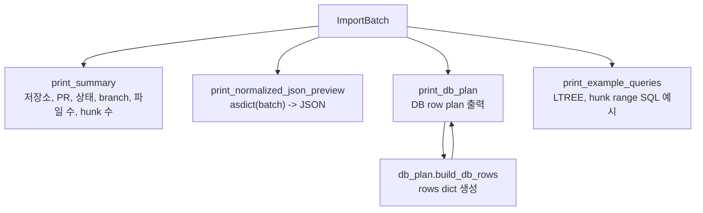

출력 순서는 `runner.run_one_pr_import()`에 고정되어 있습니다.

```text
1. GitHub에서 데이터 가져오기
2. 가져오기 요약
3. 정규화된 JSON 미리보기
4. PostgreSQL 저장 계획
5. PostgreSQL 예시 쿼리
```

## 10. 충돌 분석으로 이어지는 핵심 구조

이 MVP가 만드는 데이터 중 PR 충돌 분석과 직접 이어지는 부분은 `pr_files`와 `pr_file_hunks`입니다.

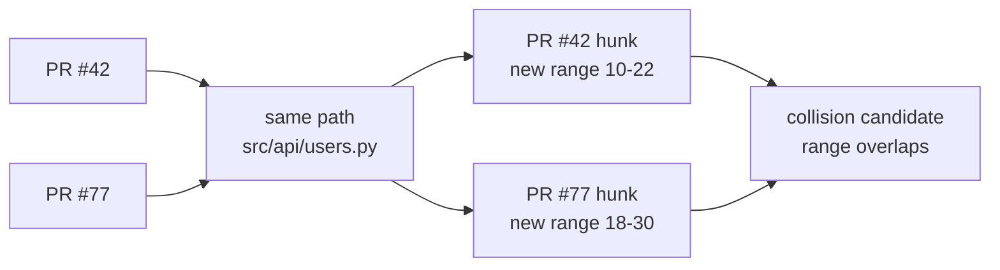

핵심 판단 기준은 먼저 단순합니다.

```text
1. 같은 파일인가?
2. 같은 파일 안에서 hunk range가 겹치는가?
3. 그 파일이 migration, config, API, auth처럼 위험도가 높은 영역인가?
```

현재 코드가 실제로 만드는 것은 1번과 2번을 계산하기 위한 기반 데이터입니다.

## 11. 코드 읽는 순서

구조도를 본 뒤 코드는 아래 순서로 읽는 것이 가장 효율적입니다.

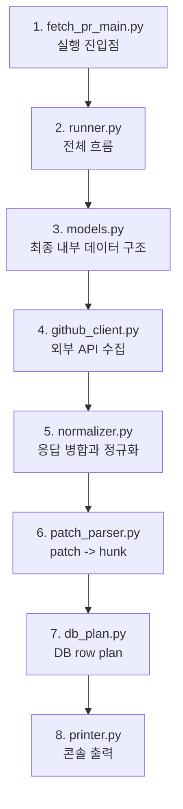

`models.py`를 `normalizer.py`보다 먼저 보는 이유는 정규화의 목적지가 먼저 보여야 변환 코드가 잘 읽히기 때문입니다.

## 12. 현재 MVP의 경계

현재 하는 일과 하지 않는 일을 분리하면 아래와 같습니다.

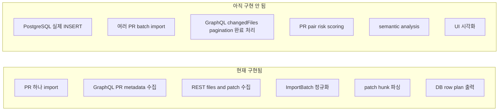

따라서 `pr_atlas_mvp`의 현재 역할은 전체 PR Collision Atlas 중 이 범위입니다.

```text
Repository Import의 최소 단위:
  PR 하나를 가져와서 충돌 분석에 쓸 수 있는 구조로 바꾸고,
  DB에 저장할 row 형태를 미리 보여준다.
```
