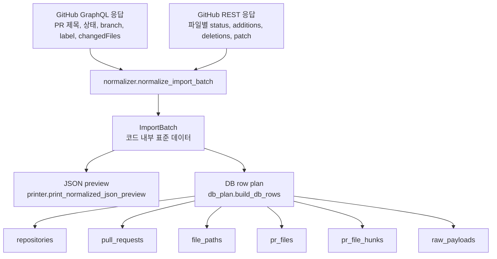
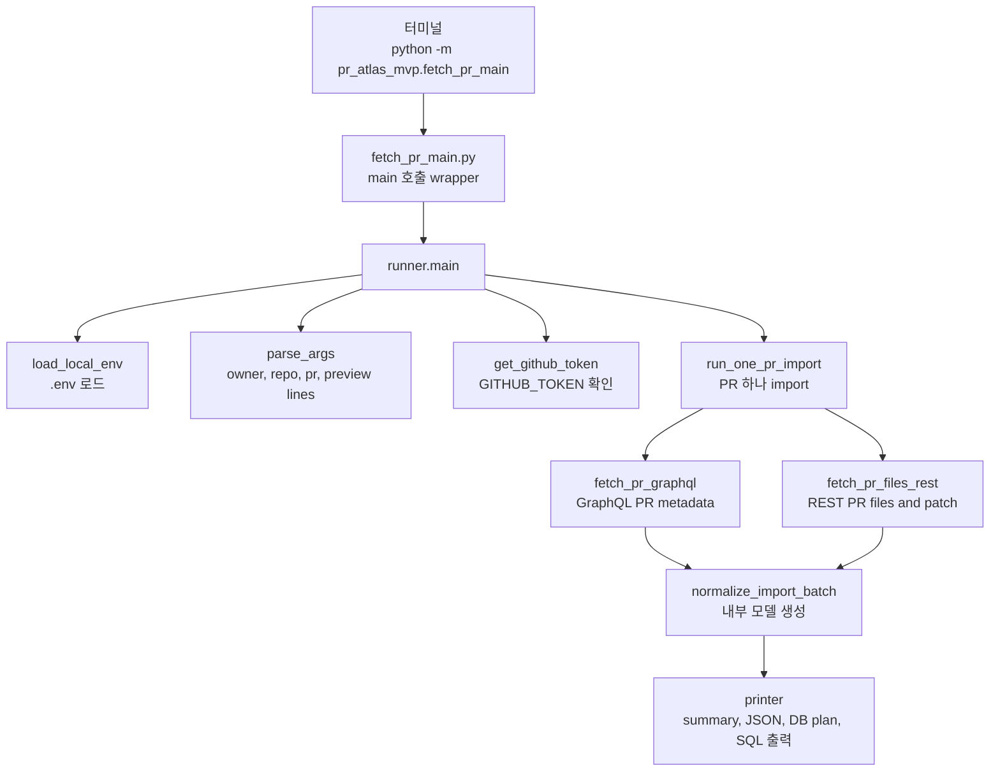
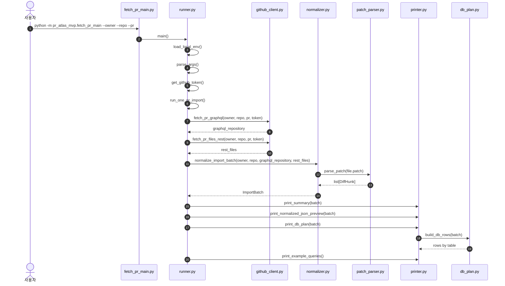
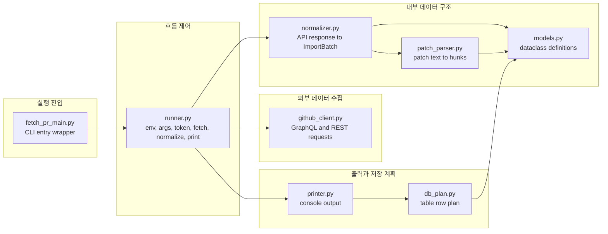
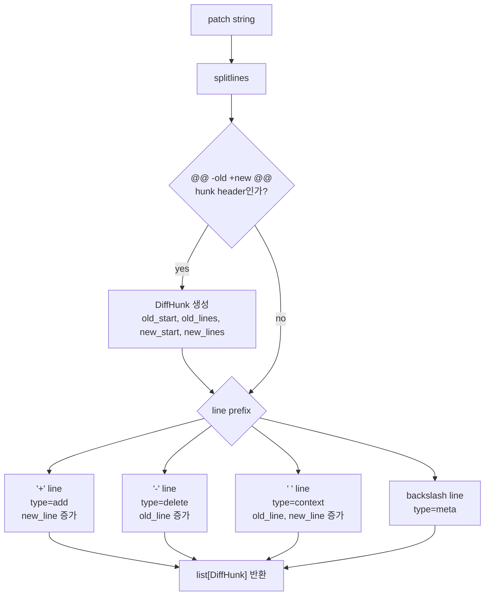
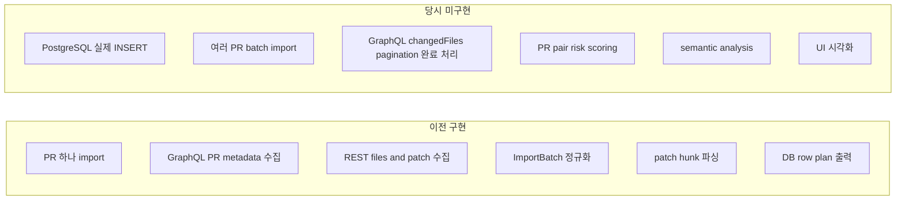

# PR Atlas MVP 레거시 출력 흐름 탑다운 읽기

이 문서는 PostgreSQL 실제 저장 코드를 붙이기 전, GitHub PR 하나를 가져와 정규화하고 DB row 계획을 콘솔에 출력하던 이전 MVP 구조를 기록합니다. 현재 코드 구조 설명은 `TOP_DOWN_POSTGRES_IMPORT.md`를 봅니다.

코드를 파일 순서대로 한 줄씩 설명하지 않습니다. 먼저 최종 데이터 모양을 보고, 그 데이터를 만들기 위해 실행 흐름이 어떻게 내려가는지 Mermaid 구조도 중심으로 읽습니다.

## 0. 최종 데이터 구조 먼저 보기

이전 MVP의 핵심은 GitHub API 응답을 그대로 출력하는 것이 아니었습니다. GraphQL 응답과 REST 응답을 합쳐서 `ImportBatch`라는 내부 표준 구조로 만들고, 그 구조를 다시 PostgreSQL에 넣을 row 묶음처럼 바꿔 보여주는 것이었습니다.



최종적으로 중요한 데이터 형식은 두 개였습니다.

```text
1. 코드 내부 데이터:
   ImportBatch

2. DB 저장 계획 데이터:
   dict[str, list[dict[str, Any]]]
```

### ImportBatch 예시

```json
{
  "repository": {
    "owner": "octocat",
    "name": "hello-world"
  },
  "pull_request": {
    "number": 42,
    "title": "Fix user profile response",
    "url": "https://github.com/octocat/hello-world/pull/42",
    "state": "OPEN",
    "base_ref": "main",
    "head_ref": "fix-user-profile-response",
    "base_sha": "3f4a0c1b9e2d",
    "head_sha": "9b8c7d6e5f4a",
    "updated_at": "2026-06-10T08:15:30Z",
    "labels": ["api", "bug"],
    "files": [
      {
        "path": "src/api/users.py",
        "path_tree": "src.api.users.py",
        "status": "modified",
        "additions": 12,
        "deletions": 3,
        "changes": 15,
        "hunks": [
          {
            "header": "@@ -10,7 +10,12 @@ def get_user(user_id):",
            "old_start": 10,
            "old_lines": 7,
            "new_start": 10,
            "new_lines": 12,
            "lines": [
              {
                "type": "delete",
                "content": "    return {\"name\": user.name}",
                "old_line": 11,
                "new_line": null
              },
              {
                "type": "add",
                "content": "    return {\"name\": user.name, \"avatarUrl\": user.avatar_url}",
                "old_line": null,
                "new_line": 11
              }
            ]
          }
        ]
      }
    ]
  }
}
```

이 구조에서 충돌 분석에 직접 중요한 값은 `path`, `path_tree`, `status`, `additions`, `deletions`, `changes`, `hunks.old_start`, `hunks.new_start`, `hunks.lines`입니다.

### DB row plan 예시

```json
{
  "repositories": [
    {
      "repo_key": "octocat/hello-world",
      "owner": "octocat",
      "name": "hello-world"
    }
  ],
  "pull_requests": [
    {
      "pr_key": "octocat/hello-world#42",
      "repo_key": "octocat/hello-world",
      "number": 42,
      "title": "Fix user profile response",
      "state": "OPEN",
      "base_ref": "main",
      "head_ref": "fix-user-profile-response",
      "head_sha": "9b8c7d6e5f4a",
      "labels": ["api", "bug"],
      "raw_graphql": "<jsonb: 전체 GraphQL PR 객체>"
    }
  ],
  "file_paths": [
    {
      "path": "src/api/users.py",
      "path_tree": "src.api.users.py"
    }
  ],
  "pr_files": [
    {
      "pr_file_key": "octocat/hello-world#42:src/api/users.py",
      "pr_key": "octocat/hello-world#42",
      "path": "src/api/users.py",
      "status": "modified",
      "additions": 12,
      "deletions": 3,
      "changes": 15,
      "raw_rest": "<jsonb: REST 파일 객체>"
    }
  ],
  "pr_file_hunks": [
    {
      "hunk_key": "octocat/hello-world#42:src/api/users.py:hunk-1",
      "pr_file_key": "octocat/hello-world#42:src/api/users.py",
      "old_start": 10,
      "old_lines": 7,
      "new_start": 10,
      "new_lines": 12,
      "line_count": 2,
      "hunk_json": "<jsonb: 파싱된 hunk와 라인 목록>"
    }
  ]
}
```

## 1. 전체 실행 구조

이전 구조에서는 `fetch_pr_main.py`에서 시작하고, 실제 orchestration은 `runner.py`가 담당했습니다.



```text
CLI 입력과 토큰을 준비하고,
GitHub에서 PR 데이터를 가져온 뒤,
내부 모델로 정규화해서 콘솔에 출력한다.
```

## 2. 실행 시퀀스



## 3. 모듈 책임 구조



읽는 순서는 `fetch_pr_main.py`에서 시작해도 되지만, 데이터 구조를 먼저 잡고 싶다면 `models.py`를 `normalizer.py`보다 먼저 보는 것이 좋았습니다.

## 4. patch 파싱 구조

REST의 `patch`는 문자열입니다. `patch_parser.parse_patch()`는 이 문자열을 `DiffHunk`와 `DiffLine` 구조로 바꿨습니다.



라인 번호는 old/new를 따로 추적했습니다.

```text
add:
  old_line = None
  new_line 사용

delete:
  old_line 사용
  new_line = None

context:
  old_line, new_line 둘 다 사용
```

## 5. 이전 MVP의 경계



이 문서는 위 레거시 흐름을 보존하기 위한 문서입니다. 현재 구현은 실제 PostgreSQL INSERT까지 수행합니다.
